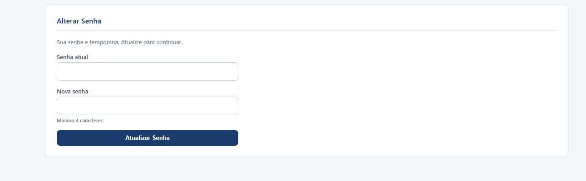
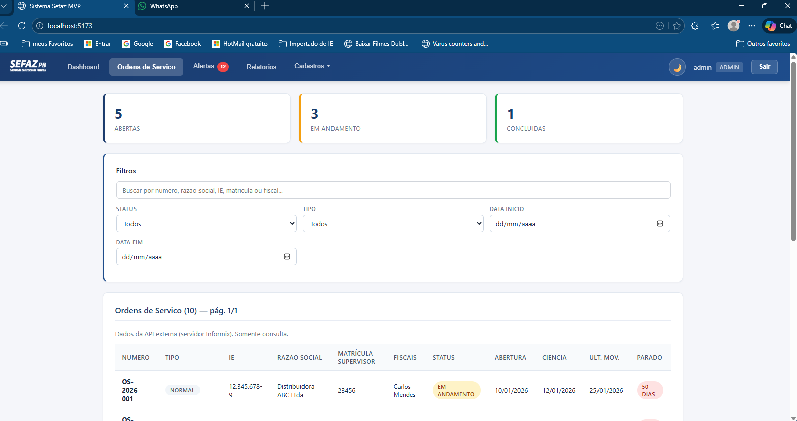
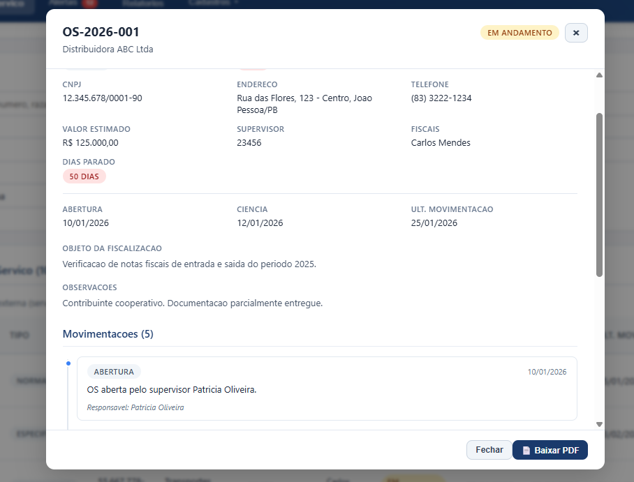
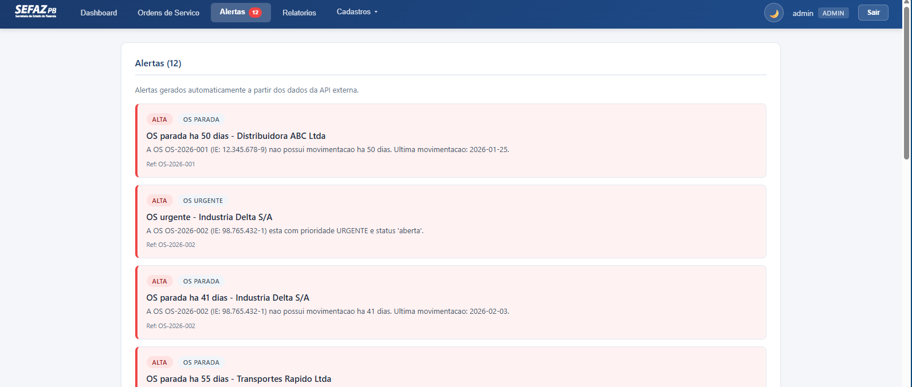
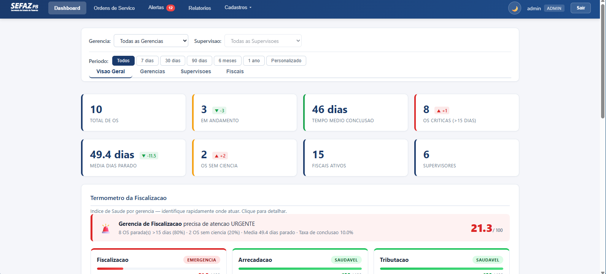
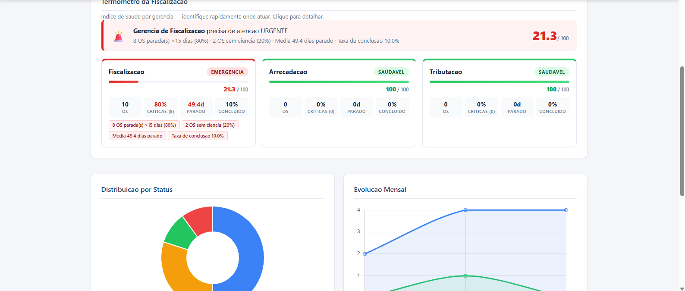
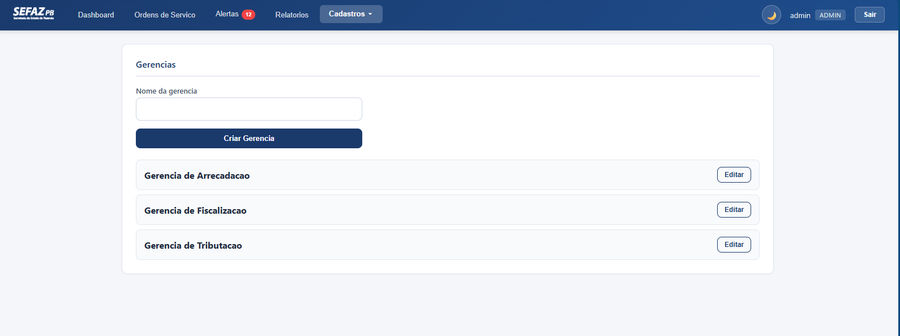
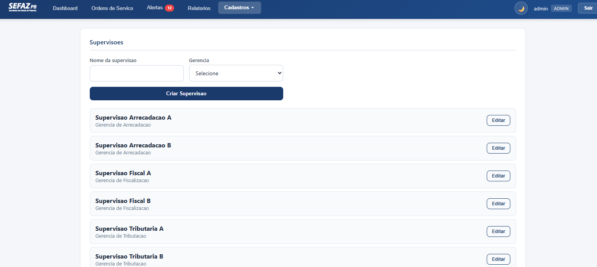
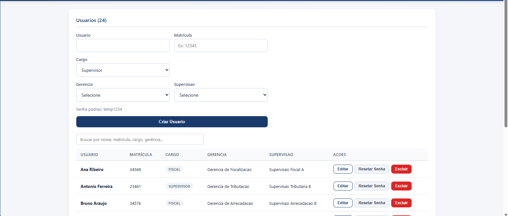
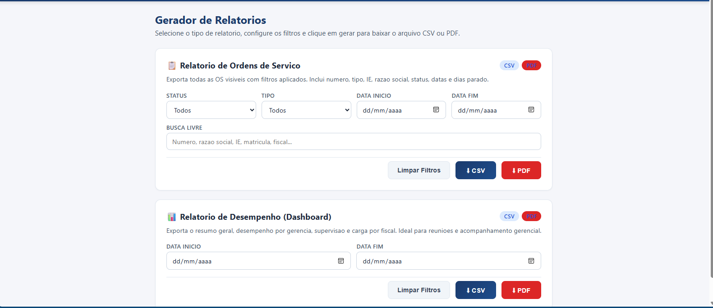

# Sistema SEFAZ PB – Gestao de Ordens de Servico

Sistema web para gestao e acompanhamento de Ordens de Servico (OS) da Secretaria de Estado da Fazenda da Paraiba, com hierarquia organizacional **Gerencia → Supervisao → Fiscal**, dashboard administrativo com graficos interativos, alertas automaticos, dark mode e integracao com banco IBM Informix.

---

## Indice

- [Visao Geral](#visao-geral)
- [Screenshots](#screenshots)
- [Tecnologias](#tecnologias)
- [Pre-requisitos](#pre-requisitos)
- [Instalacao](#instalacao)
- [Execucao](#execucao)
- [Credenciais](#credenciais)
- [Hierarquia Organizacional](#hierarquia-organizacional)
- [Funcionalidades](#funcionalidades)
- [Dashboard Administrativo](#dashboard-administrativo)
- [Formula do Indice de Saude](#formula-do-indice-de-saude)
- [Arquitetura](#arquitetura)
- [Estrutura do Projeto](#estrutura-do-projeto)
- [API REST – Endpoints](#api-rest--endpoints)
- [Testes](#testes)
- [Integracao Informix](#integracao-informix)
- [Configuracao](#configuracao)
- [Troubleshooting](#troubleshooting)
- [Notas de Producao](#notas-de-producao)

---

## Visao Geral

## Screenshots

### Primeiro Acesso (Troca de Senha)


### Ordens de Servico


### Detalhes da OS


### Alertas


### Dashboard


### Termometro e Graficos


### Cadastro de Gerencias


### Cadastro de Supervisoes


### Cadastro de Fiscais


### Relatorios


---

## Visao Geral

O Sistema SEFAZ PB permite que auditores fiscais, supervisores, gerentes e administradores acompanhem o andamento de Ordens de Servico de fiscalizacao tributaria. O sistema oferece:

- **Painel de OS** com filtros por status, tipo, periodo e busca textual
- **Dashboard com KPIs em tempo real**, graficos interativos e comparativo mensal
- **Termometro da Fiscalizacao** – ranking de saude por gerencia baseado em formula proporcional
- **Alertas automaticos** para OS urgentes, paradas e sem ciencia
- **Relatorios exportaveis** em CSV e PDF (OS e Dashboard)
- **Controle de acesso hierarquico** – cada perfil ve apenas o que lhe compete
- **Dark mode** com toggle e persistencia no localStorage

## Tecnologias

| Camada      | Tecnologia                                       | Versao       |
| ----------- | ------------------------------------------------ | ------------ |
| Backend     | Python + FastAPI + Uvicorn                        | 3.13 / 0.111 |
| Frontend    | React + Chart.js + react-chartjs-2                | 18.3 / 4.5   |
| Bundler     | esbuild (dev) / Vite (build producao)             | 0.21+        |
| Banco Local | SQLite (usuarios, gerencias, supervisoes)         | built-in     |
| Banco Ext.  | IBM Informix via pyodbc (Ordens de Servico)       | ODBC         |
| PDF         | fpdf2 (geracao de relatorios PDF)                 | 2.8          |
| Testes      | pytest                                            | 8.x          |

## Pre-requisitos

- **Python** >= 3.12
- **Node.js** >= 18 (npm incluido)
- **IBM Informix Client SDK** (opcional – sistema funciona com dados MOCK sem ele)
- **pyodbc** + driver ODBC do Informix (opcional)

## Instalacao

```powershell
# 1. Clonar o repositorio
git clone <url-do-repo> sistema_sefaz
cd sistema_sefaz

# 2. Criar e ativar o ambiente virtual Python
python -m venv .venv
.venv\Scripts\Activate.ps1          # Windows PowerShell
# source .venv/bin/activate         # Linux/Mac

# 3. Instalar dependencias do backend
pip install -r backend\requirements.txt

# 4. Instalar dependencias do frontend
npm --prefix .\frontend install

# 5. Configurar variaveis de ambiente
cp .env.example .env
# Editar .env conforme necessidade (Informix, CORS, etc.)
```

## Execucao

### Script Automatico (recomendado)

```powershell
.\start.bat         # Windows – inicia backend + frontend
./start.sh          # Linux/Mac
```

### Manual (dois terminais)

```powershell
# Terminal 1 – Backend (API FastAPI)
.venv\Scripts\Activate.ps1
uvicorn backend.main:app --reload --host 0.0.0.0 --port 8000
# -> http://localhost:8000  (Swagger: http://localhost:8000/docs)

# Terminal 2 – Frontend (dev server)
npm --prefix .\frontend run dev
# -> http://localhost:5173
```

### Build do Frontend (producao)

```powershell
# Via esbuild (leve, rapido)
cd frontend
npx esbuild src/main.jsx --bundle --outfile=public/assets/app.js --loader:.jsx=jsx --loader:.css=css

# Com URL de API customizada
npx esbuild src/main.jsx --bundle --outfile=public/assets/app.js --loader:.jsx=jsx --loader:.css=css --define:API_BASE_URL='"https://api.sefaz.pb.gov.br"'

# Ou via Vite
npm --prefix .\frontend run build
```

## Credenciais

Todos os usuarios sao criados automaticamente na primeira execucao (seed). Usuarios nao-admin usam senha temporaria e devem troca-la no primeiro login.

| Usuario             | Senha      | Cargo       | Gerencia             | Supervisao               |
| ------------------- | ---------- | ----------- | -------------------- | ------------------------- |
| `admin`             | `admin123` | Admin       | —                    | —                         |
| `Roberto Santos`    | `temp1234` | Gerente     | Fiscalizacao         | —                         |
| `Helena Rodrigues`  | `temp1234` | Gerente     | Arrecadacao          | —                         |
| `Sergio Barbosa`    | `temp1234` | Gerente     | Tributacao           | —                         |
| `Patricia Oliveira` | `temp1234` | Supervisor  | Fiscalizacao         | Supervisao Fiscal A       |
| `Joao Silva`        | `temp1234` | Supervisor  | Fiscalizacao         | Supervisao Fiscal B       |
| `Maria Santos`      | `temp1234` | Supervisor  | Arrecadacao          | Supervisao Arrecadacao A  |
| `Ricardo Pereira`   | `temp1234` | Supervisor  | Arrecadacao          | Supervisao Arrecadacao B  |
| `Lucia Costa`       | `temp1234` | Supervisor  | Tributacao           | Supervisao Tributaria A   |
| `Antonio Ferreira`  | `temp1234` | Supervisor  | Tributacao           | Supervisao Tributaria B   |
| `Carlos Mendes`     | `temp1234` | Fiscal      | Fiscalizacao         | Supervisao Fiscal A       |
| `Ana Ribeiro`       | `temp1234` | Fiscal      | Fiscalizacao         | Supervisao Fiscal A       |
| `Pedro Nascimento`  | `temp1234` | Fiscal      | Fiscalizacao         | Supervisao Fiscal A       |
| `Jose Almeida`      | `temp1234` | Fiscal      | Fiscalizacao         | Supervisao Fiscal B       |
| `Fernanda Costa`    | `temp1234` | Fiscal      | Fiscalizacao         | Supervisao Fiscal B       |
| `Marcos Silva`      | `temp1234` | Fiscal      | Arrecadacao          | Supervisao Arrecadacao A  |
| `Claudia Souza`     | `temp1234` | Fiscal      | Arrecadacao          | Supervisao Arrecadacao A  |
| `Rafael Lima`       | `temp1234` | Fiscal      | Arrecadacao          | Supervisao Arrecadacao A  |
| `Juliana Martins`   | `temp1234` | Fiscal      | Arrecadacao          | Supervisao Arrecadacao B  |
| `Bruno Araujo`      | `temp1234` | Fiscal      | Arrecadacao          | Supervisao Arrecadacao B  |
| `Tatiana Gomes`     | `temp1234` | Fiscal      | Tributacao           | Supervisao Tributaria A   |
| `Diego Cardoso`     | `temp1234` | Fiscal      | Tributacao           | Supervisao Tributaria A   |
| `Vanessa Rocha`     | `temp1234` | Fiscal      | Tributacao           | Supervisao Tributaria A   |
| `Leandro Pinto`     | `temp1234` | Fiscal      | Tributacao           | Supervisao Tributaria B   |
| `Camila Teixeira`   | `temp1234` | Fiscal      | Tributacao           | Supervisao Tributaria B   |

> **Total:** 1 admin + 3 gerentes + 6 supervisores + 15 fiscais = **25 usuarios**

## Hierarquia Organizacional

```
Admin (acesso total)
|
+-- Gerencia de Fiscalizacao
|   +-- Supervisao Fiscal A
|   |   +-- Patricia Oliveira (supervisor, mat. 23456)
|   |   +-- Carlos Mendes     (fiscal, mat. 34567)
|   |   +-- Ana Ribeiro       (fiscal, mat. 34568)
|   |   +-- Pedro Nascimento  (fiscal, mat. 34569)
|   +-- Supervisao Fiscal B
|       +-- Joao Silva        (supervisor, mat. 23457)
|       +-- Jose Almeida      (fiscal, mat. 34570)
|       +-- Fernanda Costa    (fiscal, mat. 34571)
|
+-- Gerencia de Arrecadacao
|   +-- Supervisao Arrecadacao A
|   |   +-- Maria Santos      (supervisor, mat. 23458)
|   |   +-- Marcos Silva      (fiscal, mat. 34572)
|   |   +-- Claudia Souza     (fiscal, mat. 34573)
|   |   +-- Rafael Lima       (fiscal, mat. 34574)
|   +-- Supervisao Arrecadacao B
|       +-- Ricardo Pereira   (supervisor, mat. 23459)
|       +-- Juliana Martins   (fiscal, mat. 34575)
|       +-- Bruno Araujo      (fiscal, mat. 34576)
|
+-- Gerencia de Tributacao
    +-- Supervisao Tributaria A
    |   +-- Lucia Costa       (supervisor, mat. 23460)
    |   +-- Tatiana Gomes     (fiscal, mat. 34577)
    |   +-- Diego Cardoso     (fiscal, mat. 34578)
    |   +-- Vanessa Rocha     (fiscal, mat. 34579)
    +-- Supervisao Tributaria B
        +-- Antonio Ferreira  (supervisor, mat. 23461)
        +-- Leandro Pinto     (fiscal, mat. 34580)
        +-- Camila Teixeira   (fiscal, mat. 34581)
```

### Regras de Visibilidade

| Perfil         | O que pode ver                                                     |
| -------------- | ------------------------------------------------------------------ |
| **Admin**      | Todas as OS, dashboard completo, CRUD de entidades                 |
| **Gerente**    | OS de todos os supervisores da sua gerencia                        |
| **Supervisor** | OS onde a `matricula_supervisor` e a sua matricula                 |
| **Fiscal**     | OS onde seu nome aparece no campo `fiscais`                        |

## Funcionalidades

### Autenticacao e Seguranca
- Login com token de sessao (UUID em memoria)
- Hash de senhas com **PBKDF2-HMAC-SHA256** (120.000 iteracoes + salt aleatorio de 16 bytes)
- Troca de senha obrigatoria no primeiro acesso (`must_change_password`)
- Reset de senha pelo admin (gera senha temporaria)

### Painel de Ordens de Servico
- Listagem com filtros: status, tipo, periodo (datas), busca textual (razao social, IE, numero)
- Datas exibidas no formato brasileiro (DD/MM/AAAA)
- Badges coloridos por prioridade e status
- Indicador visual de dias parado
- **Filtro por periodo**: botoes predefinidos (7d, 30d, 90d, 6m, 1ano) + datas customizadas

### Alertas Automaticos
Gerados em tempo real a partir das OS visiveis ao usuario:

| Tipo             | Severidade | Condicao                                |
| ---------------- | ---------- | --------------------------------------- |
| `os_urgente`     | Alta       | Prioridade "urgente" + status ativo     |
| `os_parada`      | Alta       | Parada > 15 dias sem movimentacao       |
| `os_sem_ciencia` | Media      | Status "aberta" sem data de ciencia     |

### CRUD Administrativo (somente Admin)
- Gerencias: criar, listar, editar
- Supervisoes: criar, listar, editar (com validacao de cascata gerencia-supervisao)
- Usuarios: criar, listar, editar, reset de senha (com validacao de cargo + lotacao)

### Interface
- **Dark mode**: toggle no topbar, persistido no `localStorage`
- **Filtro por periodo**: botoes predefinidos (7d, 30d, 90d, 6m, 1ano) + datas customizadas
- **Comparativo mensal**: deltas nos KPIs com setas coloridas (verde = melhoria, vermelho = piora)
- **Responsivo**: cards e tabelas adaptam-se a telas menores

## Dashboard Administrativo

Acessivel apenas pelo perfil **admin**. Contem:

### KPIs (Indicadores-Chave)
8 cards com metricas em tempo real + **deltas mensais** (com setas coloridas):
- Total de OS
- Em Andamento (seta vermelha = aumento e ruim)
- Tempo Medio de Conclusao (dias)
- OS Criticas (>15 dias paradas)
- Media de Dias Parado
- OS Sem Ciencia
- Fiscais Ativos
- Supervisores

O **comparativo mensal** compara o mes mais recente com o anterior e exibe indicadores:
- Seta verde para cima = melhoria (ex: mais concluidas)
- Seta vermelha para cima = piora (ex: mais criticas)

### Abas do Dashboard

| Aba          | Conteudo                                                                |
| ------------ | ----------------------------------------------------------------------- |
| Visao Geral  | Grafico pizza (status), evolucao mensal (linha), Termometro             |
| Gerencias    | Tabela + grafico comparativo por gerencia (barras agrupadas)            |
| Supervisoes  | Tabela + grafico comparativo por supervisao                             |
| Fiscais      | Tabela de carga de trabalho por fiscal                                  |

### Termometro da Fiscalizacao

Ranking visual de saude por gerencia, com cards coloridos por nivel:

| Nivel      | Score     | Cor              |
| ---------- | --------- | ---------------- |
| Saudavel   | 75–100    | Verde            |
| Atencao    | 50–74     | Amarelo          |
| Critico    | 25–49     | Laranja          |
| Emergencia | 0–24      | Vermelho         |

## Formula do Indice de Saude

O score e calculado de forma **proporcional** para escalar com qualquer volume de OS (a SEFAZ PB fiscaliza o estado inteiro):

```
Score = 100
      - (% OS criticas)           x 0.40   // Ate -40 pts
      - (dias parado medio)       x 0.5    // Cada dia = -0.5 pt
      - (100 - taxa conclusao%)   x 0.20   // Ate -20 pts
      - (% OS sem ciencia)        x 0.20   // Ate -20 pts
```

Onde:
- **OS critica** = OS ativa (aberta/em_andamento) parada ha mais de 15 dias
- **Taxa de conclusao** = (concluidas / total) x 100
- **OS sem ciencia** = status "aberta" sem `data_ciencia` preenchida
- Score final limitado entre 0 e 100 (clamped)

**Exemplo**: Gerencia com 20 OS, 4 criticas (20%), media 25 dias parado, taxa 40%, 3 sem ciencia (15%):
```
Score = 100 - (20 x 0.4) - (25 x 0.5) - (60 x 0.2) - (15 x 0.2) = 100 - 8 - 12.5 - 12 - 3 = 64.5 -> Atencao
```

As constantes da formula estao definidas em `backend/external_api.py`:
- `PESO_CRITICAS = 0.40`
- `PESO_DIAS_PARADO = 0.5`
- `PESO_TAXA_CONCLUSAO = 0.20`
- `PESO_SEM_CIENCIA = 0.20`
- `DIAS_CRITICO_THRESHOLD = 15`

## Arquitetura

```
+---------------+     HTTP/REST     +--------------------+
|  Frontend     | <---------------> |  Backend (API)     |
|  React SPA    |   JSON + Bearer   |  FastAPI/Uvicorn   |
|  Chart.js     |                   |                    |
+---------------+                   +--------+-----------+
                                    |        |           |
                                    | SQLite | Informix  |
                                    | (local)| (remoto)  |
                                    |        |           |
                                    | users  | ordens_   |
                                    | geren. | servico   |
                                    | superv.|           |
                                    +--------+-----------+
```

### Fluxo de Dados

1. **Frontend** -> `api.js` -> requisicao HTTP com token Bearer
2. **Backend** -> `main.py` -> valida token -> chama servico adequado
3. **Dados de OS** -> `external_api.py` -> tenta Informix via `informix_db.py` -> fallback MOCK
4. **Dados de usuarios** -> `db.py` -> SQLite local (`app.db`)
5. **Autenticacao** -> `auth.py` -> PBKDF2 hash + token UUID em memoria

### Principios de Design

- **Separacao de responsabilidades**: auth, db, schemas, external_api, config em modulos independentes
- **Fallback gracioso**: Informix indisponivel -> dados MOCK automaticamente
- **Validacao dupla**: Pydantic (schemas) + regras de negocio (endpoints)
- **Constantes nomeadas**: magic numbers extraidos para constantes (`DIAS_CRITICO_THRESHOLD`, `PESO_*`, `PBKDF2_ITERATIONS`)
- **Helpers reutilizaveis**: `_calcular_metricas_os()` usado por visao geral, gerencias, supervisoes e comparativo
- **Exception chaining**: `raise ... from exc` em todos os handlers de `IntegrityError`
- **DRY**: funcoes helper como `_get_user_by()`, `_validate_user_payload()` eliminam duplicacao

## Estrutura do Projeto

```
sistema_sefaz/
|-- backend/                        # API FastAPI (Python)
|   |-- main.py                     # Endpoints REST, middlewares, seed (540 linhas)
|   |-- external_api.py             # OS, alertas, dashboard com helpers decompostos (845 linhas)
|   |-- auth.py                     # PBKDF2 hash, tokens, login/registro (141 linhas)
|   |-- db.py                       # SQLite repos: User, Gerencia, Supervisao (335 linhas)
|   |-- schemas.py                  # Modelos Pydantic request/response (146 linhas)
|   |-- informix_db.py              # Conexao ODBC com Informix + reconexao automatica (210 linhas)
|   |-- config.py                   # Variaveis de ambiente (.env)
|   +-- requirements.txt            # fastapi, uvicorn, python-dotenv, pyodbc, fpdf2
|-- frontend/                       # SPA React (14 componentes)
|   |-- src/
|   |   |-- App.jsx                 # Componente raiz: auth, navegacao, data fetching (245 linhas)
|   |   |-- api.js                  # Cliente HTTP (ApiClient, URL configuravel)
|   |   |-- main.jsx                # Entry point React
|   |   |-- constants.js            # Labels, formatacao de data
|   |   |-- styles.css              # CSS com variaveis + dark mode (1481 linhas)
|   |   +-- components/
|   |       |-- LoginPage.jsx       # Tela de login
|   |       |-- ChangePasswordPage.jsx # Troca de senha obrigatoria
|   |       |-- TopBar.jsx          # Barra superior com navegacao e dark mode
|   |       |-- OrdensPanel.jsx     # Painel de OS com filtros e paginacao (257 linhas)
|   |       |-- AlertasPanel.jsx    # Painel de alertas
|   |       |-- DashboardPanel.jsx  # Orquestrador do dashboard com abas e filtros (386 linhas)
|   |       |-- DashboardGeral.jsx  # Aba Visao Geral: termometro, pizza, evolucao (295 linhas)
|   |       |-- DashboardGerencias.jsx  # Aba Gerencias: tabela + grafico
|   |       |-- DashboardSupervisoes.jsx # Aba Supervisoes: tabela + grafico
|   |       |-- DashboardFiscais.jsx    # Aba Fiscais: carga de trabalho
|   |       |-- GerenciasAdmin.jsx  # CRUD de gerencias
|   |       |-- SupervisoesAdmin.jsx # CRUD de supervisoes
|   |       |-- UsuariosAdmin.jsx   # CRUD de usuarios com cascata (406 linhas)
|   |       |-- RelatoriosPanel.jsx  # Gerador de relatorios CSV e PDF com filtros
|   |       +-- ConfirmModal.jsx    # Modal de confirmacao reutilizavel
|   |-- public/
|   |   +-- assets/app.js           # Bundle gerado pelo esbuild
|   |-- package.json                # react, chart.js, vite, esbuild
|   +-- vite.config.js
|-- tests/                          # 142 testes (unitarios + integracao)
|   |-- test_auth.py                # Hash, tokens, login, registro, troca de senha (18 testes)
|   |-- test_db.py                  # CRUD usuarios, gerencias, supervisoes – SQLite in-memory (16 testes)
|   |-- test_schemas.py             # Validacao Pydantic, campos obrigatorios/opcionais (14 testes)
|   |-- test_external_api.py        # Alertas, dashboard, filtros hierarquicos, dias parado (27 testes)
|   |-- test_integration.py         # Testes E2E com TestClient FastAPI (67 testes)
|   +-- test_informix.py            # Script standalone de diagnostico Informix (nao coletado pelo pytest)
|-- database/
|   |-- schema.sql                  # Schema canonico do Informix (30 OS de exemplo)
|   +-- queries_teste.sql           # Queries uteis para debug
|-- docs/
|   +-- diagrama-er.md              # Diagrama ER (Mermaid) – SQLite + Informix
|-- scripts/
|   |-- informix_setup.ps1          # Setup do ambiente Informix
|   +-- populate_informix.py        # Popula Informix com 30 OS variadas
|-- .github/
|   +-- copilot-instructions.md     # Instrucoes para GitHub Copilot
|-- start.bat                       # Inicia backend + frontend (Windows)
|-- start_backend.bat               # Inicia backend com env Informix
|-- start.sh                        # Inicia backend + frontend (Linux/Mac)
|-- test_api.py                     # Testes manuais da API
|-- .env.example                    # Modelo de configuracao
+-- .env                            # Configuracao local (nao versionado)
```

## API REST – Endpoints

Base URL: `http://localhost:8000`

### Autenticacao

| Metodo | Rota                    | Descricao                            | Auth  |
| ------ | ----------------------- | ------------------------------------ | ----- |
| POST   | `/auth/login`           | Login -> retorna token + dados       | Nao   |
| POST   | `/auth/change-password` | Troca senha do usuario autenticado   | Token |

**Exemplo de login:**
```bash
curl -X POST http://localhost:8000/auth/login \
  -H "Content-Type: application/json" \
  -d '{"username": "admin", "password": "admin123"}'
```

**Resposta:**
```json
{
  "token": "uuid-do-token",
  "role": "admin",
  "user_id": 1,
  "username": "admin",
  "must_change_password": false,
  "matricula": null,
  "gerencia_id": null,
  "gerencia_name": null,
  "supervisao_id": null,
  "supervisao_name": null
}
```

### Ordens de Servico (somente leitura)

| Metodo | Rota               | Descricao                          | Auth  |
| ------ | ------------------ | ---------------------------------- | ----- |
| GET    | `/ordens`          | Lista OS (filtros: status, tipo)   | Token |
| GET    | `/ordens/{numero}` | Busca OS por numero                | Token |
| GET    | `/alertas`         | Lista alertas gerados              | Token |

**Headers obrigatorios:**
```
Authorization: Bearer <token>
```

### Relatorios

| Metodo | Rota                            | Descricao                          | Auth  |
| ------ | ------------------------------- | ---------------------------------- | ----- |
| GET    | `/relatorios/ordens`            | Exporta OS em CSV (com filtros)    | Token |
| GET    | `/relatorios/ordens/pdf`        | Exporta OS em PDF (com filtros)    | Token |
| GET    | `/relatorios/dashboard`         | Exporta dashboard em CSV           | Admin |
| GET    | `/relatorios/dashboard/pdf`     | Exporta dashboard em PDF           | Admin |

### Administracao (somente Admin)

| Metodo | Rota                                              | Descricao                          |
| ------ | ------------------------------------------------- | ---------------------------------- |
| GET    | `/admin/dashboard`                                | Dashboard com KPIs e graficos      |
| GET    | `/admin/dashboard?data_inicio=...&data_fim=...`   | Dashboard filtrado por periodo     |
| POST   | `/admin/gerencias`                                | Criar gerencia                     |
| GET    | `/admin/gerencias`                                | Listar gerencias                   |
| PUT    | `/admin/gerencias/{id}`                           | Atualizar gerencia                 |
| POST   | `/admin/supervisoes`                              | Criar supervisao                   |
| GET    | `/admin/supervisoes`                              | Listar supervisoes                 |
| GET    | `/admin/supervisoes?gerencia_id={id}`             | Listar supervisoes de uma gerencia |
| PUT    | `/admin/supervisoes/{id}`                         | Atualizar supervisao               |
| POST   | `/admin/users`                                    | Criar usuario                      |
| GET    | `/admin/users`                                    | Listar usuarios                    |
| PUT    | `/admin/users/{id}`                               | Atualizar usuario                  |
| DELETE | `/admin/users/{id}`                               | Excluir usuario (retorna 204)      |
| POST   | `/admin/users/{id}/reset-password`                | Resetar senha                      |

### Resposta do Dashboard (`GET /admin/dashboard`)

```json
{
  "visao_geral": {
    "total_os": 30,
    "os_abertas": 14,
    "os_em_andamento": 8,
    "os_concluidas": 7,
    "os_canceladas": 1,
    "dias_parado_medio": 23.5,
    "os_criticas": 18,
    "os_sem_ciencia": 6,
    "tempo_medio_conclusao": 12.3,
    "total_fiscais": 15,
    "total_supervisores": 6
  },
  "comparativo_mensal": {
    "total_os": { "atual": 9, "anterior": 9, "delta": 0 },
    "em_andamento": { "atual": 3, "anterior": 5, "delta": -2 },
    "os_criticas": { "atual": 5, "anterior": 8, "delta": -3 },
    "os_sem_ciencia": { "atual": 2, "anterior": 4, "delta": -2 },
    "tempo_medio_conclusao": { "atual": 10.0, "anterior": 14.0, "delta": -4.0 },
    "dias_parado_medio": { "atual": 22.0, "anterior": 28.0, "delta": -6.0 },
    "_labels": { "mes_atual": "2026-02", "mes_anterior": "2026-01" }
  },
  "distribuicao_status": {
    "aberta": 14,
    "em_andamento": 8,
    "concluida": 7,
    "cancelada": 1
  },
  "evolucao_mensal": [
    { "mes": "2025-09", "abertas": 1, "concluidas": 0 }
  ],
  "desempenho_gerencias": [
    {
      "id": 1,
      "nome": "Gerencia de Fiscalizacao",
      "total_os": 10,
      "os_abertas": 5,
      "os_em_andamento": 3,
      "os_concluidas": 2,
      "os_canceladas": 0,
      "taxa_conclusao": 20.0,
      "os_criticas": 6,
      "os_sem_ciencia": 3,
      "tempo_medio_conclusao": 15.0
    }
  ],
  "ranking_criticidade": [
    {
      "id": 1,
      "nome": "Gerencia de Fiscalizacao",
      "indice_saude": 37.1,
      "nivel": "critico",
      "total_os": 10,
      "os_criticas": 6,
      "pct_criticas": 60.0,
      "os_sem_ciencia": 3,
      "pct_sem_ciencia": 30.0,
      "dias_parado_medio": 28.0,
      "taxa_conclusao": 20.0,
      "problemas": [
        "6 OS parada(s) >5 dias (60%)",
        "3 OS sem ciencia (30%)",
        "Media 28.0 dias parado",
        "Taxa de conclusao 20.0%"
      ]
    }
  ],
  "desempenho_supervisoes": [
    { "id": 1, "nome": "Supervisao Fiscal A", "gerencia": "...", "total_os": 5 }
  ],
  "carga_fiscais": [
    { "nome": "Carlos Mendes", "os_ativas": 4, "os_criticas": 3, "os_sem_ciencia": 1 }
  ]
}
```

## Testes

O projeto possui **142 testes** (unitarios + integracao) com cobertura dos modulos principais:

| Modulo         | Arquivo                      | Testes | Foco                                                         |
| -------------- | ---------------------------- | ------ | ------------------------------------------------------------ |
| Autenticacao   | `tests/test_auth.py`         | 18     | Hash PBKDF2, criacao/validacao de token, login, registro, troca/reset de senha |
| Banco de Dados | `tests/test_db.py`           | 16     | CRUD de users, gerencias, supervisoes (SQLite in-memory)     |
| Schemas        | `tests/test_schemas.py`      | 14     | Validacao Pydantic, campos obrigatorios/opcionais            |
| API Externa    | `tests/test_external_api.py` | 27     | Alertas, dashboard, filtros hierarquicos, dias parado, metricas |
| Integracao     | `tests/test_integration.py`  | 67     | Testes E2E com TestClient FastAPI (auth, CRUD, OS, dashboard) |
| Informix       | `tests/test_informix.py`     | —      | Script standalone de diagnostico de conexao Informix (nao coletado pelo pytest) |

```powershell
# Rodar todos os testes
.venv\Scripts\Activate.ps1
python -m pytest tests/ -v

# Rodar modulo especifico
python -m pytest tests/test_auth.py -v

# Rodar com cobertura (requer pytest-cov)
python -m pytest tests/ --cov=backend --cov-report=term-missing
```

## Integracao Informix

O sistema conecta ao **IBM Informix** para ler Ordens de Servico. Se nao configurado, usa **30 OS MOCK** automaticamente (10 fixas + 20 populadas via script). A conexao possui **reconexao automatica** — em caso de falha, tenta reconectar uma vez antes de reportar erro.

### Configuracao

1. Instale o **IBM Informix ODBC Driver** (Client SDK)
2. Preencha as variaveis `INFORMIX_*` no `.env`:

```bash
INFORMIX_SERVER=ol_informix1170
INFORMIX_DATABASE=sefaz_db
INFORMIX_HOST=192.168.1.100
INFORMIX_PORT=9088
INFORMIX_USER=informix
INFORMIX_PASSWORD=SuaSenha
INFORMIX_PROTOCOL=onsoctcp
```

3. Teste a conexao:
```powershell
python tests\test_informix.py
```

### Populando Dados de Teste (Informix)

```powershell
# Cria 30 OS variadas no Informix com datas distribuidas em 6 meses
python scripts\populate_informix.py
```

### Schema da Tabela (Informix)

```sql
CREATE TABLE ordens_servico (
    numero       VARCHAR(20)  PRIMARY KEY,
    tipo         VARCHAR(20)  NOT NULL,        -- Normal, Especifico, Simplificado
    ie           VARCHAR(20)  NOT NULL,        -- Inscricao Estadual
    razao_social VARCHAR(200) NOT NULL,
    matricula_supervisor VARCHAR(20) NOT NULL,  -- Vincula ao supervisor (users.matricula)
    fiscais      LVARCHAR(500),                -- Nomes separados por virgula
    status       VARCHAR(20)  DEFAULT 'aberta', -- aberta/em_andamento/concluida/cancelada
    prioridade   VARCHAR(20)  DEFAULT 'normal', -- baixa/normal/alta/urgente
    data_abertura DATE NOT NULL,
    data_ciencia  DATE,
    data_ultima_movimentacao DATE NOT NULL
);
```

### Teste Local (Informix Developer Edition)

Para testar localmente sem servidor real:

1. Instale o **Informix Developer Edition** (gratuito)
2. Crie o banco: `dbaccess - database\schema.sql`
3. Configure `.env` apontando para `localhost`
4. Use o script `scripts\informix_setup.ps1` para configurar o ambiente

## Configuracao

Todas as variaveis ficam no arquivo `.env` (copiado de `.env.example`):

| Variavel             | Descricao                              | Padrao                     |
| -------------------- | -------------------------------------- | -------------------------- |
| `APP_TITLE`          | Titulo da aplicacao                    | `Sistema Sefaz`            |
| `LOG_LEVEL`          | Nivel de log (DEBUG/INFO/WARNING)      | `INFO`                     |
| `DEFAULT_PASSWORD`   | Senha temporaria para novos usuarios   | `temp1234`                 |
| `CORS_ORIGINS`       | Origens permitidas (separadas por `,`) | `http://localhost:5173`    |
| `INFORMIX_SERVER`    | Servidor Informix                      | (vazio = usa MOCK)         |
| `INFORMIX_DATABASE`  | Nome do banco                          | —                          |
| `INFORMIX_HOST`      | Host do servidor                       | —                          |
| `INFORMIX_PORT`      | Porta ODBC                             | `9088`                     |
| `INFORMIX_USER`      | Usuario do banco                       | —                          |
| `INFORMIX_PASSWORD`  | Senha do banco                         | —                          |
| `INFORMIX_PROTOCOL`  | Protocolo de conexao                   | `onsoctcp`                 |

### Variaveis do Frontend (build)

A URL da API pode ser configurada no build via `--define`:
```powershell
npx esbuild src/main.jsx --bundle --outfile=public/assets/app.js --define:API_BASE_URL='"https://api.sefaz.pb.gov.br"'
```

Se `API_BASE_URL` nao for definida no build, o padrao e `http://localhost:8000`.

## Troubleshooting

| Problema                       | Solucao                                                      |
| ------------------------------ | ------------------------------------------------------------ |
| Backend nao inicia             | Verificar se venv esta ativo e porta 8000 livre              |
| Frontend nao carrega           | Verificar se backend esta rodando e CORS configurado         |
| Informix nao conecta           | Executar `python tests\test_informix.py` para diagnostico    |
| Dados MOCK em vez de Informix  | Verificar variaveis `INFORMIX_*` no `.env`                   |
| Dashboard sem dados            | Logar como `admin` – dashboard e exclusivo para admin        |
| Score sempre 0                 | Verificar se ha OS com `data_ultima_movimentacao` antiga      |
| Dark mode nao persiste         | Verificar se `localStorage` esta habilitado no navegador     |
| `IntegrityError` ao criar user | Username ou matricula ja existe no banco                     |
| Deltas nao aparecem nos KPIs   | Precisa de OS em pelo menos 2 meses diferentes               |
| CORS bloqueando requisicoes    | Adicionar a origem em `CORS_ORIGINS` no `.env`               |

### Comandos Uteis

```powershell
# Limpar banco SQLite (recria do zero na proxima execucao)
Remove-Item backend\app.db

# Ver portas em uso
Get-NetTCPConnection -LocalPort 8000,5173 -ErrorAction SilentlyContinue

# Rebuild do frontend
cd frontend; npx esbuild src/main.jsx --bundle --outfile=public/assets/app.js --loader:.jsx=jsx --loader:.css=css

# Rodar testes com output detalhado
python -m pytest tests/ -v --tb=short

# Ver Swagger da API
# Abra http://localhost:8000/docs no navegador
```

## Notas de Producao

Para deploy em producao, considerar:

| Item                    | Dev (atual)                | Producao (recomendado)          |
| ----------------------- | -------------------------- | ------------------------------- |
| Banco de usuarios       | SQLite (`app.db`)          | PostgreSQL ou MySQL             |
| Tokens de sessao        | UUID em memoria (dict)     | JWT + Redis                     |
| Hash de senha           | PBKDF2 (120k iteracoes)   | Argon2id                        |
| Frontend                | esbuild dev                | Build otimizado + CDN           |
| CORS                    | `localhost:5173`           | Dominio real                    |
| HTTPS                   | Nao                        | Certificado TLS obrigatorio     |
| Rate limiting           | Nao                        | Middleware ou WAF               |
| Monitoramento           | Logs (stdout)              | Sentry, Datadog, etc.           |
| Backup de dados         | Nao                        | Rotina automatizada             |
| App.jsx                 | 245 linhas (decomposto)    | 14 componentes separados (OK)   |

### Proximos Passos Sugeridos

1. **Implementar JWT** com refresh tokens para sessoes persistentes
2. ~~**Exportar relatorios** em PDF/Excel a partir do dashboard~~ ✅ (CSV + PDF implementados)
3. **Implementar WebSocket** para alertas em tempo real
4. **Adicionar testes end-to-end** com Playwright ou Cypress
5. **Migrar banco de usuarios** para PostgreSQL em producao
