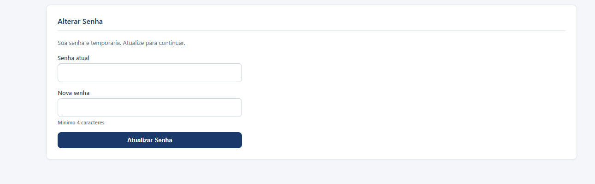
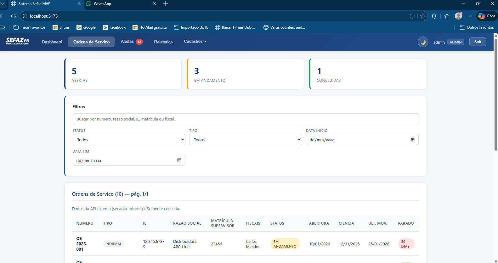
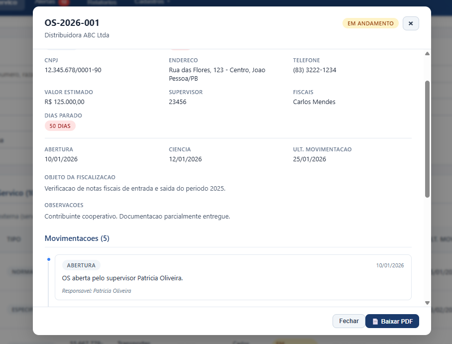
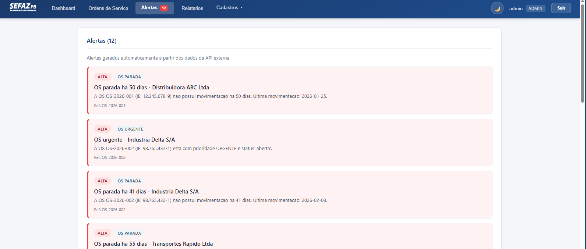
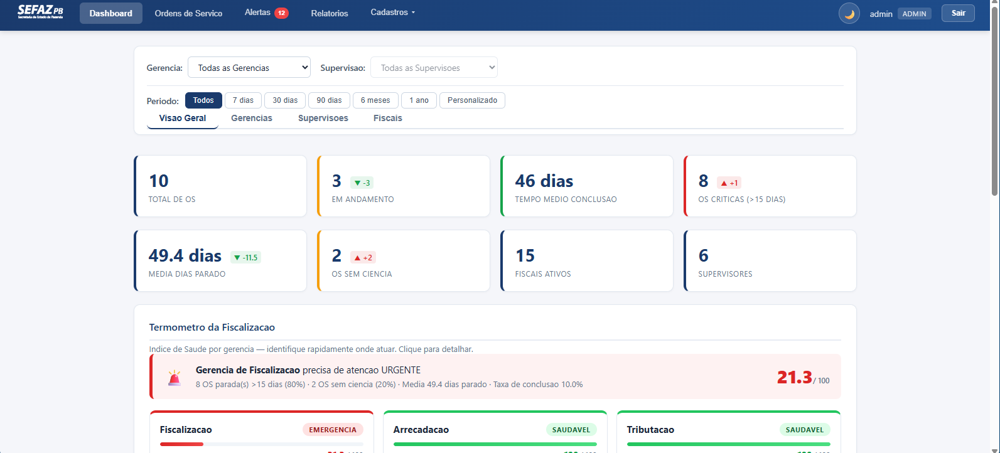
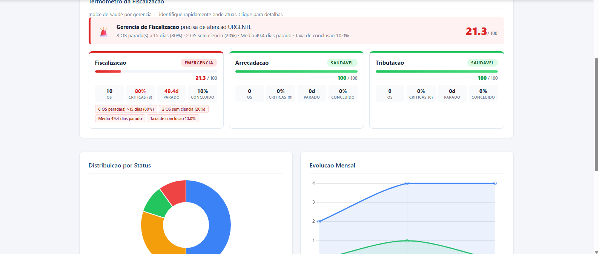
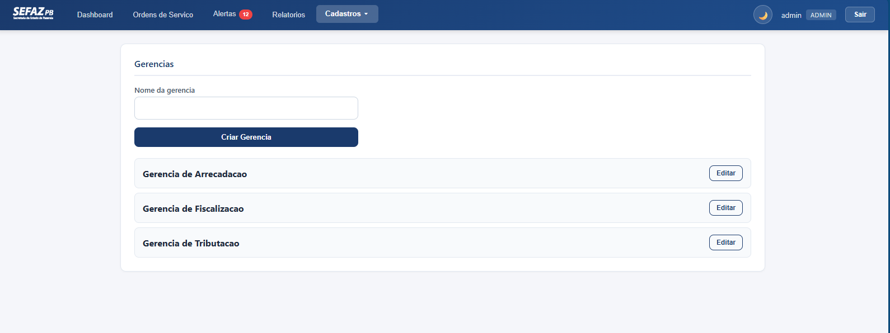
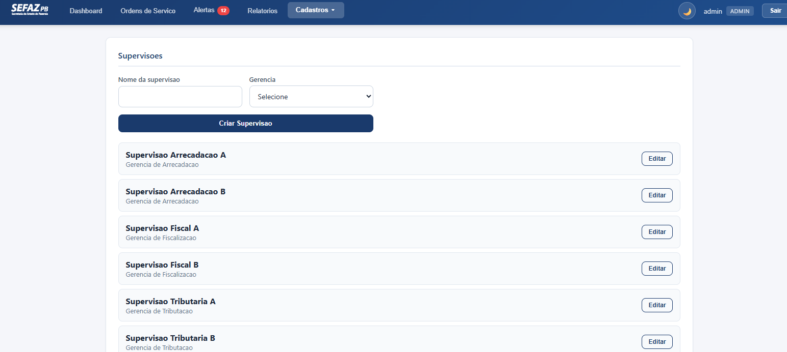
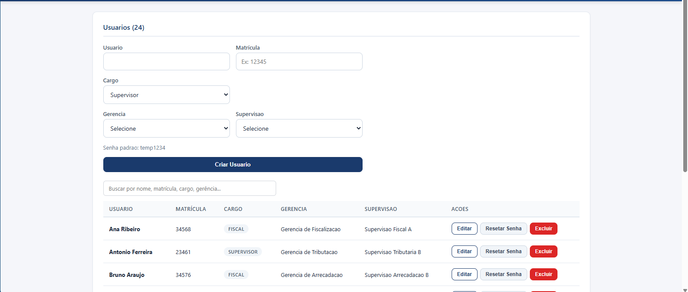
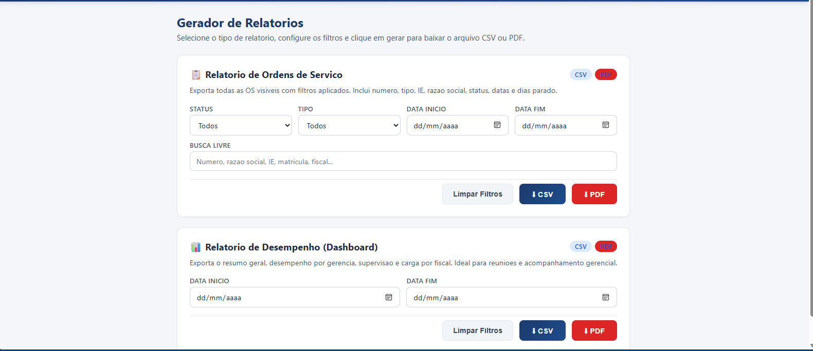

# Sistema SEFAZ PB – Gestao de Ordens de Servico

Sistema web para gestao e acompanhamento de Ordens de Servico (OS) da Secretaria de Estado da Fazenda da Paraiba, com hierarquia organizacional **Gerencia → Supervisao → Fiscal**, dashboard administrativo com graficos interativos, alertas automaticos, dark mode e integracao com banco IBM Informix.

---

## Indice

- [Visao Geral](#visao-geral)
- [Screenshots](#screenshots)
- [Tecnologias](#tecnologias)
- [Pre-requisitos](#pre-requisitos)
- [Instalacao](#instalacao)
- [Execucao](#execucao)
- [Credenciais](#credenciais)
- [Hierarquia Organizacional](#hierarquia-organizacional)
- [Funcionalidades](#funcionalidades)
- [Dashboard Administrativo](#dashboard-administrativo)
- [Formula do Indice de Saude](#formula-do-indice-de-saude)
- [Arquitetura](#arquitetura)
- [Estrutura do Projeto](#estrutura-do-projeto)
- [API REST – Endpoints](#api-rest--endpoints)
- [Testes](#testes)
- [Integracao ATF](#integracao-atf)
- [Configuracao](#configuracao)
- [Decisoes e Pendencias](#decisoes-e-pendencias)
- [Troubleshooting](#troubleshooting)
- [Notas de Producao](#notas-de-producao)

---

## Visao Geral

## Screenshots

### Primeiro Acesso (Troca de Senha)


### Ordens de Servico


### Detalhes da OS


### Alertas


### Dashboard


### Termometro e Graficos


### Cadastro de Gerencias


### Cadastro de Supervisoes


### Cadastro de Fiscais


### Relatorios


---

## Visao Geral

O Sistema SEFAZ PB permite que auditores fiscais, supervisores, gerentes e administradores acompanhem o andamento de Ordens de Servico de fiscalizacao tributaria. O sistema oferece:

- **Painel de OS** com filtros por status, tipo, periodo e busca textual
- **Dashboard com KPIs em tempo real**, graficos interativos e comparativo mensal
- **Termometro da Fiscalizacao** – ranking de saude por gerencia baseado em formula proporcional
- **Alertas automaticos** para OS urgentes, paradas e sem ciencia
- **Relatorios exportaveis** em CSV e PDF (OS e Dashboard)
- **Controle de acesso hierarquico** – cada perfil ve apenas o que lhe compete
- **Dark mode** com toggle e persistencia no localStorage

## Tecnologias

| Camada      | Tecnologia                                                     | Versao       |
| ----------- | -------------------------------------------------------------- | ------------ |
| Backend     | Python + FastAPI + Uvicorn                                     | 3.12 / 0.111 |
| Frontend    | React + Chart.js + react-chartjs-2                             | 18.3 / 4.5   |
| Bundler     | Vite                                                           | 5.4          |
| Banco Local | SQLite (usuarios, gerencias, supervisoes)                      | built-in     |
| Banco Ext.  | ATF REST/XML API (OS) + IBM Informix via pyodbc (legado)       | HTTPS / ODBC |
| HTTP Client | requests (chamadas HTTPS ao ATF)                               | 2.31+        |
| PDF         | fpdf2 (geracao de relatorios PDF)                              | 2.8.3        |
| Testes      | pytest                                                         | 8.x          |

## Pre-requisitos

- **Python** >= 3.12
- **Node.js** >= 18 (npm incluido)
- **IBM Informix Client SDK** (opcional – sistema funciona com dados MOCK sem ele)
- **pyodbc** + driver ODBC do Informix (opcional)

## Instalacao

```powershell
# 1. Clonar o repositorio
git clone <url-do-repo> sistema_sefaz
cd sistema_sefaz

# 2. Criar e ativar o ambiente virtual Python
python -m venv .venv
.venv\Scripts\Activate.ps1          # Windows PowerShell
# source .venv/bin/activate         # Linux/Mac

# 3. Instalar dependencias do backend
pip install -r backend\requirements.txt

# 4. Instalar dependencias do frontend
npm --prefix .\frontend install

# 5. Configurar variaveis de ambiente
cp .env.example .env
# Editar .env conforme necessidade (Informix, CORS, etc.)
```

## Execucao

### Script Automatico (recomendado)

```powershell
.\start.bat         # Windows – inicia backend + frontend
./start.sh          # Linux/Mac
```

### Manual (dois terminais)

```powershell
# Terminal 1 – Backend (API FastAPI)
.venv\Scripts\Activate.ps1
uvicorn backend.main:app --reload --host 0.0.0.0 --port 8000
# -> http://localhost:8000  (Swagger: http://localhost:8000/docs)

# Terminal 2 – Frontend (dev server)
npm --prefix .\frontend run dev
# -> http://localhost:5173
```

### Build do Frontend (producao)

```powershell
npm --prefix .\frontend run build
```

## Credenciais

Todos os usuarios sao criados automaticamente na primeira execucao (seed). Usuarios nao-admin usam senha temporaria e devem troca-la no primeiro login.

| Usuario             | Senha      | Cargo       | Gerencia             | Supervisao               |
| ------------------- | ---------- | ----------- | -------------------- | ------------------------- |
| `admin`             | `admin123` | Admin       | —                    | —                         |
| `Roberto Santos`    | `temp1234` | Gerente     | Fiscalizacao         | —                         |
| `Helena Rodrigues`  | `temp1234` | Gerente     | Arrecadacao          | —                         |
| `Sergio Barbosa`    | `temp1234` | Gerente     | Tributacao           | —                         |
| `Patricia Oliveira` | `temp1234` | Supervisor  | Fiscalizacao         | Supervisao Fiscal A       |
| `Joao Silva`        | `temp1234` | Supervisor  | Fiscalizacao         | Supervisao Fiscal B       |
| `Maria Santos`      | `temp1234` | Supervisor  | Arrecadacao          | Supervisao Arrecadacao A  |
| `Ricardo Pereira`   | `temp1234` | Supervisor  | Arrecadacao          | Supervisao Arrecadacao B  |
| `Lucia Costa`       | `temp1234` | Supervisor  | Tributacao           | Supervisao Tributaria A   |
| `Antonio Ferreira`  | `temp1234` | Supervisor  | Tributacao           | Supervisao Tributaria B   |
| `Carlos Mendes`     | `temp1234` | Fiscal      | Fiscalizacao         | Supervisao Fiscal A       |
| `Ana Ribeiro`       | `temp1234` | Fiscal      | Fiscalizacao         | Supervisao Fiscal A       |
| `Pedro Nascimento`  | `temp1234` | Fiscal      | Fiscalizacao         | Supervisao Fiscal A       |
| `Jose Almeida`      | `temp1234` | Fiscal      | Fiscalizacao         | Supervisao Fiscal B       |
| `Fernanda Costa`    | `temp1234` | Fiscal      | Fiscalizacao         | Supervisao Fiscal B       |
| `Marcos Silva`      | `temp1234` | Fiscal      | Arrecadacao          | Supervisao Arrecadacao A  |
| `Claudia Souza`     | `temp1234` | Fiscal      | Arrecadacao          | Supervisao Arrecadacao A  |
| `Rafael Lima`       | `temp1234` | Fiscal      | Arrecadacao          | Supervisao Arrecadacao A  |
| `Juliana Martins`   | `temp1234` | Fiscal      | Arrecadacao          | Supervisao Arrecadacao B  |
| `Bruno Araujo`      | `temp1234` | Fiscal      | Arrecadacao          | Supervisao Arrecadacao B  |
| `Tatiana Gomes`     | `temp1234` | Fiscal      | Tributacao           | Supervisao Tributaria A   |
| `Diego Cardoso`     | `temp1234` | Fiscal      | Tributacao           | Supervisao Tributaria A   |
| `Vanessa Rocha`     | `temp1234` | Fiscal      | Tributacao           | Supervisao Tributaria A   |
| `Leandro Pinto`     | `temp1234` | Fiscal      | Tributacao           | Supervisao Tributaria B   |
| `Camila Teixeira`   | `temp1234` | Fiscal      | Tributacao           | Supervisao Tributaria B   |

> **Total:** 1 admin + 3 gerentes + 6 supervisores + 15 fiscais = **25 usuarios**

## Hierarquia Organizacional

```
Admin (acesso total)
|
+-- Gerencia de Fiscalizacao
|   +-- Supervisao Fiscal A
|   |   +-- Patricia Oliveira (supervisor, mat. 23456)
|   |   +-- Carlos Mendes     (fiscal, mat. 34567)
|   |   +-- Ana Ribeiro       (fiscal, mat. 34568)
|   |   +-- Pedro Nascimento  (fiscal, mat. 34569)
|   +-- Supervisao Fiscal B
|       +-- Joao Silva        (supervisor, mat. 23457)
|       +-- Jose Almeida      (fiscal, mat. 34570)
|       +-- Fernanda Costa    (fiscal, mat. 34571)
|
+-- Gerencia de Arrecadacao
|   +-- Supervisao Arrecadacao A
|   |   +-- Maria Santos      (supervisor, mat. 23458)
|   |   +-- Marcos Silva      (fiscal, mat. 34572)
|   |   +-- Claudia Souza     (fiscal, mat. 34573)
|   |   +-- Rafael Lima       (fiscal, mat. 34574)
|   +-- Supervisao Arrecadacao B
|       +-- Ricardo Pereira   (supervisor, mat. 23459)
|       +-- Juliana Martins   (fiscal, mat. 34575)
|       +-- Bruno Araujo      (fiscal, mat. 34576)
|
+-- Gerencia de Tributacao
    +-- Supervisao Tributaria A
    |   +-- Lucia Costa       (supervisor, mat. 23460)
    |   +-- Tatiana Gomes     (fiscal, mat. 34577)
    |   +-- Diego Cardoso     (fiscal, mat. 34578)
    |   +-- Vanessa Rocha     (fiscal, mat. 34579)
    +-- Supervisao Tributaria B
        +-- Antonio Ferreira  (supervisor, mat. 23461)
        +-- Leandro Pinto     (fiscal, mat. 34580)
        +-- Camila Teixeira   (fiscal, mat. 34581)
```

### Regras de Visibilidade

| Perfil         | O que pode ver                                                     |
| -------------- | ------------------------------------------------------------------ |
| **Admin**      | Todas as OS, dashboard completo, CRUD de entidades                 |
| **Gerente**    | OS de todos os supervisores da sua gerencia                        |
| **Supervisor** | OS onde a `matricula_supervisor` e a sua matricula                 |
| **Fiscal**     | OS onde seu nome aparece no campo `fiscais`                        |

## Funcionalidades

### Autenticacao e Seguranca
- Login com token de sessao (UUID em memoria)
- Hash de senhas com **PBKDF2-HMAC-SHA256** (120.000 iteracoes + salt aleatorio de 16 bytes)
- Troca de senha obrigatoria no primeiro acesso (`must_change_password`)
- Reset de senha pelo admin (gera senha temporaria)

### Painel de Ordens de Servico
- Listagem com filtros via API ATF: numero da OS, modelo, IE, CNPJ, razao social, matriculas do fiscal/supervisor
- **Situacoes ATF**: 0-Aguardando Autorizacao, 1-Autorizada, 2-Cancelada, 3-Substituida, 4-Encerrada, 5-Bloqueada, 6-Em Analise para Encerramento, 7-Execucao Suspensa
- **Modelos**: 1-Normal, 2-Simplificada, 7-Especial, 8-Especifica
- Filtro por periodo de abertura e por periodo de ciencia (datas inicio/fim)
- **Paginacao servidor**: 20 registros por pagina (limite maximo: 50)
- Datas exibidas no formato brasileiro (DD/MM/AAAA)
- Download de PDF individual de cada OS

### Alertas Automaticos
Gerados em tempo real a partir das OS visiveis ao usuario:

| Tipo             | Severidade | Condicao                                |
| ---------------- | ---------- | --------------------------------------- |
| `os_urgente`     | Alta       | Prioridade "urgente" + status ativo     |
| `os_parada`      | Alta       | Parada > 15 dias sem movimentacao       |
| `os_sem_ciencia` | Media      | Status "aberta" sem data de ciencia     |

### CRUD Administrativo (somente Admin)
- Gerencias: criar, listar, editar
- Supervisoes: criar, listar, editar (com validacao de cascata gerencia-supervisao)
- Usuarios: criar, listar, editar, reset de senha (com validacao de cargo + lotacao)

### Interface
- **Dark mode**: toggle no topbar, persistido no `localStorage`
- **Filtro por periodo**: botoes predefinidos (7d, 30d, 90d, 6m, 1ano) + datas customizadas
- **Comparativo mensal**: deltas nos KPIs com setas coloridas (verde = melhoria, vermelho = piora)
- **Responsivo**: cards e tabelas adaptam-se a telas menores

## Dashboard Administrativo

Acessivel apenas pelo perfil **admin**. Contem:

### KPIs (Indicadores-Chave)
8 cards com metricas em tempo real + **deltas mensais** (com setas coloridas):
- Total de OS
- Em Andamento (seta vermelha = aumento e ruim)
- Tempo Medio de Conclusao (dias)
- OS Criticas (>15 dias paradas)
- Media de Dias Parado
- OS Sem Ciencia
- Fiscais Ativos
- Supervisores

O **comparativo mensal** compara o mes mais recente com o anterior e exibe indicadores:
- Seta verde para cima = melhoria (ex: mais concluidas)
- Seta vermelha para cima = piora (ex: mais criticas)

### Abas do Dashboard

| Aba          | Conteudo                                                                |
| ------------ | ----------------------------------------------------------------------- |
| Visao Geral  | Grafico pizza (status), evolucao mensal (linha), Termometro             |
| Gerencias    | Tabela + grafico comparativo por gerencia (barras agrupadas)            |
| Supervisoes  | Tabela + grafico comparativo por supervisao                             |
| Fiscais      | Tabela de carga de trabalho por fiscal                                  |

### Termometro da Fiscalizacao

Ranking visual de saude por gerencia, com cards coloridos por nivel:

| Nivel      | Score     | Cor              |
| ---------- | --------- | ---------------- |
| Saudavel   | 75–100    | Verde            |
| Atencao    | 50–74     | Amarelo          |
| Critico    | 25–49     | Laranja          |
| Emergencia | 0–24      | Vermelho         |

## Formula do Indice de Saude

O score e calculado de forma **proporcional** para escalar com qualquer volume de OS (a SEFAZ PB fiscaliza o estado inteiro):

```
Score = 100
      - (% OS criticas)           x 0.40   // Ate -40 pts
      - (dias parado medio)       x 0.5    // Cada dia = -0.5 pt
      - (100 - taxa conclusao%)   x 0.20   // Ate -20 pts
      - (% OS sem ciencia)        x 0.20   // Ate -20 pts
```

Onde:
- **OS critica** = OS ativa (aberta/em_andamento) parada ha mais de 15 dias
- **Taxa de conclusao** = (concluidas / total) x 100
- **OS sem ciencia** = status "aberta" sem `data_ciencia` preenchida
- Score final limitado entre 0 e 100 (clamped)

**Exemplo**: Gerencia com 20 OS, 4 criticas (20%), media 25 dias parado, taxa 40%, 3 sem ciencia (15%):
```
Score = 100 - (20 x 0.4) - (25 x 0.5) - (60 x 0.2) - (15 x 0.2) = 100 - 8 - 12.5 - 12 - 3 = 64.5 -> Atencao
```

As constantes da formula estao definidas em `backend/external_api.py`:
- `PESO_CRITICAS = 0.40`
- `PESO_DIAS_PARADO = 0.5`
- `PESO_TAXA_CONCLUSAO = 0.20`
- `PESO_SEM_CIENCIA = 0.20`
- `DIAS_CRITICO_THRESHOLD = 15`

## Arquitetura

```
+---------------+     HTTP/REST     +--------------------+
|  Frontend     | <---------------> |  Backend (API)     |
|  React SPA    |   JSON + Bearer   |  FastAPI/Uvicorn   |
|  Chart.js     |                   |                    |
+---------------+                   +---+--------+-------+
                                        |        |
                                    SQLite    ATF API / Informix
                                    (local)   (remoto – OS)
                                        |        |
                                    users    ordens_
                                    geren.   servico
                                    superv.
```

### Fluxo de Dados

1. **Frontend** -> `api.js` -> requisicao HTTP com token Bearer
2. **Backend** -> `main.py` -> valida token -> chama servico adequado
3. **Dados de OS** -> `external_api.py` -> se `ATF_BASE_URL` configurado: chama API ATF via HTTPS + parse XML -> senao: dados MOCK; Informix permanece como integracao legada
4. **Dados de usuarios** -> `db.py` -> SQLite local (`app.db`)
5. **Autenticacao** -> `auth.py` -> PBKDF2 hash + token UUID em memoria

### Principios de Design

- **Separacao de responsabilidades**: auth, db, schemas, external_api, config em modulos independentes
- **Fallback gracioso**: Informix indisponivel -> dados MOCK automaticamente
- **Validacao dupla**: Pydantic (schemas) + regras de negocio (endpoints)
- **Constantes nomeadas**: magic numbers extraidos para constantes (`DIAS_CRITICO_THRESHOLD`, `PESO_*`, `PBKDF2_ITERATIONS`)
- **Helpers reutilizaveis**: `_calcular_metricas_os()` usado por visao geral, gerencias, supervisoes e comparativo
- **Exception chaining**: `raise ... from exc` em todos os handlers de `IntegrityError`
- **DRY**: funcoes helper como `_get_user_by()`, `_validate_user_payload()` eliminam duplicacao

## Estrutura do Projeto

```
sistema_sefaz/
|-- backend/                        # API FastAPI (Python)
|   |-- main.py                     # Endpoints REST, middlewares, seed (1144 linhas)
|   |-- external_api.py             # OS via ATF/Informix/MOCK, alertas, dashboard (1472 linhas)
|   |-- auth.py                     # PBKDF2 hash, tokens, login/registro (141 linhas)
|   |-- db.py                       # SQLite repos: User, Gerencia, Supervisao (335 linhas)
|   |-- schemas.py                  # Modelos Pydantic request/response (224 linhas)
|   |-- informix_db.py              # Conexao ODBC com Informix + reconexao automatica (legado)
|   |-- config.py                   # Variaveis de ambiente (.env) incl. ATF_BASE_URL
|   +-- requirements.txt            # fastapi, uvicorn, python-dotenv, pyodbc, fpdf2, requests
|-- frontend/                       # SPA React (15 componentes)
|   |-- src/
|   |   |-- App.jsx                 # Componente raiz: auth, navegacao, data fetching (248 linhas)
|   |   |-- api.js                  # Cliente HTTP (ApiClient, URL configuravel)
|   |   |-- main.jsx                # Entry point React
|   |   |-- constants.js            # Labels, situacaoLabels, modeloLabels, formatarData
|   |   |-- styles.css              # CSS com variaveis + dark mode
|   |   +-- components/
|   |       |-- LoginPage.jsx       # Tela de login
|   |       |-- ChangePasswordPage.jsx # Troca de senha obrigatoria
|   |       |-- TopBar.jsx          # Barra superior com navegacao e dark mode
|   |       |-- OrdensPanel.jsx     # Painel de OS com filtros ATF e paginacao servidor (580 linhas)
|   |       |-- AlertasPanel.jsx    # Painel de alertas
|   |       |-- DashboardPanel.jsx  # Orquestrador do dashboard com abas e filtros
|   |       |-- DashboardGeral.jsx  # Aba Visao Geral: termometro, pizza, evolucao
|   |       |-- DashboardGerencias.jsx  # Aba Gerencias: tabela + grafico
|   |       |-- DashboardSupervisoes.jsx # Aba Supervisoes: tabela + grafico
|   |       |-- DashboardFiscais.jsx    # Aba Fiscais: carga de trabalho
|   |       |-- GerenciasAdmin.jsx  # CRUD de gerencias
|   |       |-- SupervisoesAdmin.jsx # CRUD de supervisoes
|   |       |-- UsuariosAdmin.jsx   # CRUD de usuarios com cascata
|   |       |-- RelatoriosPanel.jsx  # Gerador de relatorios CSV e PDF com filtros
|   |       +-- ConfirmModal.jsx    # Modal de confirmacao reutilizavel
|   |-- public/
|   |   +-- assets/app.js           # Bundle gerado pelo esbuild
|   |-- package.json                # react, chart.js, vite, esbuild
|   +-- vite.config.js
|-- tests/                          # 142 testes (unitarios + integracao)
|   |-- test_auth.py                # Hash, tokens, login, registro, troca de senha (18 testes)
|   |-- test_db.py                  # CRUD usuarios, gerencias, supervisoes – SQLite in-memory (16 testes)
|   |-- test_schemas.py             # Validacao Pydantic, campos obrigatorios/opcionais (14 testes)
|   |-- test_external_api.py        # Alertas, dashboard, filtros hierarquicos, dias parado (27 testes)
|   +-- test_integration.py         # Testes E2E com TestClient FastAPI (67 testes)
|-- docs/
|   +-- diagrama-er.md              # Diagrama ER (Mermaid) – SQLite + ATF
|-- .github/
|   +-- copilot-instructions.md     # Instrucoes para GitHub Copilot
|-- start.bat                       # Inicia backend + frontend (Windows)
|-- start_backend.bat               # Inicia backend com env Informix
|-- start.sh                        # Inicia backend + frontend (Linux/Mac)
|-- test_api.py                     # Testes manuais da API
|-- .env.example                    # Modelo de configuracao
+-- .env                            # Configuracao local (nao versionado)
```

## API REST – Endpoints

Base URL: `http://localhost:8000`

### Autenticacao

| Metodo | Rota                    | Descricao                            | Auth  |
| ------ | ----------------------- | ------------------------------------ | ----- |
| POST   | `/auth/login`           | Login -> retorna token + dados       | Nao   |
| POST   | `/auth/change-password` | Troca senha do usuario autenticado   | Token |

**Exemplo de login:**
```bash
curl -X POST http://localhost:8000/auth/login \
  -H "Content-Type: application/json" \
  -d '{"username": "admin", "password": "admin123"}'
```

**Resposta:**
```json
{
  "token": "uuid-do-token",
  "role": "admin",
  "user_id": 1,
  "username": "admin",
  "must_change_password": false,
  "matricula": null,
  "gerencia_id": null,
  "gerencia_name": null,
  "supervisao_id": null,
  "supervisao_name": null
}
```

### Ordens de Servico (somente leitura)

| Metodo | Rota                   | Descricao                                       | Auth  |
| ------ | ---------------------- | ----------------------------------------------- | ----- |
| GET    | `/ordens`              | Lista OS via ATF (com filtros e paginacao)      | Token |
| GET    | `/ordens/{numero}`     | Busca OS por numero (com verificacao hierarquica) | Token |
| GET    | `/ordens/{numero}/detalhe` | Detalhe completo de UMA OS (servico detalharOrdemServico) | Token |
| GET    | `/ordens/{numero}/pdf` | Gera e baixa PDF detalhado de uma OS            | Token |
| GET    | `/alertas`             | Lista alertas gerados                           | Token |

**Dois servicos do ATF, dois usos.** `/ordens` consome o
`listarOrdensServicoWebService` (doc da listagem) e alimenta o grid.
`/ordens/{numero}/detalhe` consome o `detalharOrdemServicoWebService`
(doc do detalhe) e e chamado a cada clique numa linha — uma OS por
chamada. O detalhe traz o que a listagem nao tem: contribuinte com
endereco, eventos de acompanhamento, prorrogacoes, notificacoes,
processos, justificativas de atraso, descricoes complementares e o
total recolhido. Como nenhum dos dois e superconjunto do outro (equipe
fiscal, dias de execucao e as medias por Modelo/Motivo so existem na
listagem), o painel sobrepoe o detalhe a linha ja carregada, campo a
campo, sem apagar o que vier vazio.

Os dois servicos precisam apontar para o mesmo ambiente do ATF, e a
doc do detalhe tem armadilhas no nome da operacao e na lista de retorno —
ver [Integracao ATF](#integracao-atf).

**Query params de `/ordens`:**

| Parametro          | Tipo        | Descricao                                              |
| ------------------ | ----------- | ------------------------------------------------------ |
| `numero_os`        | string      | Numero exato da OS                                     |
| `modelo`           | string      | Codigo do modelo: 1-Normal, 2-Simplificada, 7-Especial, 8-Especifica |
| `ie`               | string      | Inscricao Estadual                                     |
| `cnpj`             | string      | CNPJ do contribuinte                                   |
| `razao_social`     | string      | Parte do nome (minimo 6 caracteres)                    |
| `matriculas`       | string      | Matriculas separadas por virgula (fiscal/supervisor)   |
| `situacao`         | int[]       | Codigos de situacao: 0-Aguardando, 1-Autorizada, 2-Cancelada, 3-Substituida, 4-Encerrada, 5-Bloqueada, 6-Em Analise, 7-Execucao Suspensa |
| `data_abertura_ini`| string YYYY-MM-DD | Data inicial de abertura                       |
| `data_abertura_fim`| string YYYY-MM-DD | Data final de abertura                         |
| `data_ciencia_ini` | string YYYY-MM-DD | Data inicial de ciencia                        |
| `data_ciencia_fim` | string YYYY-MM-DD | Data final de ciencia                          |
| `pagina`           | int (>=1)   | Pagina atual (default: 1)                              |
| `limite`           | int (1-50)  | Registros por pagina (default: 20)                     |

**Headers obrigatorios:**
```
Authorization: Bearer <token>
```

### Relatorios

| Metodo | Rota                            | Descricao                          | Auth  |
| ------ | ------------------------------- | ---------------------------------- | ----- |
| GET    | `/relatorios/ordens`            | Exporta OS em CSV (com filtros)    | Token |
| GET    | `/relatorios/ordens/pdf`        | Exporta OS em PDF (com filtros)    | Token |
| GET    | `/relatorios/dashboard`         | Exporta dashboard em CSV           | Admin |
| GET    | `/relatorios/dashboard/pdf`     | Exporta dashboard em PDF           | Admin |

### Administracao (somente Admin)

| Metodo | Rota                                              | Descricao                          |
| ------ | ------------------------------------------------- | ---------------------------------- |
| GET    | `/admin/dashboard`                                | Dashboard com KPIs e graficos      |
| GET    | `/admin/dashboard?data_inicio=...&data_fim=...`   | Dashboard filtrado por periodo     |
| POST   | `/admin/gerencias`                                | Criar gerencia                     |
| GET    | `/admin/gerencias`                                | Listar gerencias                   |
| PUT    | `/admin/gerencias/{id}`                           | Atualizar gerencia                 |
| POST   | `/admin/supervisoes`                              | Criar supervisao                   |
| GET    | `/admin/supervisoes`                              | Listar supervisoes                 |
| GET    | `/admin/supervisoes?gerencia_id={id}`             | Listar supervisoes de uma gerencia |
| PUT    | `/admin/supervisoes/{id}`                         | Atualizar supervisao               |
| POST   | `/admin/users`                                    | Criar usuario                      |
| GET    | `/admin/users`                                    | Listar usuarios                    |
| PUT    | `/admin/users/{id}`                               | Atualizar usuario                  |
| DELETE | `/admin/users/{id}`                               | Excluir usuario (retorna 204)      |
| POST   | `/admin/users/{id}/reset-password`                | Resetar senha                      |

### Resposta do Dashboard (`GET /admin/dashboard`)

```json
{
  "visao_geral": {
    "total_os": 30,
    "os_abertas": 14,
    "os_em_andamento": 8,
    "os_concluidas": 7,
    "os_canceladas": 1,
    "dias_parado_medio": 23.5,
    "os_criticas": 18,
    "os_sem_ciencia": 6,
    "tempo_medio_conclusao": 12.3,
    "total_fiscais": 15,
    "total_supervisores": 6
  },
  "comparativo_mensal": {
    "total_os": { "atual": 9, "anterior": 9, "delta": 0 },
    "em_andamento": { "atual": 3, "anterior": 5, "delta": -2 },
    "os_criticas": { "atual": 5, "anterior": 8, "delta": -3 },
    "os_sem_ciencia": { "atual": 2, "anterior": 4, "delta": -2 },
    "tempo_medio_conclusao": { "atual": 10.0, "anterior": 14.0, "delta": -4.0 },
    "dias_parado_medio": { "atual": 22.0, "anterior": 28.0, "delta": -6.0 },
    "_labels": { "mes_atual": "2026-02", "mes_anterior": "2026-01" }
  },
  "distribuicao_status": {
    "aberta": 14,
    "em_andamento": 8,
    "concluida": 7,
    "cancelada": 1
  },
  "evolucao_mensal": [
    { "mes": "2025-09", "abertas": 1, "concluidas": 0 }
  ],
  "desempenho_gerencias": [
    {
      "id": 1,
      "nome": "Gerencia de Fiscalizacao",
      "total_os": 10,
      "os_abertas": 5,
      "os_em_andamento": 3,
      "os_concluidas": 2,
      "os_canceladas": 0,
      "taxa_conclusao": 20.0,
      "os_criticas": 6,
      "os_sem_ciencia": 3,
      "tempo_medio_conclusao": 15.0
    }
  ],
  "ranking_criticidade": [
    {
      "id": 1,
      "nome": "Gerencia de Fiscalizacao",
      "indice_saude": 37.1,
      "nivel": "critico",
      "total_os": 10,
      "os_criticas": 6,
      "pct_criticas": 60.0,
      "os_sem_ciencia": 3,
      "pct_sem_ciencia": 30.0,
      "dias_parado_medio": 28.0,
      "taxa_conclusao": 20.0,
      "problemas": [
        "6 OS parada(s) >5 dias (60%)",
        "3 OS sem ciencia (30%)",
        "Media 28.0 dias parado",
        "Taxa de conclusao 20.0%"
      ]
    }
  ],
  "desempenho_supervisoes": [
    { "id": 1, "nome": "Supervisao Fiscal A", "gerencia": "...", "total_os": 5 }
  ],
  "carga_fiscais": [
    { "nome": "Carlos Mendes", "os_ativas": 4, "os_criticas": 3, "os_sem_ciencia": 1 }
  ]
}
```

## Testes

O projeto possui **142 testes** (unitarios + integracao) com cobertura dos modulos principais:

| Modulo         | Arquivo                      | Testes | Foco                                                         |
| -------------- | ---------------------------- | ------ | ------------------------------------------------------------ |
| Autenticacao   | `tests/test_auth.py`         | 18     | Hash PBKDF2, criacao/validacao de token, login, registro, troca/reset de senha |
| Banco de Dados | `tests/test_db.py`           | 16     | CRUD de users, gerencias, supervisoes (SQLite in-memory)     |
| Schemas        | `tests/test_schemas.py`      | 14     | Validacao Pydantic, campos obrigatorios/opcionais            |
| API Externa    | `tests/test_external_api.py` | 27     | Alertas, dashboard, filtros hierarquicos, dias parado, metricas |
| Integracao     | `tests/test_integration.py`  | 67     | Testes E2E com TestClient FastAPI (auth, CRUD, OS, dashboard) |
| Informix       | `tests/test_informix.py`     | —      | Script standalone de diagnostico de conexao Informix (nao coletado pelo pytest) |

```powershell
# Rodar todos os testes
.venv\Scripts\Activate.ps1
python -m pytest tests/ -v

# Rodar modulo especifico
python -m pytest tests/test_auth.py -v

# Rodar com cobertura (requer pytest-cov)
python -m pytest tests/ --cov=backend --cov-report=term-missing
```

## Integracao ATF

O sistema consulta a **API ATF (SEFAZ PB)** via SOAP sobre HTTPS para ler
Ordens de Servico. Se `ATF_BASE_URL` nao estiver configurado, usa **dados
MOCK** automaticamente — e o que permite desenvolver sem rede.

### Os dois servicos

Ambos ficam no mesmo endpoint (`POST {ATF_BASE_URL}/<caminho-do-servico>`);
o que muda e a operacao dentro do envelope SOAP.

| Servico | Doc | Usado em | Traz |
| ------- | --- | -------- | ---- |
| `listarOrdensServicoWebService` | doc da listagem | grid de OS, relatorios, PDF | lista completa (sem paginacao), com equipe fiscal, dias de execucao e medias por Modelo/Motivo |
| `detalharOrdemServicoWebService` | doc do detalhe | clique numa linha do grid — uma OS por vez | contribuinte com endereco, eventos, prorrogacoes, notificacoes, processos, justificativas, recolhimentos |

Nenhum dos dois e superconjunto do outro, entao a OS exibida e a
**sobreposicao** dos dois: o detalhe cobre a linha do grid campo a campo,
e o que vier vazio nao apaga o que a listagem trouxe. Sem isso, abrir uma
OS apagaria da tela a equipe fiscal e os campos calculados.

A regra canonica e `mesclar_detalhe_os()`, em `external_api.py`, usada
pelo PDF de uma OS. O painel repete a mesma logica em `OrdensPanel.jsx`
(`sobrepor` / `mesclarDetalhe`) porque la a linha ja esta em maos:
refazer a consulta da listagem custaria ~1,5s a cada clique, contra 0,5s
do detalhe sozinho. **Sao duas implementacoes da mesma regra — mexeu numa,
mexa na outra.**

O **PDF de uma OS** (`/ordens/{numero}/pdf`) sai com o mesmo conteudo do
modal. Como o servidor nao tem a linha do grid em maos, ele busca os dois
servicos e mescla — por isso o download demora mais que abrir o modal. Se
o servico de detalhe falhar, o PDF sai so com os dados da listagem em vez
de nao sair: em producao ele ainda nao esta publicado.

### Ambientes — leia antes de trocar a URL

**Os dois servicos precisam apontar para o MESMO ambiente.** Producao e
desenvolvimento tem bancos diferentes: a mesma OS volta com outro
contribuinte, outra situacao e outros fiscais em cada um. Misturar
produz um registro incoerente na tela e — pior — faria a checagem de
hierarquia ser decidida por dados de desenvolvimento.

Os dois servicos nem sempre estao publicados no mesmo ambiente: pode
haver um momento em que so o ambiente de homologacao responde aos dois,
enquanto producao atende apenas a listagem. Por isso o ambiente ativo e
decidido por `.env` — **nenhum endereco vive no repositorio**.

Para migrar de ambiente:

1. Trocar `ATF_BASE_URL` no `.env`.
2. **Conferir o `?wsdl` de producao antes**: o nome da operacao difere
   entre os ambientes (ver a armadilha abaixo).
3. Refazer o mapeamento de qualquer codigo do ATF guardado no banco
   local — codigos coletados em desenvolvimento podem nao valer em
   producao.

`ATF_DETALHE_BASE_URL` existe para o caso de ser mesmo necessario separar
os dois servicos em ambientes distintos. Vazia (o normal) = usa a mesma
URL da listagem. Preenchida, a permissao de acesso a OS passa
automaticamente a ser decidida pela **listagem**, nunca pelos fiscais do
outro banco — ver `_buscar_detalhe_os_atf`, em `main.py`.

### Armadilhas da doc do detalhe

- **Nome da operacao muda por ambiente.** O elemento da requisicao e
  `detalharOrdemServicoRequest`, como a doc descreve — mas um dos
  ambientes publica a operacao com um infixo a mais no nome. Errar
  devolve HTTP 500 com o SOAP Fault `Message part [...] was not
  recognized`. Sempre conferir no `?wsdl` do ambiente de destino.
- **SOAP Fault vem com HTTP 500.** Um `raise_for_status()` seco descarta
  justamente a mensagem que explica o erro; por isso `_erro_soap()` le o
  `<faultstring>` antes de tratar como falha de transporte.
- **A lista de retorno ja esteve incompleta.** A revisao de 21/08/2026
  fechou a lacuna: `equipeFiscalizacao` / `noEquipe` (o nome da equipe
  fiscal) e `tpBdFiscal` / `dsTpBdFiscal` passaram a constar, e as
  estruturas de `recolhimentoOS` e `denuncia` — antes so citadas pelo
  nome da lista — foram detalhadas. Todas sao lidas. Vale reconferir a
  cada revisao da doc: comparar as tags de uma resposta real com a
  arvore documentada leva minutos e ja achou campo util escondido.
- **`cdEquipe` foi anunciado mas nao existe.** O time do ATF chegou a
  informar que o codigo da equipe entraria no bloco `equipeFiscalizacao`;
  ele nao esta na doc revisada nem em nenhuma das 17 OS conferidas. O
  parser ja o le por antecipacao; ate la o codigo da equipe vem da
  listagem, pela mesclagem.
- **"Nenhum registro satisfaz a pesquisa"** e como o ATF diz que a OS nao
  existe. Numa busca por numero isso vira 404, nao erro de negocio.
- Ficam de fora do parser, de proposito (estes SAO documentados): os
  codigos redundantes do endereco `cdcorreios`, `cdcorreiosUf` e
  `cdibgeUf`, que repetem municipio e UF ja exibidos.
- **O bloco de Cancelamento nao existe no retorno.** A tela do ATF
  mostra Data, Motivo, Usuario e Descricao do cancelamento; o contrato
  do detalhe nao tem nenhum desses campos — so `<autorizacao>`. Numa OS
  cancelada, portanto, nao ha como exibir o motivo. Nao e lacuna do
  parser: e o servico que nao expoe. Se a area fiscal precisar, tem que
  ser pedido a SEFAZ como campo novo.
- **Recolhimentos e denuncias sao lidos pelo contrato, sem validacao
  contra dado real:** nenhuma das 40 OS varridas no ambiente de teste
  trouxe esses blocos preenchidos. Se aparecer divergencia quando houver
  dado de verdade, e ali que se olha primeiro.

### Configuracao ATF

```bash
# Os dois servicos saem desta URL. Trocar so com o passo a passo acima.
ATF_BASE_URL=https://<host-homologacao>

# Vazia = detalhe usa a URL acima. So preencher para separar ambientes.
ATF_DETALHE_BASE_URL=

# Segundos de cache das respostas do ATF. 0 desliga.
ATF_CACHE_TTL=60
```

### Situacoes e Modelos (ATF)

| Codigo | Situacao                         |
| ------ | -------------------------------- |
| 0      | Aguardando Autorizacao           |
| 1      | Autorizada                       |
| 2      | Cancelada                        |
| 3      | Substituida                      |
| 4      | Encerrada                        |
| 5      | Bloqueada                        |
| 6      | Em Analise para Encerramento     |
| 7      | Execucao Suspensa                |

| Codigo | Modelo        |
| ------ | ------------- |
| 1      | Normal        |
| 2      | Simplificada  |
| 7      | Especial      |
| 8      | Especifica    |

### Bloqueio por atraso na cientificacao (situacao 5)

Regra do ATF, informada pela SEFAZ em 25/08/2026 junto com os casos de
teste do detalhe. Explica de onde vem a situacao **Bloqueada** e por que
ela e a unica que depende de uma acao do supervisor:

1. o auditor e designado para a OS;
2. se ele nao registra a **ciencia** em tres dias (prazo parametrizavel
   no ATF), uma rotina automatica **bloqueia** a OS;
3. para desbloquear, o auditor insere na OS uma justificativa do tipo
   **ATRASO NA CIENTIFICACAO**, dirigida ao seu supervisor;
4. de posse da justificativa, **o supervisor procede com o desbloqueio**.

O que isso significa para este sistema: uma OS bloqueada e uma
**pendencia do supervisor**, nao um estado passivo. Os dados para
detectar isso ja chegam — situacao 5 na listagem, e a justificativa com
`dsTipoJustifAtraso` no detalhe.

Hoje o painel apenas exibe a situacao; nao ha alerta nem filtro que trate
o bloqueio como fila de trabalho do supervisor. **Nao foi implementado
porque nao foi pedido** — mas e o candidato mais obvio a virar alerta,
agora que o supervisor enxerga a propria equipe.

Cuidado ao desenhar isso: o desbloqueio acontece **no ATF**, nao aqui.
Este sistema e somente leitura sobre a OS, entao o maximo que cabe e
apontar a pendencia, nunca sugerir que ela foi resolvida.

## Configuracao

Todas as variaveis ficam no arquivo `.env` (copiado de `.env.example`):

| Variavel             | Descricao                              | Padrao                     |
| -------------------- | -------------------------------------- | -------------------------- |
| `APP_TITLE`          | Titulo da aplicacao                    | `Sistema Sefaz`            |
| `LOG_LEVEL`          | Nivel de log (DEBUG/INFO/WARNING)      | `INFO`                     |
| `DEFAULT_PASSWORD`   | Senha temporaria para novos usuarios   | `temp1234`                 |
| `CORS_ORIGINS`       | Origens permitidas (separadas por `,`) | `http://localhost:5173`    |
| `ATF_BASE_URL`       | URL base da API ATF (vazio = usa MOCK). Ver [Ambientes](#ambientes--leia-antes-de-trocar-a-url) antes de trocar | `""` (vazio)               |
| `ATF_DETALHE_BASE_URL` | URL so do servico de detalhe. Vazia = usa `ATF_BASE_URL` | `""` (vazio)             |
| `ATF_CACHE_TTL`      | Segundos de cache das respostas do ATF (0 desliga) | `60`             |
| `INFORMIX_SERVER`    | Servidor Informix (legado)             | (vazio = nao usa Informix) |
| `INFORMIX_DATABASE`  | Nome do banco Informix                 | —                          |
| `INFORMIX_HOST`      | Host do servidor Informix              | —                          |
| `INFORMIX_PORT`      | Porta ODBC Informix                    | `9088`                     |
| `INFORMIX_USER`      | Usuario do banco Informix              | —                          |
| `INFORMIX_PASSWORD`  | Senha do banco Informix                | —                          |
| `INFORMIX_PROTOCOL`  | Protocolo de conexao Informix          | `onsoctcp`                 |

### Variaveis do Frontend (build)

A URL da API e configurada automaticamente pelo Vite via `import.meta.env.VITE_API_BASE_URL`.
Se nao definida, o padrao e `http://localhost:8000`.

## Decisoes e Pendencias

Registro do que foi decidido e do que esta parado esperando terceiros.
Serve para nao "corrigir" de novo algo que ja foi decidido assim de
proposito. Ultima revisao: 25/08/2026.

### Esperando a SEFAZ

| O que falta | O que fica travado |
| ----------- | ------------------ |
| **Quem chefia cada equipe fiscal** | A planilha da SEFAZ traz a composicao das equipes, mas nao diz quem e o supervisor de cada uma. Ate vir, o vinculo e feito a mao pelo admin no cadastro de usuarios (campo "Equipe Fiscal"). |
| Tabelas de codigo de `stPrazoOS`, `tpNatureza` e `tpDocumento` | Esses campos chegam so como codigo (`"0"`, `"I"`, `"1"`), sem descricao em lugar nenhum. Continuam na resposta da API, mas saem da tela — um numero solto nao informa ninguem. Ha comentario no `OrdensPanel.jsx` marcando onde recoloca-los. |

### Equipes fiscais (resolvido em 25/08/2026)

A SEFAZ entregou a planilha `DADOS_ORDEM_SERVICO.xlsx`, com cinco abas
de tabelas de dominio. Modelo de OS, motivo de abertura e status ja
estavam corretos no sistema; as duas que mudaram alguma coisa foram:

**Aba "Grupos de Auditores"** — e a tabela de equipes fiscais que
faltava: 46 equipes com codigo (`cdEquipeFisc`) e nome, e a composicao
de cada uma (339 vinculos, 334 auditores). Importada por
`python -m backend.importar_equipes CAMINHO/DADOS_ORDEM_SERVICO.xlsx`,
que grava em `equipes_fiscais` e `equipe_membros`. Com ela:

- o filtro "Equipe Fiscal" do painel virou um `<select>` por nome. Se a
  importacao nunca rodou, a lista volta vazia e o campo degrada para o
  antigo, onde se digita o codigo;
- um supervisor pode ser amarrado a uma equipe (`users.equipe_codigo`),
  e entao e ela que define o que ele enxerga.

**Aba "Elementos Organizacionais"** — confere com os 18 orgaos
executores fixos em `constants.js`, codigo e sigla, sem divergencia. A
planilha tem 595 elementos (344 ativos e com sigla), mas nem todo
elemento organizacional executa OS: os 18 sao uma curadoria da area
fiscal, e foram **mantidos como estao** por decisao de 25/08/2026.
Expandir a lista enche o filtro de opcoes que nunca retornam OS. A
planilha serve aqui como fonte para conferir, nao para substituir.

#### A importacao substitui, nao mescla

`substituir_tudo` apaga as duas tabelas antes de gravar. E de proposito:
quem sai de uma equipe some da planilha seguinte sem deixar rastro, e um
merge manteria o vinculo antigo vivo — dando a um supervisor acesso a OS
de quem nao e mais dele.

O `users.equipe_codigo` nao e tocado pela importacao. Um codigo que
aponte para equipe extinta vira conjunto vazio na leitura, nunca "ve
tudo".

#### A planilha nao entra no repositorio

Ela tem nome e matricula de 334 servidores. O importador e versionado, o
arquivo nao — guarde-o fora do repo (ver `NOTAS-INTERNAS.md`). O
endpoint `/equipes-fiscais` devolve so codigo e nome das equipes, e por
isso e aberto a qualquer usuario autenticado; a lista de membros, com
nome e matricula, fica em `/admin/equipes-fiscais/{codigo}/membros` e
exige admin.

### Passando dos usuarios de exemplo para os reais

O banco nasce com 25 usuarios de exemplo (matriculas `12345`, `23456`,
`34567`...) que existem para a demo abrir com algo na tela e para casar
com o MOCK de OS. Eles **nao tem correlacao com os dados do ATF**: as
matriculas sao ficticias e nunca aparecem numa OS real.

Para trabalhar com matricula real, a partir da mesma planilha:

```bash
# 1. as equipes (46 equipes, 339 vinculos)
python -m backend.importar_equipes CAMINHO/DADOS_ORDEM_SERVICO.xlsx

# 2. os auditores como usuarios (334 pessoas)
python -m backend.importar_usuarios CAMINHO/DADOS_ORDEM_SERVICO.xlsx --remover-seed
```

Os dois aceitam `--dry-run`. O segundo:

- cria todos como **fiscal, sem gerencia nem supervisao** — e o unico
  cargo que o modelo resolve so pela matricula. Quem for supervisor e
  promovido depois na tela de admin, onde tambem se amarra a equipe;
- e **idempotente**: quem ja tem a matricula cadastrada e pulado;
- com `--remover-seed`, apaga antes os usuarios de exemplo. O admin nunca
  e tocado — ele nao tem matricula, e o `DELETE` ainda filtra por
  `role != 'admin'`;
- grava as senhas temporarias em `backend/senhas-iniciais.csv` para o
  admin repassar. **Apague o arquivo depois**; o `.gitignore` ja barra
  `*.csv`, mas ele nao deveria sobreviver ao repasse. Em ambiente de
  teste, `--senha "Algo@123"` usa a mesma para todos e nao gera o arquivo
  (a troca no primeiro acesso continua exigida).

As gerencias e supervisoes de exemplo **nao** sao removidas: o cadastro
de usuario ainda exige lotacao, entao elas seguem servindo ate voce criar
as reais. Renomeie ou substitua pela tela de admin.

#### O seed nao volta sozinho

`_seed_database` roda a cada start e agora decide em tres passos:

| Situacao do banco | O que acontece |
| ----------------- | -------------- |
| vazio | admin + 25 usuarios de exemplo (comportamento historico) |
| vazio, mas com equipes ja importadas | so o admin |
| com usuarios importados e sem admin | cria o admin, e nada mais |
| em uso | nada |

O admin e verificado **por si**, e nao por "o banco esta vazio". Sem
isso, importar usuarios num banco novo antes do primeiro start deixava o
sistema sem ninguem capaz de administra-lo — o seed via o banco povoado e
nunca criava um admin.

### Pertencer a uma equipe nao e chefiar uma equipe

Sao dois dados diferentes, e a distincao e o que impede a importacao de
virar uma falha de acesso:

| | Onde mora | De onde vem | Efeito |
| --- | --- | --- | --- |
| **Pertence** | `equipe_membros` | planilha da SEFAZ | nenhum sobre visibilidade; e informativo |
| **Chefia** | `users.equipe_codigo` | preenchido pelo admin | o supervisor passa a ver as OS de toda a equipe |

Depois de importar, os 334 auditores tem equipe (pertencimento) e nenhum
tem chefia — e o correto. Se a importacao preenchesse `equipe_codigo`,
cada auditor viraria supervisor da propria equipe e enxergaria as OS de
todos os colegas.

Na tela de Usuarios as duas aparecem em colunas separadas: **Equipe
(ATF)**, so leitura, e **Chefia**, editavel. Ao promover alguem a
supervisor, a chefia ja vem preenchida com a equipe a que a pessoa
pertence — quem esta em duas fica sem sugestao, para o admin escolher.

### Como a visibilidade e resolvida hoje

`_matriculas_visiveis` (em `main.py`) monta o conjunto de matriculas que
o usuario pode enxergar:

| Cargo | Ve as OS de |
| ----- | ----------- |
| admin | todas (sem restricao) |
| gerente | a propria matricula + todos os lotados na sua gerencia |
| supervisor | a propria + a **equipe fiscal do ATF**, se houver uma amarrada; senao, os lotados na sua supervisao |
| fiscal | apenas a propria |

A equipe fiscal tem precedencia sobre a supervisao local por ser a fonte
da verdade da SEFAZ, e cobre tambem os fiscais que ainda nao tem login
no sistema — com o cadastro local, um fiscal sem usuario era invisivel
para o proprio supervisor.

Quem nao tem matricula nem lotacao recebe conjunto vazio e nao ve nada.
O filtro falha fechado: cadastro incompleto nunca vira acesso irrestrito.

### Em aberto — decisao de politica, nao tecnica

Restringir a visibilidade por **equipe fiscal da OS** (`cdEquipeFisc` no
registro) em vez de por **matricula designada** continua em aberto. Nao
e a mesma coisa que o vinculo supervisor-equipe descrito acima: aquele
usa a equipe para montar o conjunto de matriculas, e o criterio final
continua sendo "alguem desse conjunto esta designado na OS".

> Um fiscal da equipe A, designado numa OS da equipe B, deve ver essa OS?
> Pelo criterio de matricula ele ve; pelo de equipe, nao.

Medicao em dados reais (246 OS abertas em 07/2026) para embasar:

- 21 equipes distintas;
- 9% das OS nao tem equipe fiscal — e sao **exatamente as mesmas** que
  nao tem fiscal designado, entao os dois criterios cobrem o mesmo
  universo;
- essas mesmas OS (abertas e ainda nao distribuidas) hoje sao
  **invisiveis para supervisor e gerente** — so o admin as ve, porque o
  filtro exige alguem da equipe designado na OS. Se a intencao e o
  supervisor acompanhar o que ainda nao foi distribuido, isso e uma
  lacuna do modelo atual, independente de equipe fiscal.

Para implementar por equipe da OS seria preciso comparar o
`equipe_fiscal_codigo` do registro com a equipe do usuario, e nao a
lista de fiscais designados.

### Convencao de interface: codigo e coisa interna

O usuario final le **nomes**; os codigos do ATF (`cdModeloOS`,
`cdMotivoAberturaOS`, `cdElementoOrg`, situacao...) continuam indo e
voltando nas consultas e nos `value` dos `<select>`, mas nao aparecem na
tela. O helper `nomeOuCodigo()` no `OrdensPanel.jsx` centraliza a regra:
mostra o nome e so cai no codigo quando o ATF manda o codigo sem
descricao.

Um efeito colateral disso ja mordeu uma vez: o detalhe manda o *codigo*
do status do fiscal (`stFiscalOS` = `"0"`) e a listagem manda o *texto*
(`"DESIGNADO"`). Mapear os dois para a mesma chave fazia o codigo apagar
a descricao na mesclagem — por isso o detalhe usa `status_codigo`.

### Divida tecnica conhecida

- `listaDenuncia` e `recolhimentoOS` sao parseados pelo contrato da doc
  revisada, mas nunca chegaram preenchidos no ambiente de teste (40 OS
  varridas). A leitura desses dois blocos e a unica parte do detalhe que
  nunca foi confrontada com dado real.

## Troubleshooting

| Problema                       | Solucao                                                      |
| ------------------------------ | ------------------------------------------------------------ |
| Backend nao inicia             | Verificar se venv esta ativo e porta 8000 livre              |
| Frontend nao carrega           | Verificar se backend esta rodando e CORS configurado         |
| Dados MOCK em vez de ATF       | Verificar se `ATF_BASE_URL` esta definido no `.env`          |
| Informix nao conecta           | Executar `python tests\test_informix.py` para diagnostico    |
| Dados MOCK em vez de Informix  | Verificar variaveis `INFORMIX_*` no `.env`                   |
| Dashboard sem dados            | Logar como `admin` – dashboard e exclusivo para admin        |
| Score sempre 0                 | Verificar se ha OS com `data_ultima_movimentacao` antiga      |
| Dark mode nao persiste         | Verificar se `localStorage` esta habilitado no navegador     |
| `IntegrityError` ao criar user | Username ou matricula ja existe no banco                     |
| Deltas nao aparecem nos KPIs   | Precisa de OS em pelo menos 2 meses diferentes               |
| CORS bloqueando requisicoes    | Adicionar a origem em `CORS_ORIGINS` no `.env`               |

### Comandos Uteis

```powershell
# Limpar banco SQLite (recria do zero na proxima execucao)
Remove-Item backend\app.db

# Ver portas em uso
Get-NetTCPConnection -LocalPort 8000,5173 -ErrorAction SilentlyContinue

# Rebuild do frontend
cd frontend; npx esbuild src/main.jsx --bundle --outfile=public/assets/app.js --loader:.jsx=jsx --loader:.css=css

# Rodar testes com output detalhado
python -m pytest tests/ -v --tb=short

# Ver Swagger da API
# Abra http://localhost:8000/docs no navegador
```

## Notas de Producao

Para deploy em producao, considerar:

| Item                    | Dev (atual)                | Producao (recomendado)          |
| ----------------------- | -------------------------- | ------------------------------- |
| Banco de usuarios       | SQLite (`app.db`)          | PostgreSQL ou MySQL             |
| Tokens de sessao        | UUID em memoria (dict)     | JWT + Redis                     |
| Hash de senha           | PBKDF2 (120k iteracoes)   | Argon2id                        |
| Frontend                | esbuild dev                | Build otimizado + CDN           |
| CORS                    | `localhost:5173`           | Dominio real                    |
| HTTPS                   | Nao                        | Certificado TLS obrigatorio     |
| Rate limiting           | Nao                        | Middleware ou WAF               |
| Monitoramento           | Logs (stdout)              | Sentry, Datadog, etc.           |
| Backup de dados         | Nao                        | Rotina automatizada             |
| App.jsx                 | 245 linhas (decomposto)    | 14 componentes separados (OK)   |

### Proximos Passos Sugeridos

1. **Implementar JWT** com refresh tokens para sessoes persistentes
2. ~~**Exportar relatorios** em PDF/Excel a partir do dashboard~~ ✅ (CSV + PDF implementados)
3. **Implementar WebSocket** para alertas em tempo real
4. **Adicionar testes end-to-end** com Playwright ou Cypress
5. **Migrar banco de usuarios** para PostgreSQL em producao
