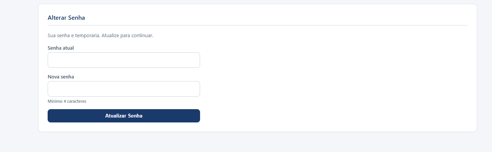
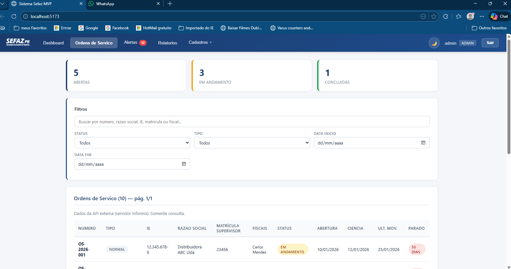
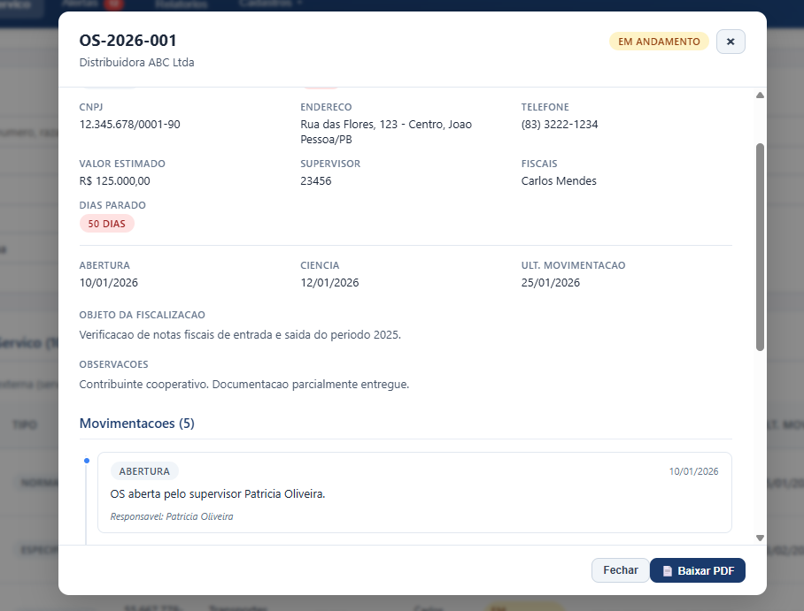
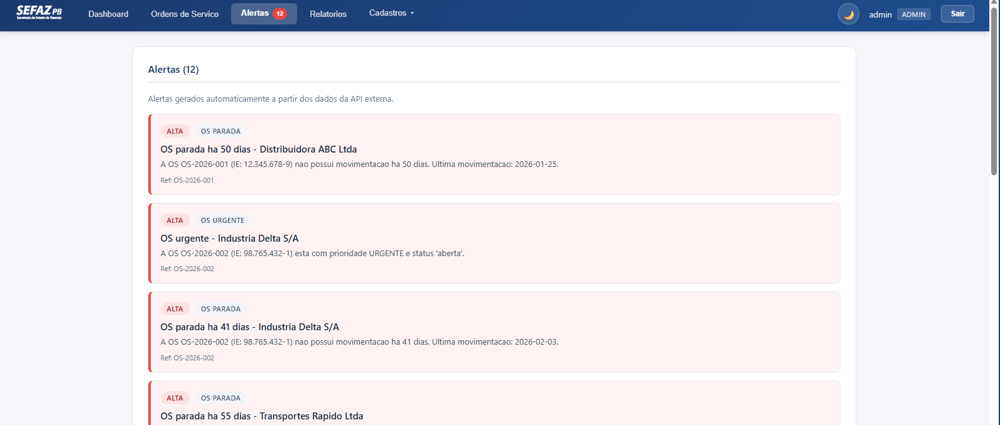
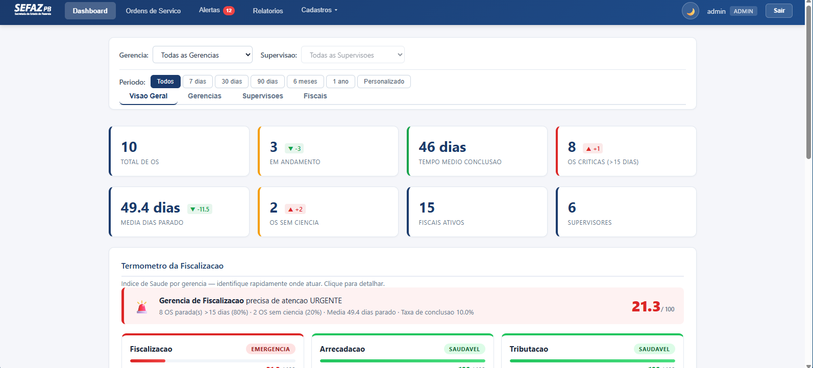
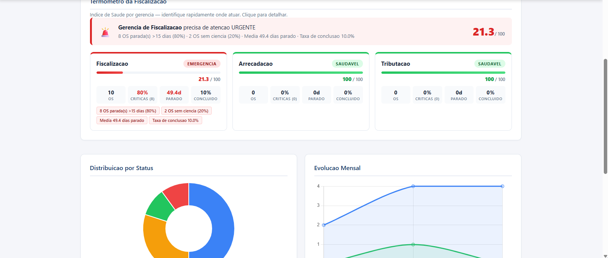
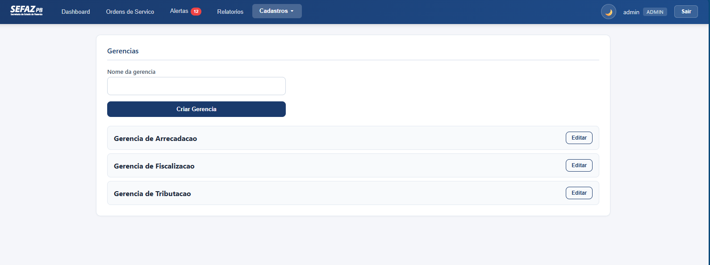
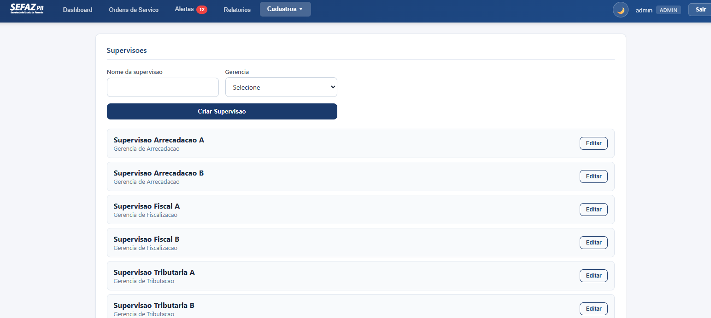
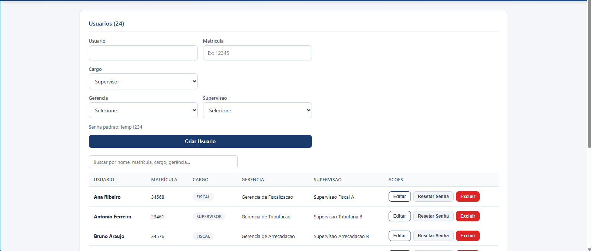
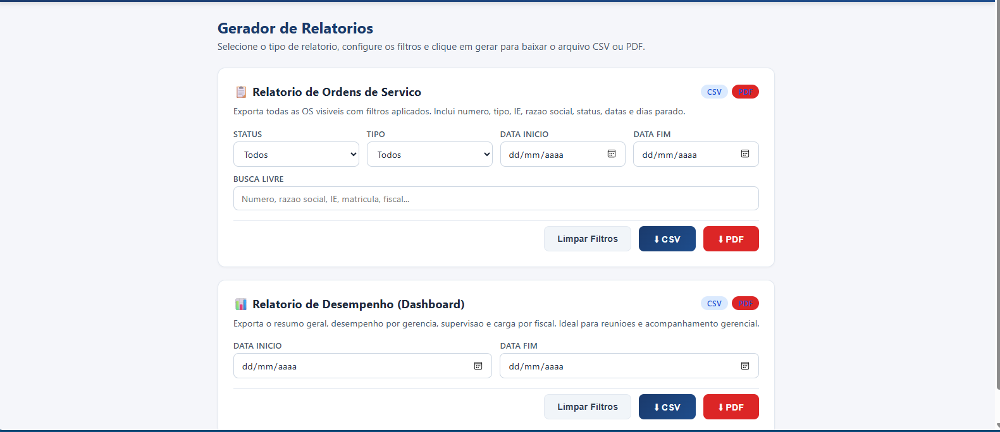

# Sistema SEFAZ PB – Gestao de Ordens de Servico

Sistema web para gestao e acompanhamento de Ordens de Servico (OS) da Secretaria de Estado da Fazenda da Paraiba, com hierarquia organizacional **Gerencia → Equipe fiscal → Fiscal**, dashboard administrativo com graficos interativos, alertas automaticos, dark mode e integracao com o **ATF** (webservice SOAP da SEFAZ-PB), de onde vem toda OS exibida.

---

## Indice

- [Visao Geral](#visao-geral)
- [Screenshots](#screenshots)
- [Tecnologias](#tecnologias)
- [Pre-requisitos](#pre-requisitos)
- [Instalacao](#instalacao)
- [Execucao](#execucao)
- [Credenciais](#credenciais)
- [Hierarquia Organizacional](#hierarquia-organizacional)
- [Funcionalidades](#funcionalidades)
- [Dashboard Administrativo](#dashboard-administrativo)
- [Formula do Indice de Saude](#formula-do-indice-de-saude)
- [Arquitetura](#arquitetura)
- [Estrutura do Projeto](#estrutura-do-projeto)
- [API REST – Endpoints](#api-rest--endpoints)
- [Testes](#testes)
- [Integracao ATF](#integracao-atf)
- [Configuracao](#configuracao)
- [Decisoes e Pendencias](#decisoes-e-pendencias)
- [Troubleshooting](#troubleshooting)
- [Notas de Producao](#notas-de-producao)

---

## Visao Geral

O Sistema SEFAZ PB permite que auditores fiscais, supervisores, gerentes e administradores acompanhem o andamento de Ordens de Servico de fiscalizacao tributaria. O sistema e **somente leitura sobre a OS**: ela nasce e muda no ATF, e aqui e consultada. O sistema oferece:

- **Painel de OS** com filtros por situacao, modelo, motivo, equipe fiscal, orgao executor, contribuinte e periodos de abertura, ciencia e encerramento
- **Detalhe da OS** com eventos, prorrogacoes, notificacoes, justificativas e recolhimentos, e PDF de cada OS
- **Dashboard** com KPIs, comparativo mensal e cortes por gerencia, equipe fiscal, fiscal, motivo e tipo, alem de uma aba so de eventos de acompanhamento
- **Termometro da Fiscalizacao** – ranking de saude por gerencia, sobre a taxa de encerramento e a ciencia atrasada das OS do ATF
- **Alertas automaticos** para OS sem designacao, fiscal sem ciencia (incluindo OS bloqueada) e OS sem evento de acompanhamento, com os prazos em dias configurados pelo admin
- **Relatorios exportaveis** em CSV e PDF (OS e Dashboard)
- **Controle de acesso hierarquico** – cada perfil ve apenas o que lhe compete
- **Importacao das equipes fiscais e dos auditores** a partir da planilha da SEFAZ
- **Dark mode** com toggle e persistencia no localStorage

## Screenshots

### Primeiro Acesso (Troca de Senha)


### Ordens de Servico


### Detalhes da OS


### Alertas


### Dashboard


### Termometro e Graficos


### Cadastro de Gerencias


### Cadastro de Supervisoes


### Cadastro de Fiscais


### Relatorios


---

## Tecnologias

| Camada      | Tecnologia                                                     | Versao              |
| ----------- | -------------------------------------------------------------- | ------------------- |
| Backend     | Python + FastAPI + Uvicorn                                     | 3.12+ / 0.141 / 0.53 |
| Frontend    | React + Chart.js + react-chartjs-2                             | 18.3 / 4.5 / 5.3    |
| Bundler     | Vite                                                           | 8.3                 |
| Banco Local | SQLite (usuarios, gerencias, supervisoes, equipes fiscais)     | built-in            |
| Fonte das OS | ATF – webservice SOAP/XML da SEFAZ-PB                         | HTTPS               |
| HTTP Client | requests (chamadas HTTPS ao ATF)                               | 2.31+               |
| PDF         | fpdf2 (geracao de relatorios PDF)                              | 2.8.3               |
| Testes      | unittest (a suite tambem roda com pytest)                      | stdlib              |

## Pre-requisitos

- **Python** >= 3.12
- **Node.js** 20.19+ ou 22.12+ (exigencia do Vite 8; npm incluido)
- Acesso de rede ao ATF, para dados reais. Sem ele, deixe `ATF_BASE_URL` vazio e o sistema usa dados MOCK

## Instalacao

```powershell
# 1. Clonar o repositorio
git clone <url-do-repo> sistema_OS
cd sistema_OS

# 2. Criar e ativar o ambiente virtual Python
python -m venv .venv
.venv\Scripts\Activate.ps1          # Windows PowerShell
# source .venv/bin/activate         # Linux/Mac

# 3. Instalar dependencias do backend
pip install -r backend\requirements.txt

# 4. Instalar dependencias do frontend
npm --prefix .\frontend install

# 5. Configurar variaveis de ambiente
cp .env.example .env
# Editar .env conforme necessidade (ATF, senha do admin, etc.)
```

## Execucao

### Script Automatico (recomendado)

```powershell
.\start.bat         # Windows – inicia backend + frontend
./start.sh          # Linux/Mac
```

### Manual (dois terminais)

```powershell
# Terminal 1 – Backend (API FastAPI)
.venv\Scripts\Activate.ps1
uvicorn backend.main:app --reload --port 8000
# -> http://127.0.0.1:8000 (so local: a rede entra pelo proxy do front, porta 5000)
#    Swagger em /docs apenas com API_DOCS=true no .env

# Terminal 2 – Frontend (dev server)
npm --prefix .\frontend run dev
# -> http://localhost:5000 (porta do vite.config.js; publica na rede)
```

### Build do Frontend (producao)

```powershell
npm --prefix .\frontend run build
npm --prefix .\frontend run preview   # serve o build na mesma porta 5000, sem HMR
```

O `start.bat` sobe o backend pelo `start_backend.bat`, com `--reload`, que e
modo de desenvolvimento. Para uso continuo, prefira `uvicorn` sem `--reload`
e o `preview` do build.

## Credenciais

Num banco novo, os usuarios abaixo sao criados automaticamente na primeira
execucao (seed). Eles sao **de exemplo** — matriculas ficticias, que so casam
com os dados MOCK. Em uso real sao substituidos pelos auditores importados da
planilha da SEFAZ; ver [Passando dos usuarios de exemplo para os reais](#passando-dos-usuarios-de-exemplo-para-os-reais).

**Nao existe senha padrao.** O `admin` usa a senha de `ADMIN_PASSWORD` no
`.env`; se a variavel estiver vazia, o sistema gera uma aleatoria e a imprime
no log do primeiro boot. Os demais usuarios do seed nascem com uma senha
aleatoria que e descartada: o admin usa "Resetar Senha" na tela de usuarios
e recebe uma temporaria, exibida uma unica vez, que o usuario e obrigado a
trocar no primeiro acesso.

| Usuario | Cargo | Gerencia | Supervisao |
| ------------------- | ----------- | -------------------- | ------------------------- |
| `admin` | Admin | — | — |
| `Roberto Santos` | Gerente | Fiscalizacao | — |
| `Helena Rodrigues` | Gerente | Arrecadacao | — |
| `Sergio Barbosa` | Gerente | Tributacao | — |
| `Patricia Oliveira` | Supervisor | Fiscalizacao | Supervisao Fiscal A |
| `Joao Silva` | Supervisor | Fiscalizacao | Supervisao Fiscal B |
| `Maria Santos` | Supervisor | Arrecadacao | Supervisao Arrecadacao A |
| `Ricardo Pereira` | Supervisor | Arrecadacao | Supervisao Arrecadacao B |
| `Lucia Costa` | Supervisor | Tributacao | Supervisao Tributaria A |
| `Antonio Ferreira` | Supervisor | Tributacao | Supervisao Tributaria B |
| `Carlos Mendes` | Fiscal | Fiscalizacao | Supervisao Fiscal A |
| `Ana Ribeiro` | Fiscal | Fiscalizacao | Supervisao Fiscal A |
| `Pedro Nascimento` | Fiscal | Fiscalizacao | Supervisao Fiscal A |
| `Jose Almeida` | Fiscal | Fiscalizacao | Supervisao Fiscal B |
| `Fernanda Costa` | Fiscal | Fiscalizacao | Supervisao Fiscal B |
| `Marcos Silva` | Fiscal | Arrecadacao | Supervisao Arrecadacao A |
| `Claudia Souza` | Fiscal | Arrecadacao | Supervisao Arrecadacao A |
| `Rafael Lima` | Fiscal | Arrecadacao | Supervisao Arrecadacao A |
| `Juliana Martins` | Fiscal | Arrecadacao | Supervisao Arrecadacao B |
| `Bruno Araujo` | Fiscal | Arrecadacao | Supervisao Arrecadacao B |
| `Tatiana Gomes` | Fiscal | Tributacao | Supervisao Tributaria A |
| `Diego Cardoso` | Fiscal | Tributacao | Supervisao Tributaria A |
| `Vanessa Rocha` | Fiscal | Tributacao | Supervisao Tributaria A |
| `Leandro Pinto` | Fiscal | Tributacao | Supervisao Tributaria B |
| `Camila Teixeira` | Fiscal | Tributacao | Supervisao Tributaria B |

> **Total:** 1 admin + 3 gerentes + 6 supervisores + 15 fiscais = **25 usuarios**

## Hierarquia Organizacional

A arvore abaixo e a do seed de exemplo, com gerencias e supervisoes locais.
Com os dados reais, as gerencias e as equipes fiscais vem do ATF e da
planilha da SEFAZ, e a supervisao local vira fallback — ver
[Como a visibilidade e resolvida hoje](#como-a-visibilidade-e-resolvida-hoje).

```
Admin (acesso total)
|
+-- Gerencia de Fiscalizacao
|   +-- Supervisao Fiscal A
|   |   +-- Patricia Oliveira (supervisor, mat. 23456)
|   |   +-- Carlos Mendes     (fiscal, mat. 34567)
|   |   +-- Ana Ribeiro       (fiscal, mat. 34568)
|   |   +-- Pedro Nascimento  (fiscal, mat. 34569)
|   +-- Supervisao Fiscal B
|       +-- Joao Silva        (supervisor, mat. 23457)
|       +-- Jose Almeida      (fiscal, mat. 34570)
|       +-- Fernanda Costa    (fiscal, mat. 34571)
|
+-- Gerencia de Arrecadacao
|   +-- Supervisao Arrecadacao A
|   |   +-- Maria Santos      (supervisor, mat. 23458)
|   |   +-- Marcos Silva      (fiscal, mat. 34572)
|   |   +-- Claudia Souza     (fiscal, mat. 34573)
|   |   +-- Rafael Lima       (fiscal, mat. 34574)
|   +-- Supervisao Arrecadacao B
|       +-- Ricardo Pereira   (supervisor, mat. 23459)
|       +-- Juliana Martins   (fiscal, mat. 34575)
|       +-- Bruno Araujo      (fiscal, mat. 34576)
|
+-- Gerencia de Tributacao
    +-- Supervisao Tributaria A
    |   +-- Lucia Costa       (supervisor, mat. 23460)
    |   +-- Tatiana Gomes     (fiscal, mat. 34577)
    |   +-- Diego Cardoso     (fiscal, mat. 34578)
    |   +-- Vanessa Rocha     (fiscal, mat. 34579)
    +-- Supervisao Tributaria B
        +-- Antonio Ferreira  (supervisor, mat. 23461)
        +-- Leandro Pinto     (fiscal, mat. 34580)
        +-- Camila Teixeira   (fiscal, mat. 34581)
```

### Regras de Visibilidade

A OS do ATF so se liga as pessoas pelas matriculas dos fiscais designados,
entao cada perfil ve as OS em que alguem do seu conjunto de matriculas esta
designado:

| Perfil         | O que pode ver                                                     |
| -------------- | ------------------------------------------------------------------ |
| **Admin**      | Todas as OS, dashboard completo, CRUD de entidades                 |
| **Gerente**    | A propria + os lotados na sua gerencia + as equipes dos seus supervisores |
| **Supervisor** | A propria + as equipes fiscais que chefia; sem equipe, a supervisao local |
| **Fiscal**     | So as OS em que a sua matricula esta designada                     |

Detalhes e o que segue em aberto em
[Como a visibilidade e resolvida hoje](#como-a-visibilidade-e-resolvida-hoje).

## Funcionalidades

### Autenticacao e Seguranca
- Login com token de sessao (UUID guardado em memoria, vale 8 h — `SESSION_TTL_MINUTES`); logout revoga no servidor. Reiniciar o backend encerra todas as sessoes
- Hash de senhas com **PBKDF2-HMAC-SHA256** (600.000 iteracoes + salt aleatorio); hashes antigos sao refeitos no login
- Limite de tentativas por usuario (5) e por IP (20), com bloqueio de 15 min — vale para o login e para a troca de senha
- Troca de senha obrigatoria no primeiro acesso (`must_change_password`): ate trocar, o resto da API recusa o token
- Senha nova com no minimo 8 caracteres, maiuscula, minuscula, numero e caractere especial
- Reset de senha pelo admin (gera senha temporaria, exibida uma unica vez)

### Painel de Ordens de Servico
- Listagem com filtros via API ATF: numero da OS, modelo, motivo de abertura, equipe fiscal, orgao executor, IE, CNPJ, razao social, matriculas do fiscal/supervisor
- **Situacoes ATF**: 0-Aguardando Autorizacao, 1-Autorizada, 2-Cancelada, 3-Substituida, 4-Encerrada, 5-Bloqueada, 6-Em Analise para Encerramento, 7-Execucao Suspensa
- **Modelos**: 1-Normal, 2-Simplificada, 7-Especial, 8-Especifica
- Filtro por periodo de abertura, de ciencia e de encerramento (datas inicio/fim)
- Ordenacao por coluna, feita no servidor
- **Paginacao servidor**: 20 registros por pagina (limite maximo: 50)
- Clique numa linha abre o detalhe completo da OS (servico de detalhe do ATF)
- Datas exibidas no formato brasileiro (DD/MM/AAAA)
- Download de PDF individual de cada OS

### Alertas Automaticos
Gerados sobre as OS do ATF visiveis ao usuario (mesma hierarquia da
listagem), **abertas na janela configurada** — de partida 365 dias, o
maior periodo que o ATF aceita numa busca so por periodo. OS aberta
antes disso e ainda em execucao nao entra. Encerrada, cancelada e
substituida nunca geram alerta.

Regras definidas pela area em 05/10/2026. Cada uma conta de um marco da
OS, e o alerta sai quando o prazo e ultrapassado:

| Tipo                | Conta a partir de | Condicao | Prazo inicial | Quem ve |
| ------------------- | ----------------- | -------- | ------------- | ------- |
| `os_sem_designacao` | abertura da OS (ou o ultimo cancelamento de designacao) | nenhum fiscal designado — designacao cancelada nao conta | 15 dias | so o admin |
| `os_sem_ciencia`    | designacao de cada fiscal | fiscal designado, e nao cancelado, sem ciencia. Se o ATF ja **bloqueou** a OS, o texto diz que o desbloqueio e do supervisor, no ATF | 3 dias | hierarquia |
| `os_sem_eventos`    | ultimo evento, ou a primeira ciencia quando a OS ainda nao teve evento (vale o mais recente) | OS **autorizada** sem evento de acompanhamento. Sem ciencia nenhuma nao entra: a pendencia ainda e a ciencia | 15 dias | hierarquia |

**Prazos configuraveis.** O admin muda os tres prazos e a janela em
Cadastros → Prazos dos alertas (`PUT /admin/alertas/config`), gravados
na tabela `config_alertas`. Chave que nunca foi gravada vale o padrao do
codigo (`CONFIG_ALERTAS_PADRAO`). A mudanca vale da proxima consulta em
diante. A aba de alertas mostra as regras com os prazos em vigor.

**O Dashboard conta as mesmas regras.** A conta de cada regra fica em
`_pendencias` (`backend/external_api.py`), que os alertas e o dashboard
de desempenho usam, com os mesmos prazos. Sobre as mesmas OS, no mesmo
dia, os dois dao o mesmo numero. O que muda e o universo: o dashboard
conta as OS abertas no periodo escolhido, e os alertas, as abertas na
janela.

**Sem designacao so para o admin.** A OS se liga as pessoas pela
matricula do fiscal: sem fiscal, nao ha fiscal nem chefe a avisar. Quando
alguem e designado, a OS passa para a regra da ciencia, e o fiscal e o
chefe dele passam a ve-la.

**Sem classificacao.** Ate 05/10/2026 havia severidade alta/media; a area
pediu para tirar. Os alertas saem do mais antigo para o mais novo, pela
data em que o problema comecou.

Cada consulta e uma listagem do ATF (~15 s em homologacao para 6.879 OS),
entao os alertas **nao carregam no login**: saem ao abrir a aba, e o
botao Atualizar refaz. A tela pagina de 20 em 20, sem nova consulta ao
ATF ao trocar de pagina: os alertas chegam todos de uma vez.

Ate 25/09/2026 os alertas vinham de uma lista fixa de OS de exemplo, e
havia um `os_urgente` por prioridade. O ATF nao tem prioridade, e esse
alerta saiu junto com o mock.

### CRUD Administrativo (somente Admin)
- Gerencias: criar, listar, editar
- Supervisoes: criar, listar, editar (com validacao de cascata gerencia-supervisao)
- Usuarios: criar, listar, editar, reset de senha (com validacao de cargo + lotacao)
- Prazos dos alertas: dias de cada regra e janela de busca (ver Alertas Automaticos)

A lotacao do usuario tem duas partes e nenhuma delas e obrigatoria desde
23/09/2026: **gerencia** (do ATF ou local) e **supervisao** (so local).
Exigir supervisao impedia cadastrar qualquer pessoa nas 10 gerencias que
vieram do ATF, que nao tem supervisao nenhuma — e era tambem o que fazia
a edicao de um auditor importado falhar com "Gerencia invalida" sem que o
admin tivesse tocado na lotacao: a tela mandava `Number("")`, isto e, 0.
Quando as duas vem preenchidas, a cascata continua sendo conferida. A
unica exigencia que sobrou e o **gerente**, que sem gerencia nao
enxergaria nenhuma OS alem das proprias.

### Interface
- **Dark mode**: toggle no topbar, persistido no `localStorage`
- **Filtro por periodo** (abas do Dashboard): atalhos (30d, 90d, 6m, ano atual, 12m) que so preenchem as datas; periodo de abertura obrigatorio, no maximo um ano, e a consulta sai no botao
- **Comparativo mensal**: deltas nos KPIs com setas coloridas (verde = melhoria, vermelho = piora)
- **Responsivo**: cards e tabelas adaptam-se a telas menores

## Dashboard Administrativo

Acessivel apenas pelo perfil **admin**, na tela.

Todas as abas leem o ATF. Ordens de Servico e Eventos tem cada uma a
propria consulta; Visao Geral, Gerencias, Supervisoes e Fiscais dividem
uma so (`GET /admin/dashboard`), com periodo de abertura obrigatorio e
filtros de gerencia e equipe aplicados no navegador. Contrato em
[`docs/dashboard-api-spec.md`](docs/dashboard-api-spec.md).

### KPIs (Indicadores-Chave)
10 cards nas abas de desempenho, em duas linhas, alguns com **deltas
mensais** (setas coloridas):
- Total de OS, Em andamento (seta vermelha = aumento e ruim), Encerradas,
  Taxa de encerramento e Bloqueadas
- Sem designacao, Sem ciencia e Sem evento: as regras dos alertas, com
  os prazos em vigor no rotulo ("+15 dias") e contadas hoje sobre as OS
  abertas no periodo
- Fiscais com OS ativa e Equipes com OS

Sem designacao e sem evento nao tem delta: a OS aberta no ultimo mes mal
teve tempo de passar do prazo, e a seta sairia sempre "boa".

O **comparativo mensal** compara as OS abertas no ultimo mes do periodo
com as do mes anterior, e so aparece sem filtro de gerencia ou equipe.

### Abas do Dashboard

| Aba          | Conteudo                                                                |
| ------------ | ----------------------------------------------------------------------- |
| Visao Geral  | Termometro, pizza por situacao do ATF, evolucao mensal por safra, comparativo por gerencia |
| Gerencias    | Taxa de encerramento + tabela por gerencia do cadastro, com sem ciencia e sem evento |
| Supervisoes  | Uma linha por **equipe fiscal** do ATF, com os supervisores da planilha, sem ciencia e sem evento |
| Fiscais      | Carga de trabalho (OS ativas) por fiscal, e quantas delas estao sem ciencia (dele) ou sem evento |
| Ordens de Servico | Quantidade de OS e tempo medio de execucao por gerencia, orgao executor, fiscal, motivo, tipo e mes (`/admin/dashboard/os`) |
| Eventos      | Quantidade de eventos de acompanhamento por gerencia, equipe, procedimento, motivo, tipo e mes (`/admin/dashboard/eventos`) |

### Termometro da Fiscalizacao

Ranking visual de saude por gerencia, com cards coloridos por nivel:

| Nivel      | Score     | Cor              |
| ---------- | --------- | ---------------- |
| Saudavel   | 75–100    | Verde            |
| Atencao    | 50–74     | Amarelo          |
| Critico    | 25–49     | Laranja          |
| Emergencia | 0–24      | Vermelho         |

## Formula do Indice de Saude

O score e **proporcional**, para escalar com qualquer volume de OS, e
sai das OS do ATF abertas no periodo:

```
Score = 100
      - (100 - taxa de encerramento%)  x 0.50   // Ate -50 pts
      - (% OS sem ciencia)             x 0.50   // Ate -50 pts
```

Onde:
- **Taxa de encerramento** = encerradas / (total - canceladas e substituidas) x 100
- **OS sem ciencia** = a regra do alerta `os_sem_ciencia`: OS que nao terminou com fiscal designado,
  e nao cancelado, sem `dataCiencia` ha mais de `dias_sem_ciencia` dias (3 de partida). Ate
  06/10/2026 entrava qualquer fiscal sem ciencia, e quem foi designado na vespera ja pesava
- Score final limitado entre 0 e 100
- Gerencia sem OS no periodo fica fora do Termometro (sairia com 100 sem ter sido medida)

Numa janela recente a taxa e baixa por calendario, e nao por desempenho:
as OS ainda nao tiveram tempo de encerrar.

**Exemplo**: gerencia com 11 OS, taxa de encerramento 10%, 9 sem ciencia (81,8%):
```
Score = 100 - (90 x 0.5) - (81.8 x 0.5) = 100 - 45 - 40.9 = 14.1 -> Emergencia
```

As constantes estao em `backend/external_api.py`: `PESO_TAXA_ENCERRAMENTO = 0.50`
e `PESO_SEM_CIENCIA = 0.50`.

## Arquitetura

```
+---------------+   HTTP (porta 5000)   +----------------+   127.0.0.1:8000   +--------------------+
|  Navegador    | --------------------> |  Vite          | -----------------> |  Backend (API)     |
|  React SPA    |   pagina + /api       |  (dev/preview) |   proxy, xfwd      |  FastAPI/Uvicorn   |
|  Chart.js     |   JSON + Bearer       |                |                    |                    |
+---------------+                       +----------------+                    +---+------------+---+
                                                                                  |            |
                                                                               SQLite      ATF (SOAP/HTTPS)
                                                                               (local)     listagem, detalhe
                                                                                  |        e eventos de OS
                                                                               usuarios,
                                                                               gerencias, supervisoes,
                                                                               equipes fiscais
```

So a porta 5000 sai da maquina: o backend escuta em 127.0.0.1 e e
alcancado pelo proxy do Vite, que repassa o IP real em `X-Forwarded-For`.
Como pagina e API tem a mesma origem, nao ha CORS no caminho.

### Fluxo de Dados

1. **Frontend** -> `api.js` -> requisicao HTTP relativa (mesma origem) com token Bearer
2. **Backend** -> `main.py` -> valida token -> resolve o que o usuario pode ver (`_matriculas_visiveis`) -> chama o servico adequado
3. **Dados de OS** -> `external_api.py` -> se `ATF_BASE_URL` configurado: chama o ATF via SOAP/HTTPS + parse XML, com cache curto (`ATF_CACHE_TTL`) -> senao: dados MOCK
4. **Dados de usuarios, gerencias e equipes** -> `db.py` -> SQLite local (`app.db`)
5. **Autenticacao** -> `auth.py` -> PBKDF2 hash + token UUID em memoria

### Principios de Design

- **Separacao de responsabilidades**: auth, db, schemas, external_api, config em modulos independentes
- **MOCK so sem ATF**: `ATF_BASE_URL` vazio usa dados de exemplo, para desenvolver sem rede. Com o ATF configurado nao ha fallback — uma falha dele aparece como erro, nunca como dado de exemplo. Falha de rede com o ATF vira **HTTP 502** em qualquer rota, pelo handler de `requests.RequestException` em `main.py`, com uma mensagem que diz que o problema e do ATF
- **Falha fechada**: cadastro incompleto resulta em conjunto de matriculas vazio, nunca em acesso irrestrito
- **Validacao dupla**: Pydantic (schemas) + regras de negocio (endpoints)
- **Constantes nomeadas**: magic numbers extraidos para constantes (`CONFIG_ALERTAS_PADRAO`, `PESO_*`, `PBKDF2_ITERATIONS`)
- **Helpers reutilizaveis**: `_metricas_desempenho()` usado por visao geral, gerencias, equipes e comparativo
- **Exception chaining**: `raise ... from exc` em todos os handlers de `IntegrityError`
- **DRY**: funcoes helper como `_get_user_by()`, `_validate_user_payload()` eliminam duplicacao

## Estrutura do Projeto

```
sistema_OS/
|-- backend/                        # API FastAPI (Python)
|   |-- main.py                     # Endpoints REST, middlewares, visibilidade, seed, PDFs
|   |-- external_api.py             # ATF (listagem, detalhe, eventos), MOCK, cache, alertas, dashboards
|   |-- auth.py                     # PBKDF2, tokens de sessao, limite de tentativas de login
|   |-- db.py                       # SQLite: usuarios, gerencias, supervisoes, equipes fiscais
|   |-- schemas.py                  # Modelos Pydantic request/response
|   |-- config.py                   # Variaveis de ambiente (.env)
|   |-- gerencias_atf.py            # Regra que tira a gerencia do nome da equipe fiscal
|   |-- importar_equipes.py         # CLI: importa equipes, chefias e lotacao da planilha da SEFAZ
|   |-- importar_usuarios.py        # CLI: cadastra os auditores da planilha como usuarios
|   |-- seed.py                     # Usuarios, gerencias e supervisoes de exemplo
|   |-- verificar_eventos.py        # CLI: diagnostico isolado do servico de eventos
|   +-- requirements.txt            # fastapi, uvicorn, python-dotenv, fpdf2, requests
|-- frontend/                       # SPA React
|   |-- src/
|   |   |-- App.jsx                 # Componente raiz: auth, navegacao, carga de dados
|   |   |-- api.js                  # Cliente HTTP (chamadas relativas, via proxy)
|   |   |-- main.jsx                # Entry point React
|   |   |-- constants.js            # Rotulos do ATF (situacao, modelo, motivo, orgao), formatarData
|   |   |-- atfFilters.js           # Filtros de busca de OS e as regras do ATF (painel e relatorios)
|   |   |-- dashboardShared.js      # Periodos, formatacao e cores comuns as abas do dashboard
|   |   |-- styles.css              # CSS com variaveis + dark mode
|   |   +-- components/
|   |       |-- LoginPage.jsx       # Tela de login
|   |       |-- ChangePasswordPage.jsx # Troca de senha obrigatoria
|   |       |-- TopBar.jsx          # Barra superior com navegacao e dark mode
|   |       |-- OrdensPanel.jsx     # Painel de OS: filtros, ordenacao, paginacao, detalhe e PDF
|   |       |-- AlertasPanel.jsx    # Painel de alertas
|   |       |-- AlertasConfig.jsx   # Prazos dos alertas (admin)
|   |       |-- DashboardPanel.jsx  # Orquestrador do dashboard com abas e periodo
|   |       |-- DashboardFiltros.jsx # Barra de filtros comum as abas de OS e eventos
|   |       |-- DashboardGeral.jsx  # Aba Visao Geral: termometro, pizza, evolucao
|   |       |-- DashboardGerencias.jsx  # Aba Gerencias
|   |       |-- DashboardSupervisoes.jsx # Aba Supervisoes (uma linha por equipe fiscal)
|   |       |-- DashboardFiscais.jsx    # Aba Fiscais: carga de trabalho
|   |       |-- DashboardOS.jsx     # Aba Ordens de Servico: cortes de quantidade de OS
|   |       |-- DashboardEventos.jsx # Aba Eventos: cortes de quantidade de eventos
|   |       |-- GerenciasAdmin.jsx  # CRUD de gerencias
|   |       |-- SupervisoesAdmin.jsx # CRUD de supervisoes
|   |       |-- UsuariosAdmin.jsx   # CRUD de usuarios, lotacao e chefia de equipe
|   |       |-- RelatoriosPanel.jsx # Gerador de relatorios CSV e PDF com filtros
|   |       +-- ConfirmModal.jsx    # Modal de confirmacao reutilizavel
|   |-- public/                     # logo
|   |-- package.json                # react, chart.js, vite
|   +-- vite.config.js              # porta 5000, proxy para o backend, cabecalhos de seguranca
|-- tests/                          # 429 testes (unitarios + integracao)
|-- docs/
|   |-- dashboard-api-spec.md       # Contrato dos endpoints de dashboard
|   |-- diagrama-er.md              # Diagrama ER (Mermaid) – SQLite + ATF
|   |-- teste_regra_periodo_atf.md  # Teste da regra de periodo dos filtros da listagem
|   |-- testes-atf/                 # Envelopes XML usados nesses casos
|   +-- screenshots/
|-- .github/
|   +-- copilot-instructions.md     # Instrucoes para GitHub Copilot
|-- start.bat                       # Inicia backend + frontend (Windows)
|-- start_backend.bat               # Inicia so o backend (chamado pelo start.bat)
|-- start.sh                        # Inicia backend + frontend (Linux/Mac)
|-- .env.example                    # Modelo de configuracao
+-- .env                            # Configuracao local (nao versionado)
```

## API REST – Endpoints

Base URL: `http://127.0.0.1:8000` na propria maquina. Pela rede, as mesmas
rotas passam pelo proxy do front, na porta 5000.

### Autenticacao

| Metodo | Rota                    | Descricao                            | Auth  |
| ------ | ----------------------- | ------------------------------------ | ----- |
| POST   | `/auth/login`           | Login -> retorna token + dados       | Nao   |
| POST   | `/auth/logout`          | Revoga o token da sessao atual       | Token |
| POST   | `/auth/change-password` | Troca senha do usuario autenticado   | Token |

**Exemplo de login:**
```bash
curl -X POST http://localhost:8000/auth/login \
  -H "Content-Type: application/json" \
  -d '{"username": "admin", "password": "<senha-do-admin>"}'
```

**Resposta:**
```json
{
  "token": "uuid-do-token",
  "role": "admin",
  "user_id": 1,
  "username": "admin",
  "must_change_password": false,
  "matricula": null,
  "gerencia_id": null,
  "gerencia_name": null,
  "supervisao_id": null,
  "supervisao_name": null
}
```

### Ordens de Servico (somente leitura)

| Metodo | Rota                   | Descricao                                       | Auth  |
| ------ | ---------------------- | ----------------------------------------------- | ----- |
| GET    | `/ordens`              | Lista OS via ATF (com filtros e paginacao)      | Token |
| GET    | `/ordens/{numero}`     | Busca OS por numero (com verificacao hierarquica) | Token |
| GET    | `/ordens/{numero}/detalhe` | Detalhe completo de UMA OS (servico detalharOrdemServico) | Token |
| GET    | `/ordens/{numero}/pdf` | Gera e baixa PDF detalhado de uma OS            | Token |
| GET    | `/alertas`             | Lista alertas gerados                           | Token |
| GET    | `/alertas/config`      | Prazos dos alertas e janela em vigor            | Token |
| GET    | `/equipes-fiscais`     | Codigo e nome das equipes fiscais importadas (alimenta o filtro) | Token |

**Tres servicos do ATF, tres usos.** `/ordens` consome o
`listarOrdensServicoWebService` (doc da listagem) e alimenta o grid.
`/ordens/{numero}/detalhe` consome o `detalharOrdemServicoWebService`
(doc do detalhe) e e chamado a cada clique numa linha — uma OS por
chamada. O detalhe traz o que a listagem nao tem: contribuinte com
endereco, eventos de acompanhamento, prorrogacoes, notificacoes,
processos, justificativas de atraso, descricoes complementares e o
total recolhido. Como nenhum dos dois e superconjunto do outro (equipe
fiscal, dias de execucao e as medias por Modelo/Motivo so existem na
listagem), o painel sobrepoe o detalhe a linha ja carregada, campo a
campo, sem apagar o que vier vazio. O terceiro, `listarEventosOrdemServico`
(doc dos eventos), devolve eventos de acompanhamento em lote e alimenta so
a aba Eventos do Dashboard.

Os servicos precisam apontar para o mesmo ambiente do ATF, e a
doc do detalhe tem armadilhas no nome da operacao e na lista de retorno —
ver [Integracao ATF](#integracao-atf).

**Query params de `/ordens`:**

| Parametro          | Tipo        | Descricao                                              |
| ------------------ | ----------- | ------------------------------------------------------ |
| `numero_os`        | string      | Numero exato da OS                                     |
| `modelo`           | string      | Codigo do modelo: 1-Normal, 2-Simplificada, 7-Especial, 8-Especifica |
| `ie`               | string      | Inscricao Estadual                                     |
| `cnpj`             | string      | CNPJ do contribuinte                                   |
| `razao_social`     | string      | Parte do nome (minimo 6 caracteres)                    |
| `matriculas`       | string      | Matriculas separadas por virgula (fiscal/supervisor)   |
| `situacao`         | int[]       | Codigos de situacao: 0-Aguardando, 1-Autorizada, 2-Cancelada, 3-Substituida, 4-Encerrada, 5-Bloqueada, 6-Em Analise, 7-Execucao Suspensa |
| `data_abertura_ini`| string YYYY-MM-DD | Data inicial de abertura                       |
| `data_abertura_fim`| string YYYY-MM-DD | Data final de abertura                         |
| `data_ciencia_ini` | string YYYY-MM-DD | Data inicial de ciencia                        |
| `data_ciencia_fim` | string YYYY-MM-DD | Data final de ciencia                          |
| `data_encerramento_ini` | string YYYY-MM-DD | Data inicial de encerramento              |
| `data_encerramento_fim` | string YYYY-MM-DD | Data final de encerramento                |
| `motivo_abertura`  | string      | Codigo do motivo de abertura                           |
| `equipe_fiscal`    | string      | Codigo da equipe fiscal                                |
| `orgao_executor`   | string      | Codigo do orgao executor                               |
| `ordenar_por`      | string      | Coluna de ordenacao                                    |
| `ordem`            | `asc`/`desc` | Direcao da ordenacao (default: `asc`)                 |
| `pagina`           | int (>=1)   | Pagina atual (default: 1)                              |
| `limite`           | int (1-50)  | Registros por pagina (default: 20)                     |

Modelo, motivo, situacao, equipe e orgao executor precisam vir junto com
um periodo de abertura ou de encerramento — regra da doc da listagem, que
a tela confere antes de consultar.

**Headers obrigatorios:**
```
Authorization: Bearer <token>
```

### Relatorios

| Metodo | Rota                            | Descricao                          | Auth  |
| ------ | ------------------------------- | ---------------------------------- | ----- |
| GET    | `/relatorios/ordens`            | Exporta OS em CSV (com filtros)    | Token |
| GET    | `/relatorios/ordens/pdf`        | Exporta OS em PDF (com filtros)    | Token |
| GET    | `/relatorios/dashboard`         | Exporta desempenho (ATF) em CSV; periodo obrigatorio | Admin |
| GET    | `/relatorios/dashboard/pdf`     | Exporta desempenho (ATF) em PDF; periodo obrigatorio | Admin |

### Administracao (somente Admin)

| Metodo | Rota                                              | Descricao                          |
| ------ | ------------------------------------------------- | ---------------------------------- |
| GET    | `/admin/dashboard?data_inicio=...&data_fim=...`   | Desempenho sobre o ATF (periodo de abertura obrigatorio) |
| GET    | `/admin/dashboard/os`                             | Cortes de qtd de OS (dados do ATF) |
| GET    | `/admin/dashboard/eventos`                        | Cortes de qtd de EVENTOS (doc dos eventos) |
| POST   | `/admin/gerencias`                                | Criar gerencia                     |
| GET    | `/admin/gerencias`                                | Listar gerencias                   |
| PUT    | `/admin/gerencias/{id}`                           | Atualizar gerencia                 |
| POST   | `/admin/supervisoes`                              | Criar supervisao                   |
| GET    | `/admin/supervisoes`                              | Listar supervisoes                 |
| GET    | `/admin/supervisoes?gerencia_id={id}`             | Listar supervisoes de uma gerencia |
| PUT    | `/admin/supervisoes/{id}`                         | Atualizar supervisao               |
| POST   | `/admin/users`                                    | Criar usuario                      |
| GET    | `/admin/users`                                    | Listar usuarios                    |
| PUT    | `/admin/users/{id}`                               | Atualizar usuario                  |
| DELETE | `/admin/users/{id}`                               | Excluir usuario (retorna 204)      |
| POST   | `/admin/users/{id}/reset-password`                | Resetar senha                      |
| GET    | `/admin/equipes-fiscais/{codigo}/membros`         | Membros de uma equipe fiscal (nome e matricula) |
| PUT    | `/admin/alertas/config`                           | Grava os prazos dos alertas e a janela (0 a 365 dias; janela de 1 a 365) |

> **`/admin/dashboard/os` e a excecao da tabela acima: nao exige admin.**
> Ele agrega o mesmo universo que a listagem de OS ja mostra a quem
> pergunta, com a hierarquia de `_matriculas_visiveis` — um gerente soma
> a sua gerencia, um fiscal soma as suas OS. Ficou sob `/admin/` por ser
> a tela de Dashboard; o conteudo nao e privilegiado.
>
> **`/admin/dashboard/eventos` NAO e excecao: exige admin.** A diferenca
> nao e de politica, e de dado — o servico de eventos nao devolve
> matricula, entao a hierarquia acima nao tem por onde ser aplicada.

### Dashboard de OS (`GET /admin/dashboard/os`)

Cortes de **quantidade de OS** sobre os dados reais do ATF, pedidos pela
area fiscal em 31/08/2026: por gerencia, orgao executor, fiscal, motivo,
tipo (modelo) e mes de abertura — cada um com o tempo medio de execucao.
Alimenta a aba "Ordens de Servico" do Dashboard.

Contrato completo, incluindo as tres decisoes que mudam a leitura dos
numeros (tempo medio so das encerradas, corte por fiscal que soma mais
que o total, e campo em branco virando grupo proprio) em
[`docs/dashboard-api-spec.md`](docs/dashboard-api-spec.md).

A **quantidade de eventos**, pedida na mesma demanda, nao esta neste
endpoint: a listagem do ATF nao traz evento nenhum (so
`mediaEventosModMot`, uma media ja pronta por modelo+motivo) e a lista de
eventos so existe no detalhe, uma chamada por OS. Ela veio em
`/admin/dashboard/eventos`, abaixo.

### Dashboard de Eventos (`GET /admin/dashboard/eventos`)

Bloco 2 da mesma demanda, sobre o servico `listarEventosOrdemServico`
(doc dos eventos): **quantidade de eventos de acompanhamento** por gerencia,
equipe fiscal, procedimento, motivo, tipo e mes de inclusao. Alimenta a
aba "Eventos" do Dashboard.

Fica em aba separada da de OS, e nao dentro dela, porque conta outra
coisa: ali a linha e uma OS, aqui e um evento, e a mesma OS aparece em
varios. Cada linha traz `total` (eventos) **e** `os` (OS distintas) — sem
o segundo, "40 eventos" nao distingue 40 OS tranquilas de uma OS
problematica.

Tres coisas que valem saber antes de usar:

- **A operacao precisa estar publicada no ambiente da listagem.** Ela
  chegou aos ambientes da SEFAZ em momentos diferentes. Se o ambiente em
  uso ainda nao a tiver, `ATF_EVENTOS_BASE_URL` aponta para um que tenha —
  e a aba mostra um aviso vermelho, porque os numeros deixam de fechar com
  os da aba de OS. Para diagnosticar o servico isolado, sem subir o
  backend: `python -m backend.verificar_eventos --url <URL> --dias 60`.
- **A gerencia aqui vem do ATF**, e nao do cadastro local: o servico
  manda `cdGerencia`/`sgGerencia` (97% dos eventos medidos). Este
  corte nao depende do cadastro local, ao contrario do corte por gerencia
  da aba de OS, que sai da equipe fiscal (ver
  [A gerencia de cada equipe sai do nome dela](#a-gerencia-de-cada-equipe-sai-do-nome-dela)).
  Por isso as duas abas podem nomear a mesma area de forma diferente;
  ainda falta a SEFAZ confirmar como as duas se correspondem.
- **Este endpoint exige admin**, e por limite de dado: o servico nao
  devolve matricula nenhuma, que e a unica chave pela qual o sistema liga
  uma OS a uma pessoa. Sem ela nao ha como aplicar `_matriculas_visiveis`.

Contrato completo, divergencias entre a doc e o servico real, e as saidas
possiveis para a visibilidade em
[`docs/dashboard-api-spec.md`](docs/dashboard-api-spec.md).

### Resposta do Dashboard (`GET /admin/dashboard`)

Visao geral (grupos de situacao, pendencias dos alertas, taxa de encerramento),
comparativo mensal, pizza por situacao, evolucao mensal por safra,
desempenho por gerencia e por equipe fiscal, Termometro e carga por
fiscal. O JSON completo, a tabela de grupos de situacao e como cada corte
e montado estao em
[`docs/dashboard-api-spec.md`](docs/dashboard-api-spec.md).

## Testes

O projeto possui **444 testes** (unitarios + integracao) com cobertura dos modulos principais:

| Modulo         | Arquivo                      | Testes | Foco                                                         |
| -------------- | ---------------------------- | ------ | ------------------------------------------------------------ |
| Autenticacao   | `tests/test_auth.py`         | 25     | Hash PBKDF2 e rehash do hash legado, tokens, login, registro, limite de tentativas, troca/reset de senha |
| Banco de Dados | `tests/test_db.py`           | 23     | CRUD de users, gerencias, supervisoes (SQLite in-memory)     |
| Schemas        | `tests/test_schemas.py`      | 19     | Validacao Pydantic, campos obrigatorios/opcionais            |
| API Externa    | `tests/test_external_api.py` | 104    | Envelopes e parse SOAP, caches, alertas, dashboards e equipe de codigo antigo na listagem |
| Equipes fiscais| `tests/test_equipes_fiscais.py` | 47  | Importacao da planilha, chefia pela cor da celula, vinculo equipe/membros, visibilidade |
| Gerencias ATF  | `tests/test_gerencias_atf.py` | 29    | Regra que tira a gerencia do nome da equipe, cadastro das gerencias do ATF, mapa matricula -> gerencia, equivalencia de codigos de equipe |
| Eventos de OS  | `tests/test_eventos_os.py`   | 29     | Servico de eventos: envelope, parse, regras de periodo, cortes do bloco 2, equipe de codigo antigo |
| Seed/usuarios  | `tests/test_seed_e_importacao_usuarios.py` | 12 | Seed de exemplo e importacao dos auditores reais |
| Integracao     | `tests/test_integration.py`  | 156    | Testes E2E com TestClient FastAPI (auth, CRUD, OS, alertas e seus prazos, dashboard, falhas do ATF) |

A suite nao depende de rede nem do `.env`: os testes forcam o MOCK e usam
banco temporario. Ela e escrita com `unittest`, que ja vem com o Python;
o pytest e opcional (nao esta no `requirements.txt`).

```powershell
# Rodar todos os testes
.venv\Scripts\Activate.ps1
python -m unittest discover -s tests -t .

# Com pytest (pip install pytest), a mesma suite:
python -m pytest tests/ -v
python -m pytest tests/test_auth.py -v

# Com cobertura (pip install pytest-cov)
python -m pytest tests/ --cov=backend --cov-report=term-missing
```

## Integracao ATF

O sistema consulta a **API ATF (SEFAZ PB)** via SOAP sobre HTTPS para ler
Ordens de Servico. Se `ATF_BASE_URL` nao estiver configurado, usa **dados
MOCK** automaticamente — e o que permite desenvolver sem rede.

### Os tres servicos

Todos ficam no mesmo endpoint (`POST {ATF_BASE_URL}/<caminho-do-servico>`);
o que muda e a operacao dentro do envelope SOAP.

| Servico | Doc | Usado em | Traz |
| ------- | --- | -------- | ---- |
| `listarOrdensServicoWebService` | doc da listagem | grid de OS, alertas, dashboard, relatorios, PDF | lista completa (sem paginacao), com equipe fiscal, dias de execucao e medias por Modelo/Motivo |
| `detalharOrdemServicoWebService` | doc do detalhe | clique numa linha do grid — uma OS por vez | contribuinte com endereco, eventos, prorrogacoes, notificacoes, processos, justificativas, recolhimentos |
| `listarEventosOrdemServico` | doc dos eventos | aba Eventos do Dashboard | eventos de acompanhamento em lote, com gerencia e equipe; sem matricula |

Nenhum dos dois primeiros e superconjunto do outro, entao a OS exibida e a
**sobreposicao** dos dois: o detalhe cobre a linha do grid campo a campo,
e o que vier vazio nao apaga o que a listagem trouxe. Sem isso, abrir uma
OS apagaria da tela a equipe fiscal e os campos calculados.

A regra canonica e `mesclar_detalhe_os()`, em `external_api.py`, usada
pelo PDF de uma OS. O painel repete a mesma logica em `OrdensPanel.jsx`
(`sobrepor` / `mesclarDetalhe`) porque la a linha ja esta em maos:
refazer a consulta da listagem custaria ~1,5s a cada clique, contra 0,5s
do detalhe sozinho. **Sao duas implementacoes da mesma regra — mexeu numa,
mexa na outra.**

O **PDF de uma OS** (`/ordens/{numero}/pdf`) sai com o mesmo conteudo do
modal. Como o servidor nao tem a linha do grid em maos, ele busca os dois
servicos e mescla — por isso o download demora mais que abrir o modal. Se
o servico de detalhe falhar, o PDF sai so com os dados da listagem em vez
de nao sair.

### Ambientes — leia antes de trocar a URL

**Os servicos precisam apontar para o MESMO ambiente.** Os ambientes de
teste da SEFAZ sao copias da base de producao com o contribuinte
**mascarado** e **congeladas numa data**. Duas consequencias:

- misturar ambientes faz a mesma OS aparecer com uma razao social na
  linha do grid e outra no detalhe;
- num ambiente de teste, periodo posterior ao congelamento volta
  **zerado** — na tela parece queda de produtividade e e so o fim da
  copia. As contagens anteriores ao corte sao dado real.

Os servicos nem sempre estao publicados ao mesmo tempo em todos os
ambientes. Por isso o ambiente ativo e decidido por `.env` — **nenhum
endereco vive no repositorio**.

Para migrar de ambiente:

1. **Conferir o `?wsdl` do destino**: se as tres operacoes estao
   declaradas e com o nome esperado (ver a armadilha abaixo). Para o
   servico de eventos, `python -m backend.verificar_eventos --url <URL>`
   faz a chamada real e mostra o preenchimento dos campos.
2. **Conferir a cadeia TLS** (`openssl s_client -connect <host>:443`). Se o
   servidor mandar a cadeia incompleta, o `requests` falha com
   "unable to get local issuer certificate". Prefira montar um bundle com
   a intermediaria e apontar `REQUESTS_CA_BUNDLE` para ele a desligar
   `ATF_SSL_VERIFY`, que desliga a verificacao para todos os servicos.
3. Trocar `ATF_BASE_URL` no `.env` (e `REQUESTS_CA_BUNDLE`, se for o caso)
   e **reiniciar o backend**: o `.env` so e lido na inicializacao.
4. Refazer o mapeamento de qualquer codigo do ATF guardado no banco
   local — codigos coletados num ambiente podem nao valer em outro.

`ATF_DETALHE_BASE_URL` existe para o caso de ser mesmo necessario separar
os dois servicos em ambientes distintos. Vazia (o normal) = usa a mesma
URL da listagem. Preenchida, a permissao de acesso a OS passa
automaticamente a ser decidida pela **listagem**, nunca pelos fiscais do
outro banco — ver `_buscar_detalhe_os_atf`, em `main.py`.
`ATF_EVENTOS_BASE_URL` funciona do mesmo jeito para o servico de eventos.

### Armadilhas da doc do detalhe

- **Nome da operacao muda por ambiente.** O elemento da requisicao e
  `detalharOrdemServicoRequest`, como a doc descreve — mas um dos
  ambientes publica a operacao com um infixo a mais no nome. Errar
  devolve HTTP 500 com o SOAP Fault `Message part [...] was not
  recognized`. Sempre conferir no `?wsdl` do ambiente de destino.
- **SOAP Fault vem com HTTP 500.** Um `raise_for_status()` seco descarta
  justamente a mensagem que explica o erro; por isso `_erro_soap()` le o
  `<faultstring>` antes de tratar como falha de transporte.
- **A lista de retorno ja esteve incompleta.** A revisao de 21/08/2026
  fechou a lacuna: `equipeFiscalizacao` / `noEquipe` (o nome da equipe
  fiscal) e `tpBdFiscal` / `dsTpBdFiscal` passaram a constar, e as
  estruturas de `recolhimentoOS` e `denuncia` — antes so citadas pelo
  nome da lista — foram detalhadas. Todas sao lidas. Vale reconferir a
  cada revisao da doc: comparar as tags de uma resposta real com a
  arvore documentada leva minutos e ja achou campo util escondido.
- **`cdEquipe` foi anunciado mas nao existe.** O time do ATF chegou a
  informar que o codigo da equipe entraria no bloco `equipeFiscalizacao`;
  ele nao esta na doc revisada nem em nenhuma das 17 OS conferidas. O
  parser ja o le por antecipacao; ate la o codigo da equipe vem da
  listagem, pela mesclagem.
- **"Nenhum registro satisfaz a pesquisa"** e como o ATF diz que a OS nao
  existe. Numa busca por numero isso vira 404, nao erro de negocio.
- Ficam de fora do parser, de proposito (estes SAO documentados): os
  codigos redundantes do endereco `cdcorreios`, `cdcorreiosUf` e
  `cdibgeUf`, que repetem municipio e UF ja exibidos.
- **O bloco de Cancelamento nao existe no retorno.** A tela do ATF
  mostra Data, Motivo, Usuario e Descricao do cancelamento; o contrato
  do detalhe nao tem nenhum desses campos — so `<autorizacao>`. Numa OS
  cancelada, portanto, nao ha como exibir o motivo. Nao e lacuna do
  parser: e o servico que nao expoe. Se a area fiscal precisar, tem que
  ser pedido a SEFAZ como campo novo.
- **Recolhimentos ja foram conferidos contra dado real:** a OS indicada
  pela SEFAZ como caso de teste volta com os 40 registros e o total que a
  tela do ATF mostra. **Denuncias continuam lidas so pelo contrato**:
  nenhuma OS conferida trouxe esse bloco preenchido. Se aparecer
  divergencia, e ali que se olha primeiro.

### Configuracao ATF

```bash
# Os tres servicos saem desta URL. Trocar so com o passo a passo acima.
ATF_BASE_URL=https://<host-do-atf>

# Caminho do endpoint SOAP, somado a ATF_BASE_URL (ignorado se a URL ja
# terminar no servico).
ATF_WS_PATH=<caminho-do-servico>

# Vazias = usam a URL acima. So preencher para separar ambientes.
ATF_DETALHE_BASE_URL=
ATF_EVENTOS_BASE_URL=

# Verificacao TLS. Cadeia incompleta: prefira REQUESTS_CA_BUNDLE a false.
ATF_SSL_VERIFY=true
# REQUESTS_CA_BUNDLE=C:/caminho/para/bundle.pem

# Segundos de cache das respostas do ATF. 0 desliga.
ATF_CACHE_TTL=60
```

### Situacoes e Modelos (ATF)

| Codigo | Situacao                         |
| ------ | -------------------------------- |
| 0      | Aguardando Autorizacao           |
| 1      | Autorizada                       |
| 2      | Cancelada                        |
| 3      | Substituida                      |
| 4      | Encerrada                        |
| 5      | Bloqueada                        |
| 6      | Em Analise para Encerramento     |
| 7      | Execucao Suspensa                |

| Codigo | Modelo        |
| ------ | ------------- |
| 1      | Normal        |
| 2      | Simplificada  |
| 7      | Especial      |
| 8      | Especifica    |

### Bloqueio por atraso na cientificacao (situacao 5)

Regra do ATF, informada pela SEFAZ em 25/08/2026 junto com os casos de
teste do detalhe. Explica de onde vem a situacao **Bloqueada** e por que
ela e a unica que depende de uma acao do supervisor:

1. o auditor e designado para a OS;
2. se ele nao registra a **ciencia** em tres dias (prazo parametrizavel
   no ATF), uma rotina automatica **bloqueia** a OS;
3. para desbloquear, o auditor insere na OS uma justificativa do tipo
   **ATRASO NA CIENTIFICACAO**, dirigida ao seu supervisor;
4. de posse da justificativa, **o supervisor procede com o desbloqueio**.

O que isso significa para este sistema: uma OS bloqueada e uma
**pendencia do supervisor**, nao um estado passivo. Os dados para
detectar isso ja chegam — situacao 5 na listagem, e a justificativa com
`dsTipoJustifAtraso` no detalhe.

Desde 25/09/2026 a OS bloqueada aparece nos **Alertas** (`os_sem_ciencia`,
com "bloqueada" no titulo e o texto dizendo que o desbloqueio e do
supervisor) e no KPI **Bloqueadas** do Dashboard. A severidade alta que
ela tinha saiu em 05/10/2026, junto com toda a classificacao. Filtro ou fila de trabalho dedicada do
supervisor ainda nao existe: **nao foi pedido**.

Cuidado ao desenhar isso: o desbloqueio acontece **no ATF**, nao aqui.
Este sistema e somente leitura sobre a OS, entao o maximo que cabe e
apontar a pendencia, nunca sugerir que ela foi resolvida.

## Configuracao

Todas as variaveis ficam no arquivo `.env` (copiado de `.env.example`):

| Variavel             | Descricao                              | Padrao                     |
| -------------------- | -------------------------------------- | -------------------------- |
| `APP_TITLE`          | Titulo da aplicacao                    | `Sistema Sefaz`            |
| `LOG_LEVEL`          | Nivel de log (DEBUG/INFO/WARNING)      | `INFO`                     |
| `CORS_ORIGINS`       | Origens permitidas (separadas por `,`). So importa se o front for servido de outra origem; pelo proxy do Vite nao ha CORS | `http://localhost:5173`    |
| `ATF_BASE_URL`       | URL base da API ATF (vazio = usa MOCK). Ver [Ambientes](#ambientes--leia-antes-de-trocar-a-url) antes de trocar | `""` (vazio)               |
| `ATF_WS_PATH`        | Caminho do endpoint SOAP, somado a `ATF_BASE_URL` | `""` (vazio)               |
| `ATF_DETALHE_BASE_URL` | URL so do servico de detalhe. Vazia = usa `ATF_BASE_URL` | `""` (vazio)             |
| `ATF_EVENTOS_BASE_URL` | URL so do servico de eventos. Vazia = usa `ATF_BASE_URL` | `""` (vazio)             |
| `ATF_CACHE_TTL`      | Segundos de cache das respostas do ATF (0 desliga) | `60`             |
| `ATF_SSL_VERIFY`     | Verifica o certificado TLS do ATF (so desligue em ambiente controlado) | `true` |
| `REQUESTS_CA_BUNDLE` | Bundle de CAs usado pelo `requests` (lido do ambiente; serve para cadeia TLS incompleta) | bundle do `certifi` |
| `ADMIN_PASSWORD`     | Senha do `admin` no primeiro boot (vazia = aleatoria, impressa no log) | `""` (vazio) |
| `API_DOCS`           | Liga `/docs`, `/redoc` e `/openapi.json` (so em desenvolvimento) | `false` |
| `WORKER_THREADS`     | Threads dos endpoints sincronos (cada chamada ao ATF ocupa uma por ate 60 s) | `100` |
| `PBKDF2_ITERATIONS`  | Iteracoes do hash de senha; hashes antigos sao refeitos no login | `600000` |
| `SESSION_TTL_MINUTES` | Validade do token de sessao, em minutos | `480` |
| `LOGIN_MAX_FALHAS_USUARIO` | Falhas de login por usuario antes do bloqueio | `5` |
| `LOGIN_MAX_FALHAS_IP` | Falhas de login por IP antes do bloqueio | `20` |
| `LOGIN_BLOQUEIO_MINUTOS` | Duracao do bloqueio de login | `15` |

### URL da API no frontend

O front chama a API com caminho **relativo**, na mesma origem da pagina, e
o proxy do Vite encaminha ao backend (`vite.config.js`). Nao ha variavel a
configurar. So se o front for servido de outra origem e preciso fixar a
URL no build, com o `define` `API_BASE_URL` (ver o comentario em
`frontend/src/api.js`) — e ai `CORS_ORIGINS` passa a valer.

## Decisoes e Pendencias

Registro do que foi decidido e do que esta parado esperando terceiros.
Serve para nao "corrigir" de novo algo que ja foi decidido assim de
proposito. Ultima revisao: 29/09/2026.

### Esperando a SEFAZ

| O que falta | O que fica travado |
| ----------- | ------------------ |
| **Equipes sem supervisor marcado** | A planilha marca a chefia de 30 das 46 equipes. Para as outras 16 falta saber se estao mesmo sem supervisor ou se ficaram de fora do preenchimento; ate la, o admin pode amarrar a mao. |
| **Chefia como coluna, e nao como cor** | A chefia vem na cor da celula (ver abaixo). Um "limpar formatacao" ou uma exportacao em CSV apaga a informacao sem deixar rastro. |
| **Gerencia do servico de eventos x gerencia da equipe** | O servico de eventos manda a gerencia pronta; a aba de OS a deduz do nome da equipe. Ate a SEFAZ confirmar como as duas se correspondem, os cortes por gerencia das duas abas nao devem ser comparados linha a linha. |
| Tabelas de codigo de `stPrazoOS`, `tpNatureza` e `tpDocumento` | Esses campos chegam so como codigo (`"0"`, `"I"`, `"1"`), sem descricao em lugar nenhum. Continuam na resposta da API, mas saem da tela — um numero solto nao informa ninguem. Ha comentario no `OrdensPanel.jsx` marcando onde recoloca-los. |
| Motivo do cancelamento | O servico de detalhe nao devolve o bloco de cancelamento (ver [Armadilhas da doc do detalhe](#armadilhas-da-doc-do-detalhe)). Se a area fiscal precisar, e campo novo a pedir. |

### Equipes fiscais (resolvido em 25/08/2026)

A SEFAZ entregou a planilha `DADOS_ORDEM_SERVICO.xlsx`, com cinco abas
de tabelas de dominio. Modelo de OS, motivo de abertura e status ja
estavam corretos no sistema; as duas que mudaram alguma coisa foram:

**Aba "Grupos de Auditores"** — e a tabela de equipes fiscais que
faltava: 46 equipes com codigo (`cdEquipeFisc`) e nome, e a composicao
de cada uma (339 vinculos, 334 auditores). Importada por
`python -m backend.importar_equipes CAMINHO/DADOS_ORDEM_SERVICO.xlsx`,
que grava em `equipes_fiscais` e `equipe_membros`. Com ela:

- o filtro "Equipe Fiscal" do painel virou um `<select>` por nome. Se a
  importacao nunca rodou, a lista volta vazia e o campo degrada para o
  antigo, onde se digita o codigo;
- um supervisor pode ser amarrado a uma equipe (`users.equipe_codigo`),
  e entao e ela que define o que ele enxerga. Desde 17/09/2026 a chefia
  tambem vem da propria planilha — ver
  [Quem chefia cada equipe vem na cor da celula](#quem-chefia-cada-equipe-vem-na-cor-da-celula).

**Aba "Elementos Organizacionais"** — confere com os 18 orgaos
executores fixos em `constants.js`, codigo e sigla, sem divergencia. A
planilha tem 595 elementos (344 ativos e com sigla), mas nem todo
elemento organizacional executa OS: os 18 sao uma curadoria da area
fiscal, e foram **mantidos como estao** por decisao de 25/08/2026.
Expandir a lista enche o filtro de opcoes que nunca retornam OS. A
planilha serve aqui como fonte para conferir, nao para substituir.

Desde 22/09/2026 essa aba tem um segundo uso: ela e a **tabela de
gerencias**. A coluna "Tipo Elemento" traz a hierarquia (GERENCIA
EXECUTIVA, GERENCIA OPERACIONAL, SUBGERENCIA, NUCLEO, NUCLEO REGIONAL),
e as 10 gerencias que aparecem como donas de alguma equipe fiscal viram
cadastro local — ver a proxima secao.

#### A gerencia de cada equipe sai do nome dela

A OS do ATF nao tem gerencia, e por isso o corte por gerencia do painel
ficava vazio: dependia de o admin lotar pessoa por pessoa, e os 334
auditores foram importados sem lotacao. Em 22/09/2026 a area fiscal
confirmou a regra que fecha essa ponte sozinha:

- **em `A - B`, o `B` e o nivel ACIMA do `A`** — a gerencia e sempre o
  lado ESQUERDO. `GOAC - GEFTE` e equipe da GOAC, que responde a GEFTE
  (o topo da hierarquia). Quando o lado direito e um assunto e nao uma
  unidade (`GOFE - VAREJO`), e subdivisao interna, e a leitura e a mesma;
- **barra e outra coisa: em `GOFE/GR2` a gerencia e a GOFE**, nao a GR2 —
  a regional e so onde a equipe atua.

A regra esta em `backend/gerencias_atf.py`, junto com as 10 gerencias e
as equipes que a area fiscal decidiu deixar de fora do painel. O
importador aplica a regra, cria no cadastro as gerencias que faltarem
(casando por `gerencias.codigo_atf`, nunca apagando as locais) e grava
`equipes_fiscais.gerencia_codigo`. Equipe cujo nome nao permita decidir
fica sem gerencia e **avisa** na importacao, em vez de receber um chute.

Efeito medido sobre 4499 OS de jan-jul/2026: o mapa matricula -> gerencia
passou de 24 para 339 matriculas, e o corte de "tudo em sem gerencia"
para 8 gerencias, com 3% das OS sem — as que nao tem fiscal designado ou
cujo fiscal nao esta em equipe nenhuma.

#### A mesma regra preenche a lotacao no cadastro

O painel deduz a gerencia na hora de montar o grafico e nao grava nada;
a tela de usuarios continuava mostrando "-" na coluna Gerencia para os
334 auditores importados. Desde 23/09/2026 a mesma deducao pode descer
para o cadastro:

```bash
python -m backend.importar_equipes --lotar-por-equipe
```

Sem planilha mesmo: a gerencia de cada equipe ja esta em
`equipes_fiscais.gerencia_codigo` desde a ultima carga, e o que falta e
so leva-la ate `users.gerencia_id`. Passar a planilha junto tambem
funciona, e ai a lotacao roda no fim da importacao. `--dry-run` lista
nome por nome sem gravar.

A regra de quem e tocado:

- **so escreve em cima de NULL.** A lotacao que o admin fez na tela vale
  sobre a deduzida — a mesma ordem que o painel usa. Reexecutar depois
  de cada planilha e seguro;
- **quem esta em equipes de gerencias diferentes fica de fora**, e sai
  como aviso. O painel desempata sozinho (pega a de menor codigo) para
  nao contar a mesma OS duas vezes, mas cadastro e outra coisa: um chute
  ali fica gravado dizendo onde a pessoa trabalha. Na carga que esta no
  banco hoje nao ha nenhum caso;
- **nao toca em `supervisao_id`.** As gerencias do ATF sao elemento
  organizacional da SEFAZ e nao tem supervisao local nenhuma; inventar
  uma seria inventar hierarquia que ninguem confirmou.

Efeito na carga de 23/09/2026: **315 dos 334 auditores lotados**. Os 19
restantes sao os das equipes `GEST_ITCD_TECNICOS` e `GEST_ITCD_AUDITORES`,
que a area fiscal deixou fora do painel — continuam sem gerencia de
proposito.

O painel **nao muda**: o mapa matricula -> gerencia sai identico antes e
depois (339 matriculas, nenhuma diferenca), porque a via da lotacao
direta passa a dizer o que a via da equipe ja dizia. O que muda e o
cadastro — e, com ele, a visibilidade do dia em que existir um gerente
lotado numa gerencia do ATF: ele passa a enxergar as OS de todos os
lotados nela. Hoje os tres gerentes cadastrados estao em gerencias
locais de exemplo, entao ninguem ve nada novo.

Para desfazer: `UPDATE users SET gerencia_id = NULL WHERE ...` no banco,
ou volte o backup — o importador nao tem flag de desfazer, porque nao
sabe distinguir o que ele preencheu do que o admin preencheu.

#### Quem chefia cada equipe vem na cor da celula

A exportacao de 02/09/2026 respondeu a pendencia da chefia, mas **sem
coluna nova**: a aba passou a se chamar "Supervisores do Grupo" e marca o
supervisor pintando matricula e nome de amarelo (`FFF2CC`, a mesma cor da
celula que serve de legenda ao lado do titulo). Fora o destaque, os 339
vinculos sao identicos aos da planilha anterior.

O importador le a marca direto do `xl/styles.xml` — celula aponta para
estilo, estilo aponta para preenchimento — e grava em
`equipe_membros.supervisor`.

**A visibilidade soma as duas origens de chefia.** Para um supervisor,
`_matriculas_visiveis` junta as equipes que a planilha marca para a
matricula dele com a que o admin amarrou a mao em `users.equipe_codigo`.
A marca da planilha e o que resolve quem chefia **mais de uma** equipe —
a exportacao de 02/09/2026 tem dois casos. A coluna guarda um codigo so,
e escolher um dos dois deixaria o supervisor cego para metade do que e
dele. O gerente soma do mesmo jeito, senao a hierarquia inverte. A tela
de usuarios mostra as equipes chefiadas, com um "!" quando sao mais de
uma.

A marca so vale para quem **ja e supervisor** no cadastro: importar a
planilha nao promove ninguem sozinho. Para promover:

```bash
python -m backend.importar_equipes CAMINHO.xlsx --amarrar-supervisores
```

A flag promove de fiscal a supervisor cada pessoa marcada e, quando ela
chefia uma equipe so, preenche tambem `users.equipe_codigo` (quem chefia
duas fica com a coluna vazia — a chefia dele vem inteira da planilha).
Ficam de fora quem ainda nao tem login e quem ja e gerente ou admin: o
papel do cadastro local manda mais que a planilha. Com `--dry-run` a
lista sai nome por nome, sem gravar.

Como e formatacao e nao dado, a informacao e fragil: uma reexportacao ou
um "limpar formatacao" apaga tudo sem deixar rastro. Por isso o importador
avisa quando nao encontra marca alguma — ou quando encontra uma cor que
nao conhece — em vez de gravar zero chefias em silencio.

#### A importacao substitui, nao mescla

`substituir_tudo` apaga as duas tabelas antes de gravar. E de proposito:
quem sai de uma equipe some da planilha seguinte sem deixar rastro, e um
merge manteria o vinculo antigo vivo — dando a um supervisor acesso a OS
de quem nao e mais dele.

O `users.equipe_codigo` nao e tocado pela importacao, a nao ser com
`--amarrar-supervisores`. Um codigo que aponte para equipe extinta vira
conjunto vazio na leitura, nunca "ve tudo". A marca de chefia, ao
contrario, e substituida junto: quem deixou de chefiar na planilha nova
perde a visibilidade na mesma carga.

#### A planilha nao entra no repositorio

Ela tem nome e matricula de 334 servidores. O importador e versionado, o
arquivo nao — guarde-o fora do repo (ver `NOTAS-INTERNAS.md`). O
endpoint `/equipes-fiscais` devolve so codigo e nome das equipes, e por
isso e aberto a qualquer usuario autenticado; a lista de membros, com
nome e matricula, fica em `/admin/equipes-fiscais/{codigo}/membros` e
exige admin.

### Passando dos usuarios de exemplo para os reais

O banco nasce com 25 usuarios de exemplo (matriculas `12345`, `23456`,
`34567`...) que existem para a demo abrir com algo na tela e para casar
com o MOCK de OS. Eles **nao tem correlacao com os dados do ATF**: as
matriculas sao ficticias e nunca aparecem numa OS real.

Para trabalhar com matricula real, a partir da mesma planilha:

```bash
# 1. as equipes (46 equipes, 339 vinculos) e quem chefia cada uma
python -m backend.importar_equipes CAMINHO/DADOS_ORDEM_SERVICO.xlsx

# 2. os auditores como usuarios (334 pessoas)
python -m backend.importar_usuarios CAMINHO/DADOS_ORDEM_SERVICO.xlsx --remover-seed

# 3. so agora, com os usuarios criados: amarra cada supervisor a sua equipe
python -m backend.importar_equipes CAMINHO/DADOS_ORDEM_SERVICO.xlsx --amarrar-supervisores

# 4. preenche a gerencia de cada um pela equipe fiscal dele (le so o banco)
python -m backend.importar_equipes --lotar-por-equipe
```

A ordem importa: os passos 3 e 4 procuram o usuario pela matricula,
entao rodados antes do passo 2 nao encontrariam ninguem.

Os dois aceitam `--dry-run`. O segundo:

- cria todos como **fiscal, sem gerencia nem supervisao** — e o unico
  cargo que o modelo resolve so pela matricula. Quem a planilha marca
  como supervisor e promovido pelo passo 3; os demais, na tela de admin;
- e **idempotente**: quem ja tem a matricula cadastrada e pulado;
- com `--remover-seed`, apaga antes os usuarios de exemplo. O admin nunca
  e tocado — ele nao tem matricula, e o `DELETE` ainda filtra por
  `role != 'admin'`;
- grava as senhas temporarias em `backend/senhas-iniciais.csv` para o
  admin repassar. **Apague o arquivo depois**; o `.gitignore` ja barra
  `*.csv`, mas ele nao deveria sobreviver ao repasse. Em ambiente de
  teste, `--senha "Algo@123"` usa a mesma para todos e nao gera o arquivo
  (a troca no primeiro acesso continua exigida).

As gerencias e supervisoes de exemplo **nao** sao removidas. As gerencias
de verdade ja chegam pela importacao das equipes (as 10 do ATF, casadas
por `codigo_atf`), e as de exemplo convivem com elas ate voce apagar ou
renomear pela tela de admin. As supervisoes de exemplo continuam sendo as
unicas que existem — supervisao e recorte local, e o ATF nao manda
nenhuma —, mas desde 23/09/2026 elas nao travam mais nada: o cadastro de
usuario aceita gerencia sem supervisao.

#### O seed nao volta sozinho

`_seed_database` roda a cada start e agora decide em tres passos:

| Situacao do banco | O que acontece |
| ----------------- | -------------- |
| vazio | admin + 25 usuarios de exemplo (comportamento historico) |
| vazio, mas com equipes ja importadas | so o admin |
| com usuarios importados e sem admin | cria o admin, e nada mais |
| em uso | nada |

O admin e verificado **por si**, e nao por "o banco esta vazio". Sem
isso, importar usuarios num banco novo antes do primeiro start deixava o
sistema sem ninguem capaz de administra-lo — o seed via o banco povoado e
nunca criava um admin.

### Pertencer a uma equipe nao e chefiar uma equipe

Sao dois dados diferentes, e a distincao e o que impede a importacao de
virar uma falha de acesso:

| | Onde mora | De onde vem | Efeito |
| --- | --- | --- | --- |
| **Pertence** | `equipe_membros` | planilha da SEFAZ | nenhum sobre visibilidade; e informativo |
| **Chefia** | `equipe_membros.supervisor` e `users.equipe_codigo` | a cor da planilha e a amarracao feita pelo admin, somadas | o supervisor passa a ver as OS de toda a equipe |

A chefia so tem efeito para quem **ja e supervisor** no cadastro. Importar
a planilha grava a marca de chefia, mas nao promove ninguem: sem
`--amarrar-supervisores`, os 334 auditores continuam fiscais e so enxergam
as proprias OS. Se a importacao simplesmente preenchesse `equipe_codigo`
para todos, cada auditor viraria supervisor da propria equipe e
enxergaria as OS de todos os colegas.

Na tela de Usuarios as duas aparecem em colunas separadas: **Equipe
(ATF)**, so leitura, e **Chefia**, editavel. Ao promover alguem a
supervisor, a chefia ja vem preenchida com a equipe a que a pessoa
pertence — quem esta em duas fica sem sugestao, para o admin escolher.

### Como a visibilidade e resolvida hoje

`_matriculas_visiveis` (em `main.py`) monta o conjunto de matriculas que
o usuario pode enxergar:

| Cargo | Ve as OS de |
| ----- | ----------- |
| admin | todas (sem restricao) |
| gerente | a propria matricula + todos os lotados na sua gerencia + as equipes chefiadas pelos seus supervisores |
| supervisor | a propria + as **equipes fiscais do ATF** que chefia (marca da planilha somada a amarracao manual); sem nenhuma, os lotados na sua supervisao local |
| fiscal | apenas a propria |

O gerente soma as equipes dos supervisores para a hierarquia nao
inverter: a equipe do ATF alcanca fiscais de outra lotacao e ate quem nao
tem login, e sem isso um supervisor veria OS que o gerente dele nao ve.

A equipe fiscal tem precedencia sobre a supervisao local por ser a fonte
da verdade da SEFAZ, e cobre tambem os fiscais que ainda nao tem login
no sistema — com o cadastro local, um fiscal sem usuario era invisivel
para o proprio supervisor.

Quem nao tem matricula nem lotacao recebe conjunto vazio e nao ve nada.
O filtro falha fechado: cadastro incompleto nunca vira acesso irrestrito.

### Em aberto — decisao de politica, nao tecnica

Restringir a visibilidade por **equipe fiscal da OS** (`cdEquipeFisc` no
registro) em vez de por **matricula designada** continua em aberto. Nao
e a mesma coisa que o vinculo supervisor-equipe descrito acima: aquele
usa a equipe para montar o conjunto de matriculas, e o criterio final
continua sendo "alguem desse conjunto esta designado na OS".

> Um fiscal da equipe A, designado numa OS da equipe B, deve ver essa OS?
> Pelo criterio de matricula ele ve; pelo de equipe, nao.

Medicao em dados reais (246 OS abertas em 07/2026) para embasar:

- 21 equipes distintas;
- 9% das OS nao tem equipe fiscal — e sao **exatamente as mesmas** que
  nao tem fiscal designado, entao os dois criterios cobrem o mesmo
  universo;
- essas mesmas OS (abertas e ainda nao distribuidas) hoje sao
  **invisiveis para supervisor e gerente** — so o admin as ve, porque o
  filtro exige alguem da equipe designado na OS. Se a intencao e o
  supervisor acompanhar o que ainda nao foi distribuido, isso e uma
  lacuna do modelo atual, independente de equipe fiscal.

Para implementar por equipe da OS seria preciso comparar o
`equipe_fiscal_codigo` do registro com a equipe do usuario, e nao a
lista de fiscais designados.

### Convencao de interface: codigo e coisa interna

O usuario final le **nomes**; os codigos do ATF (`cdModeloOS`,
`cdMotivoAberturaOS`, `cdElementoOrg`, situacao...) continuam indo e
voltando nas consultas e nos `value` dos `<select>`, mas nao aparecem na
tela. O helper `nomeOuCodigo()` no `OrdensPanel.jsx` centraliza a regra:
mostra o nome e so cai no codigo quando o ATF manda o codigo sem
descricao.

Um efeito colateral disso ja mordeu uma vez: o detalhe manda o *codigo*
do status do fiscal (`stFiscalOS` = `"0"`) e a listagem manda o *texto*
(`"DESIGNADO"`). Mapear os dois para a mesma chave fazia o codigo apagar
a descricao na mesclagem — por isso o detalhe usa `status_codigo`.

### Codigo antigo de equipe

O ATF ainda devolve OS gravadas com o codigo antigo de uma equipe: a 542
(`GR2-ESTABELECIMENTO`) e a 545 (`GOFE/GR2 - ESTABELECIMENTOS`), que
conviveram ate julho/2026. A planilha — e portanto todo `<select>` de
equipe — so tem a 545, e o filtro que desce ao ATF e um `cdEquipeFisc`
so: filtrar pela 545 perdia as OS da 542, sem aviso.

A tabela `EQUIPES_EQUIVALENTES`, em `backend/gerencias_atf.py`, liga o
codigo antigo ao atual, e tem tres efeitos:

- **na leitura**, a listagem, o detalhe e os eventos trocam o codigo
  antigo pelo atual. O **nome** fica como o ATF mandou, entao a linha da
  OS continua mostrando `GR2-ESTABELECIMENTO`;
- **no filtro**, pedir a equipe (pelo codigo atual ou pelo antigo) vira
  **uma chamada ao ATF por codigo**, e o resultado e a soma. Nao e uma
  chamada so, sem equipe, filtrada aqui: o custo do ATF cresce com o
  periodo varrido, e 12 meses sem filtro estouraram o timeout de 60s em
  producao, contra ~9s por codigo filtrado. Equipes sem codigo antigo
  seguem com uma chamada;
- **no corte por equipe da aba Eventos**, o grupo e o codigo, e nao o par
  codigo+nome — senao a mesma equipe sairia em duas linhas. O rotulo e o
  nome mais frequente.

A 536 (`GOFE - GEFTE`), que aparecia em OS e nao esta na planilha,
**nao entra na tabela**: ela nao e codigo antigo de equipe nenhuma. Era a
equipe generica da GOFE — as OS que a usavam num ambiente de teste
aparecem em producao redistribuidas entre equipes regionais (GOFE/GR3,
GOFE/GR5) ou sem equipe, e a propria 536 nao tem mais OS em producao
(conferido em 29/09/2026). Liga-la a uma equipe so juntaria OS que a
SEFAZ separou.

### Divida tecnica conhecida

- `listaDenuncia` e parseada pelo contrato da doc revisada, mas nunca
  chegou preenchida numa OS conferida. E a unica parte do detalhe que
  nunca foi confrontada com dado real.

## Troubleshooting

| Problema                       | Solucao                                                      |
| ------------------------------ | ------------------------------------------------------------ |
| Backend nao inicia             | Verificar se venv esta ativo e porta 8000 livre              |
| Frontend nao carrega           | Verificar se o backend esta rodando em 127.0.0.1:8000 (o proxy do Vite depende dele) |
| Dados MOCK em vez de ATF       | Verificar se `ATF_BASE_URL` esta definido no `.env` e reiniciar o backend (o `.env` so e lido no boot) |
| "Nao foi possivel falar com o ATF: SSLError" | Cadeia TLS incompleta no servidor do ATF. Apontar `REQUESTS_CA_BUNDLE` para um bundle com a intermediaria (ver [Ambientes](#ambientes--leia-antes-de-trocar-a-url)) |
| "O ATF esta indisponivel (HTTP 503)" | A aplicacao do ATF esta reiniciando; costuma voltar sozinha em minutos. Conferir com `curl` no `?wsdl` |
| Numeros zerados a partir de certo mes | Ambiente de teste do ATF congelado numa data — nao e queda de produtividade |
| Dashboard sem dados            | Dashboard e exclusivo para `admin`; preencher o periodo de abertura e clicar em consultar |
| Termometro com notas baixas num periodo recente | Esperado: as OS ainda nao tiveram tempo de encerrar |
| Corte por gerencia ou equipe quase vazio | Gerencia e equipe fiscal sao campos novos no ATF; em periodo antigo vem vazios. Conferir o periodo antes de investigar |
| Dark mode nao persiste         | Verificar se `localStorage` esta habilitado no navegador     |
| `IntegrityError` ao criar user | Username ou matricula ja existe no banco                     |
| Deltas nao aparecem nos KPIs   | Precisa de OS em pelo menos 2 meses diferentes, e sem filtro de gerencia ou equipe |
| CORS bloqueando requisicoes    | So acontece com o front servido de outra origem: adicionar a origem em `CORS_ORIGINS` no `.env` |

### Comandos Uteis

```powershell
# Limpar banco SQLite (recria do zero na proxima execucao)
Remove-Item backend\app.db

# Ver portas em uso
Get-NetTCPConnection -LocalPort 8000,5000 -ErrorAction SilentlyContinue

# Build do frontend (gera frontend/dist, servido por `npm run preview`)
npm --prefix .\frontend run build

# Rodar testes com output detalhado
python -m unittest discover -s tests -t . -v

# Diagnosticar o servico de eventos do ATF sem subir o backend
python -m backend.verificar_eventos --url <URL> --dias 60

# Ver Swagger da API (exige API_DOCS=true no .env; fica desligado por padrao)
# Abra http://127.0.0.1:8000/docs no navegador
```

## Notas de Producao

Para deploy em producao, considerar:

| Item                    | Dev (atual)                | Producao (recomendado)          |
| ----------------------- | -------------------------- | ------------------------------- |
| Banco de usuarios       | SQLite (`app.db`)          | PostgreSQL ou MySQL             |
| Tokens de sessao        | UUID em memoria, 8 h; reiniciar o backend derruba todas as sessoes | Sessao persistente (JWT + Redis) |
| Hash de senha           | PBKDF2 (600k iteracoes, rehash no login) | Argon2id         |
| Processo                | `uvicorn --reload` e Vite em janelas abertas a mao | Servico com reinicio automatico, sem `--reload` |
| Frontend                | vite (dev ou preview)      | Build servido por servidor estatico |
| HTTPS                   | Nao                        | Certificado TLS obrigatorio     |
| Rate limiting           | So no login e na troca de senha | Middleware ou WAF          |
| Monitoramento           | Logs (stdout)              | Log em arquivo + alerta         |
| Backup de dados         | Copias manuais do `app.db` | Rotina automatizada             |

### Proximos Passos Sugeridos

1. **Validar o sistema contra o ambiente definitivo do ATF**, seguindo [Ambientes](#ambientes--leia-antes-de-trocar-a-url)
2. **Trocar os usuarios de exemplo pelos reais** e cadastrar os gerentes nas gerencias do ATF — ver [Passando dos usuarios de exemplo para os reais](#passando-dos-usuarios-de-exemplo-para-os-reais)
3. **Levar a SEFAZ as perguntas de [Esperando a SEFAZ](#esperando-a-sefaz)**
4. **Sessoes persistentes** (JWT com refresh tokens), para um reinicio nao deslogar todo mundo
5. ~~**Exportar relatorios** em PDF/Excel a partir do dashboard~~ ✅ (CSV + PDF implementados)
6. **Adicionar testes end-to-end** com Playwright ou Cypress
7. **Migrar banco de usuarios** para PostgreSQL em producao
