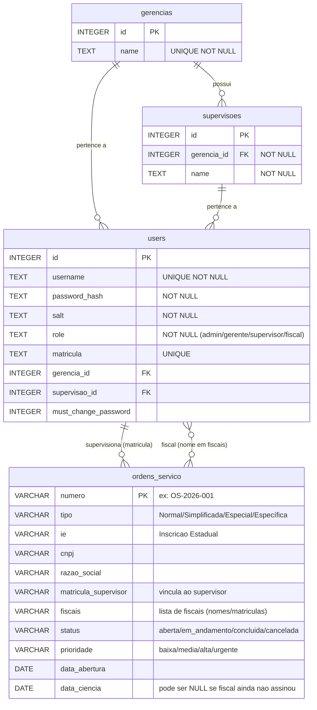

# Diagrama ER - Sistema SEFAZ

## Visão Geral

O sistema utiliza **três fontes de dados**:
- **SQLite** (`backend/app.db`) — usuários, gerências, supervisões (persistência local)
- **API ATF** — ordens de serviço (fonte principal, via HTTPS + XML)
- **IBM Informix** (`sefaz_test`) — ordens de serviço (legado, via ODBC; substituído pela ATF)

## Diagrama Entidade-Relacionamento

> **Nota:** `ordens_servico` não é uma tabela SQLite — representa os dados retornados pela API ATF
> (ou Informix em fallback). Os campos acima refletem o schema normalizado pelo backend após o parse do XML.

## Relações

| De | Para | Tipo | Descrição |
|---|---|---|---|
| `gerencias` | `supervisoes` | 1:N | Uma gerência possui várias supervisões |
| `gerencias` | `users` | 1:N | Gerentes pertencem a uma gerência |
| `supervisoes` | `users` | 1:N | Supervisores e fiscais pertencem a uma supervisão |
| `users` | `ordens_servico` | 1:N | Supervisor supervisiona OS (via `matricula` ↔ `matricula_supervisor`) |
| `users` | `ordens_servico` | N:N | Fiscal aparece em OS (via nome no campo `fiscais`) |

## Fontes de dados por endpoint

| Endpoint                    | Fonte de dados                      |
|-----------------------------|-------------------------------------|
| `GET /ordens`               | API ATF (primária) → MOCK           |
| `GET /ordens/{numero}/pdf`  | API ATF (primária) → MOCK           |
| `GET /admin/dashboard`      | Informix (legado) → MOCK            |
| `GET /relatorio/*`          | Informix (legado) → MOCK            |
| `GET /alertas`              | Informix (legado) → MOCK            |
| `GET/POST /admin/users`     | SQLite                              |
| `GET/POST /admin/gerencias` | SQLite                              |
| `GET/POST /admin/supervisoes` | SQLite                            |
