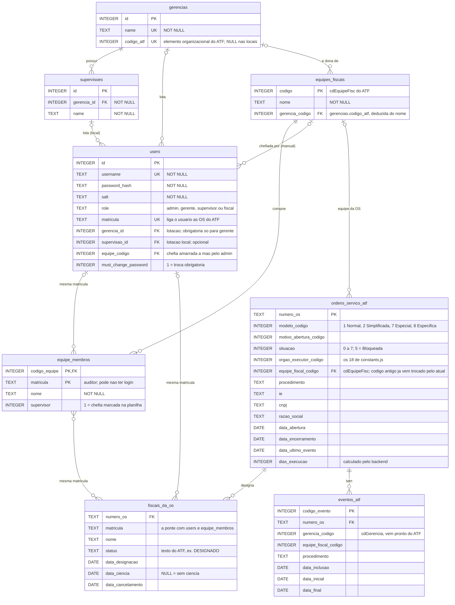

# Diagrama ER - Sistema SEFAZ

## Visão Geral

O sistema utiliza **duas fontes de dados**:
- **SQLite** (`backend/app.db`) — usuários, gerências, supervisões e equipes fiscais. É o único dado que o sistema grava.
- **API ATF** — ordens de serviço e eventos, lidos a cada consulta via SOAP sobre HTTPS e nunca gravados aqui (só ficam num cache em memória por `ATF_CACHE_TTL` segundos). Sem `ATF_BASE_URL`, dados MOCK.

Não há chave estrangeira entre as duas. **A única ponte entre uma pessoa e
uma OS é a matrícula do fiscal designado** (`fiscais[].matricula`):
visibilidade, hierarquia e a gerência que o dashboard atribui a cada OS
são resolvidas a partir dela, no backend.

## Diagrama Entidade-Relacionamento

```mermaid
erDiagram
    gerencias {
        INTEGER id PK
        TEXT name UK "NOT NULL"
        INTEGER codigo_atf UK "elemento organizacional do ATF; NULL nas locais"
    }

    supervisoes {
        INTEGER id PK
        INTEGER gerencia_id FK "NOT NULL"
        TEXT name "NOT NULL"
    }

    users {
        INTEGER id PK
        TEXT username UK "NOT NULL"
        TEXT password_hash "NOT NULL"
        TEXT salt "NOT NULL"
        TEXT role "admin, gerente, supervisor ou fiscal"
        TEXT matricula UK "liga o usuario as OS do ATF"
        INTEGER gerencia_id FK "lotacao; obrigatoria so para gerente"
        INTEGER supervisao_id FK "lotacao local; opcional"
        INTEGER equipe_codigo FK "chefia amarrada a mao pelo admin"
        INTEGER must_change_password "1 = troca obrigatoria"
    }

    equipes_fiscais {
        INTEGER codigo PK "cdEquipeFisc do ATF"
        TEXT nome "NOT NULL"
        INTEGER gerencia_codigo FK "gerencias.codigo_atf, deduzida do nome"
    }

    equipe_membros {
        INTEGER codigo_equipe PK, FK
        TEXT matricula PK "auditor; pode nao ter login"
        TEXT nome "NOT NULL"
        INTEGER supervisor "1 = chefia marcada na planilha"
    }

    ordens_servico_atf {
        TEXT numero_os PK
        INTEGER modelo_codigo "1 Normal, 2 Simplificada, 7 Especial, 8 Especifica"
        INTEGER motivo_abertura_codigo
        INTEGER situacao "0 a 7; 5 = Bloqueada"
        INTEGER orgao_executor_codigo "os 18 de constants.js"
        INTEGER equipe_fiscal_codigo FK "cdEquipeFisc; codigo antigo ja vem trocado pelo atual"
        TEXT procedimento
        TEXT ie
        TEXT cnpj
        TEXT razao_social
        DATE data_abertura
        DATE data_encerramento
        DATE data_ultimo_evento
        INTEGER dias_execucao "calculado pelo backend"
    }

    fiscais_da_os {
        TEXT numero_os FK
        TEXT matricula "a ponte com users e equipe_membros"
        TEXT nome
        TEXT status "texto do ATF, ex. DESIGNADO"
        DATE data_designacao
        DATE data_ciencia "NULL = sem ciencia"
        DATE data_cancelamento
    }

    eventos_atf {
        INTEGER codigo_evento PK
        TEXT numero_os FK
        INTEGER gerencia_codigo "cdGerencia, vem pronto do ATF"
        INTEGER equipe_fiscal_codigo
        TEXT procedimento
        DATE data_inclusao
        DATE data_inicial
        DATE data_final
    }

    gerencias ||--o{ supervisoes : "possui"
    gerencias |o--o{ users : "lota"
    supervisoes |o--o{ users : "lota (local)"
    gerencias |o--o{ equipes_fiscais : "e dona de"
    equipes_fiscais ||--o{ equipe_membros : "compoe"
    equipes_fiscais |o--o{ users : "chefiada por (manual)"
    users |o--o{ equipe_membros : "mesma matricula"
    ordens_servico_atf ||--o{ fiscais_da_os : "designa"
    users |o--o{ fiscais_da_os : "mesma matricula"
    equipe_membros }o--o{ fiscais_da_os : "mesma matricula"
    equipes_fiscais |o--o{ ordens_servico_atf : "equipe da OS"
    ordens_servico_atf ||--o{ eventos_atf : "tem"
```

> **`ordens_servico_atf`, `fiscais_da_os` e `eventos_atf` não são tabelas.**
> Representam o que o backend normaliza a partir do XML do ATF
> (`OSListagemATF` e `FiscalATF` em `backend/schemas.py`, e a linha de
> `_parse_resposta_eventos_soap` em `backend/external_api.py`). A OS mostra
> só os campos usados em filtros e cortes; o serviço de detalhe acrescenta
> contribuinte com endereço, eventos, prorrogações, notificações,
> processos, justificativas, recolhimentos e denúncias — ver
> `OSDetalheCompletoResponse`.
>
> **Do lado SQLite, só duas chaves estrangeiras são declaradas:**
> `supervisoes.gerencia_id` e `equipe_membros.codigo_equipe`. As colunas de
> lotação e chefia em `users` e o `equipes_fiscais.gerencia_codigo` entraram
> por migração (`ALTER TABLE`) e são referências lógicas. `users.matricula`
> e `gerencias.codigo_atf` são únicos por índice (o segundo, só entre os
> preenchidos). Todas as ligações por matrícula são lógicas.

## Relações

| De | Para | Tipo | Como liga | Descrição |
|---|---|---|---|---|
| `gerencias` | `supervisoes` | 1:N | `supervisoes.gerencia_id` | Supervisão é recorte local; as gerências que vieram do ATF não têm nenhuma |
| `gerencias` | `users` | 0..1:N | `users.gerencia_id` | Lotação. Vem do admin ou de `importar_equipes --lotar-por-equipe`, que só escreve em cima de NULL |
| `supervisoes` | `users` | 0..1:N | `users.supervisao_id` | Lotação local; na visibilidade, só vale para o supervisor sem equipe |
| `gerencias` | `equipes_fiscais` | 0..1:N | `gerencia_codigo` = `codigo_atf` | Gerência dona da equipe, deduzida do nome dela (`backend/gerencias_atf.py`) |
| `equipes_fiscais` | `equipe_membros` | 1:N | `equipe_membros.codigo_equipe` | Composição da planilha da SEFAZ; um auditor pode estar em mais de uma. Substituída inteira a cada importação |
| `equipes_fiscais` | `users` | 0..1:N | `users.equipe_codigo` | Chefia amarrada à mão; soma-se à marca `equipe_membros.supervisor` |
| `users` | `equipe_membros` | 0..1:N | matrícula | Pertencer a uma equipe não dá visibilidade; chefiar dá, e só para quem é supervisor |
| `ordens_servico_atf` | `fiscais_da_os` | 1:N | `numero_os` | Fiscais designados na OS |
| `users` / `equipe_membros` | `fiscais_da_os` | N:N | matrícula | Base da visibilidade e dos cortes por fiscal e por gerência |
| `equipes_fiscais` | `ordens_servico_atf` | 0..1:N | `cdEquipeFisc` | Filtro e corte por equipe; não entra na visibilidade. Vazio em OS antigas; código antigo de equipe chega trocado pelo atual (`EQUIPES_EQUIVALENTES`, ver README) |
| `ordens_servico_atf` | `eventos_atf` | 1:N | `numero_os` | Serviço de eventos. Não traz matrícula, por isso a aba Eventos é só do admin |

## O que a matrícula resolve

### Visibilidade (`_matriculas_visiveis`, em `backend/main.py`)

O backend monta um conjunto de matrículas para o usuário, e uma OS é
visível quando alguém desse conjunto está em `fiscais_da_os`:

| Cargo | Conjunto de matrículas |
|---|---|
| admin | sem filtro |
| gerente | a própria + os lotados na sua gerência + os membros das equipes chefiadas pelos seus supervisores |
| supervisor | a própria + os membros das equipes que chefia (`equipe_membros.supervisor` somado a `users.equipe_codigo`); sem equipe nenhuma, os lotados na sua supervisão |
| fiscal | a própria |

### Gerência de uma OS no dashboard (`_gerencia_por_matricula`)

A OS não tem gerência. O dashboard a atribui pela matrícula dos fiscais,
por três vias, da mais específica para a mais ampla — a primeira que
responder vale:

1. `users.gerencia_id` — a lotação direta;
2. a equipe amarrada a um supervisor — os membros herdam a gerência dele;
3. `equipe_membros` → `equipes_fiscais.gerencia_codigo` → `gerencias.codigo_atf`.
   Quem está em equipes de gerências diferentes fica com a de menor código,
   para a mesma OS não ser contada duas vezes.

A gerência dos eventos **não** passa por aqui: vem pronta em
`eventos_atf.gerencia_codigo` e não é ligada ao cadastro local. Como as
duas se correspondem ainda depende de confirmação da SEFAZ.

## Fontes de dados por endpoint

| Endpoint | ATF | SQLite |
|---|---|---|
| `GET /ordens`, `GET /ordens/{numero}` | listagem | visibilidade |
| `GET /ordens/{numero}/detalhe` | detalhe | visibilidade |
| `GET /ordens/{numero}/pdf` | listagem + detalhe | visibilidade |
| `GET /alertas` | listagem (últimos 12 meses) | visibilidade |
| `GET /admin/dashboard` | listagem | gerência por matrícula, equipes e supervisores da planilha |
| `GET /admin/dashboard/os` | listagem | visibilidade, gerência por matrícula |
| `GET /admin/dashboard/eventos` | eventos | — |
| `GET /relatorios/*` | listagem | visibilidade; gerência por matrícula no de desempenho |
| `/admin/users`, `/admin/gerencias`, `/admin/supervisoes` | — | leitura e escrita |
| `GET /equipes-fiscais`, `GET /admin/equipes-fiscais/{codigo}/membros` | — | leitura |

Sem `ATF_BASE_URL`, toda a coluna ATF vira MOCK. Com ele configurado não há
fallback: uma falha do ATF aparece como erro, nunca como dado de exemplo.
